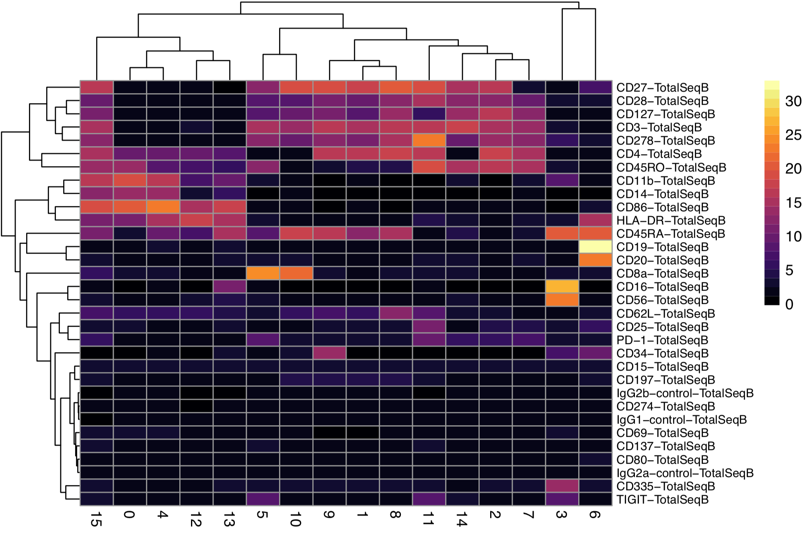
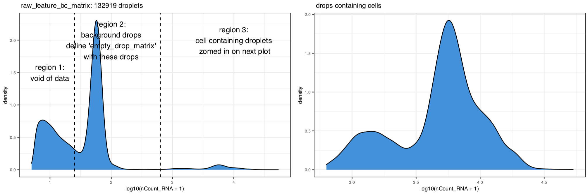

<!-- README.md is generated from README.Rmd. Please edit that file -->

# dsb : an R package for normalizing and denoising CITEseq protein data <a href='https://mattpm.github.io/dsb'></a>

```{r, include = FALSE}
knitr::opts_chunk$set(
  collapse = TRUE,
  comment = "#>",
  fig.path = "man/figures/README-",
  out.width = "100%"
)
```

<!-- badges: start -->
<!-- [](https://travis-ci.org/MattPM/dsb) -->
<!-- badges: end -->

**check out more vignettes on the [dsb package site](https://mattpm.github.io/dsb/)**

**DSB was recently used in [this informative preprint on optomizing CITE-seq experiments](https://www.biorxiv.org/content/10.1101/2020.06.15.153080v1)**

dsb is a lightweight R package and is the first dedicated method for normalizing and denoising protein expression data from CITE-seq experiments. The method was developed in [John Tsang's Lab](https://www.niaid.nih.gov/research/john-tsang-phd) by Matt Mulè, Andrew Martins and John Tsang. Details of the method can be found in [the biorxiv preprint](https://www.biorxiv.org/content/10.1101/2020.02.24.963603v1.full.pdf). We utilized the dsb package to normalize CITEseq data reported in [our Nature Medicine paper on baseline immune states](https://doi.org/10.1038/s41591-020-0769-8). 

As described in [preprint](https://www.biorxiv.org/content/10.1101/2020.02.24.963603v1.full.pdf) in experiments comparing unstained control cells and empty droplets we found a major contributor to background noise in CITE-seq protein data is unbound antibodies encapsulated and sequenced in droplets. DSB corrects for this background by leveraging empty droplets, which serve as a “built in” noise measurement in all droplet capture single cell experiments. In an optional recommended step we define and regress out for each cell the primary latent noise component of that cell's protein library to account for several potential sources of technical differences among single cells – see our preprint for details. 

## Installation 

```{r, eval = FALSE}
# this is analagous to install.packages("package), you need the package devtools to install a package from a github repository like this one. 
require(devtools); devtools::install_github(repo = 'MattPM/dsb')
library(dsb)

# quick example - RUN dsb on package example data 
norm_mtx = DSBNormalizeProtein(cell_protein_matrix = cells_citeseq_mtx, empty_drop_matrix = empty_drop_citeseq_mtx)
```

# Quick start DSB normalize CITE-seq protein data starting from *RAW* cell ranger output 

With this workflow, a matrix of protein counts for empty droplets and cells are estimated using the protein and mRNA library size distributions of the raw cell ranger output. These are used to normalize the protein data for cells using the dsb package. This normalized (and raw) protein data and raw RNA data can then be used to create a Seurat object or any object in various single cell analysis software ecosystems, for example, Bioconductor's SingleCellExperiment object, or the anndata class in Python. (see following setion for instructions)

To follow this example load the RAW (not filtered!) **feature / cellmatrix raw** public 10X CITE-seq data from here:   https://support.10xgenomics.com/single-cell-gene-expression/datasets/3.0.2/5k_pbmc_protein_v3 

The steps below use R 3.6 and Seurat version 3. 

```{r, eval = FALSE}
# R 3.6 Seurat V 3 
library(Seurat)
library(tidyverse)
library(dsb)
# library(magrittr)

# read raw data using the Seurat function "Read10X"
raw = Read10X("data/10x_data/10x_pbmc5k_V3/raw_feature_bc_matrix/")

# Define separate RNA and protein sparse matrix  
prot = raw$`Antibody Capture`
rna = raw$`Gene Expression`

# calculate metadata 
mtgene = grep(pattern = "^MT-", rownames(rna), value = TRUE)
pctmt = Matrix::colSums(rna[mtgene, ])/Matrix::colSums(rna)
log10umi = log10((rna))
log10umiprot = log10(Matrix::colSums(prot))
nGene = Matrix::colSums(rna > 0)

# combine into metadata 
md = as.data.frame(cbind(pctmt, log10umi, nGene, log10umiprot))

# histogram to estimate cells and background-cells are a tiny fraction of drops with log 10 protien lib size > 3
hist(md$log10umiprot[md$log10umiprot < 5], breaks = 100)

# define a vector of background / empty droplet barcodes based on protein library size and mRNA content  
neg_drops2 = md %>%
  rownames_to_column("bc") %>% 
  filter(log10umiprot < 2.5 & log10umiprot > 1.4)  %>% 
  filter(nGene < 80) # %$% bc
neg_drops2 = neg_drops2$bc
neg_prot2 = prot[ , neg_drops2] %>%  as.matrix()

# define a vector of cell-containing droplet barcodes based on protein library size and mRNA content 
positive_cells = md %>%
  rownames_to_column("bc") %>% 
  filter(log10umiprot > min_cell_logprotumi) %>% 
  filter(nGene < 3000 & nGene > 200) %>% 
  filter(pctmt < 0.2) # %$% bc
positive_cells = positive_cells$bc
cells_prot = prot[ , positive_cells] %>% as.matrix()

#normalize protein data for the cell containing droplets with the dsb method. 
isotypes = rownames(pos_prot)[30:32]
mtx2 = DSBNormalizeProtein(cell_protein_matrix = cells_prot,
                           empty_drop_matrix = neg_prot2,
                           denoise.counts = TRUE,
                           use.isotype.control = TRUE,
                           isotype.control.name.vec = isotypes)
```

# Example of next steps: set up Seurat object 

```{r, eval = FALSE}
# filter raw protein, RNA and metadata ton only include the cell containing droplets 
count_rna = raw$`Gene Expression`[ ,positive_cells]
count_prot = raw$`Antibody Capture`[ ,positive_cells]
md = md %>% 
  rownames_to_column("bc") %>% 
  filter(bc %in% positive_cells) %>% 
  column_to_rownames('bc')

# create Seurat object * note min.cells ins a gene filter not a cell filter, we alerady filtered cells in steps above
s = CreateSeuratObject(counts = count_rna, meta.data = md, assay = "RNA", min.cells = 20)

# add DSB normalized "dsb_norm_prot" protein data to the seurat object 
s[["CITE"]] = CreateAssayObject(data = dsb_norm_prot)

```

# Suggested workflow: Protein based clustering + visualization for cluster annotation  
 - This is similar to the workflow used in our paper https://www.nature.com/articles/s41591-020-0769-8 

```{r, eval = FALSE}

# define euclidean distance matrix on dsb normalized protein data (without isotype controls)
dsb = s@assays$CITE@data[1:29, ]
p_dist = dist(t(dsb))
p_dist = as.matrix(p_dist)

# Cluster using Seurat 
s[["p_dist"]] = FindNeighbors(p_dist)$snn
s = FindClusters(s, resolution = 0.5, graph.name = "p_dist")

```

# annotate clusters via average protein expression

DSB normalized vlaues provide a straightforward comparable value for each protein in each cluster. They are the log number of standard deviations (+ / - the cell-intrinsic denoised technical component) from the expected noise as reflected by the protein distribution in empty droplets.

```{r, eval = FALSE}
prots = rownames(s@assays$CITE@data)
adt_plot = adt_data %>% 
  group_by(seurat_clusters) %>% 
  summarize_at(.vars = prots, .funs = mean) %>% 
  column_to_rownames("seurat_clusters") %>% 
  t %>% 
  as.data.frame

pheatmap::pheatmap(adt_plot, color = viridis::viridis(25, option = "B"), 
                   fontsize_row = 8, border_color = NA, width = 5, height = 5 )
#
```


 

```{r, eval = FALSE}

# create 

# Get dsb normalized protein data without isotype controls for clustering
s_dsb = s@assays$CITE@data
s_dsb = s_dsb[1:29, ]

# defint euclidean distance matrix and cluster 
p_dist = dist(t(s_dsb))
p_dist = as.matrix(p_dist)
s[["p_dist"]] <- FindNeighbors(p_dist)$snn
s = FindClusters(s, resolution = 0.6, graph.name = "p_dist")

# Plot clusters by average protein expression for annotation 

adt_data = cbind(as.data.frame(t(s@assays$CITE@data)), s@meta.data)
prots = rownames(s@assays$CITE@data)
adt_plot = adt_data %>% 
    group_by(seurat_clusters) %>% 
    summarize_at(.vars = prots, .funs = mean) %>% 
    column_to_rownames("seurat_clusters") %>% 
    t %>% 
    as.data.frame

pheatmap::pheatmap(adt_plot, color = viridis::viridis(25, option = "B"), fontsize_row = 8)
```



# More information: How were background drops defined in the quick example above? 

First apply some minimal (RNA based in this case) filtering to retain noise / empty droplets for DSB. Below the cells that should be used for background in this experiment are shown in a histogram of the droplets passing a minimal filtering step. 

```{r, eval = FALSE}

path_to_data = "data/10x_data/10x_pbmc5k_V3/raw_feature_bc_matrix/"
raw = Read10X(data.dir = path_to_data)

# create object with Minimal filtering (retain drops with 5 unique mRNAs detected)
s1 = CreateSeuratObject(counts = raw$`Gene Expression`,  min.cells = 10, min.features = 5)

# define number of total drops (>130K) after minimal filtering
ndrop = dim(s1@meta.data)[1]

# Plot
hist_attr = list(  theme_bw() , theme(text = element_text(size = 8)) , geom_density(fill = "#3e8ede") )
p1 = ggplot(s1@meta.data, aes(x = log10(nCount_RNA + 1 ) )) +
  hist_attr + 
  ggtitle(paste0( " raw_feature_bc_matrix: ", ndrop, " droplets")) + 
  geom_vline(xintercept = c(2.8, 1.4 ),   linetype = "dashed") + 
  annotate("text", x = 1, y=1.5, label = " region 1: \n void of data ") + 
  annotate("text", x = 2, y=2, label = " region 2: \n background drops \n define 'empty_drop_matrix' \n with these drops ") + 
  annotate("text", x = 4, y=2, label = " region 3: \n cell containing droplets \n zomed in on next plot") 


p2 = ggplot(s1@meta.data %>% filter(log10(nCount_RNA + 1) > 2.8), aes(x = log10(nCount_RNA + 1 ) )) +
  hist_attr + 
  ggtitle(paste0(" drops containing cells "))  
p3 = cowplot::plot_grid( p1 , p2 ) 
p3
```



## Quickstart 2 removing background and correcting for per-cell technical factor without isotype controls 

By default, dsb defines the per-cell technical covariate by fitting a two-component gaussian mixture model to the log + 10 counts (of all proteins) within each cell and defining the covariate as the mean of the “negative” component. If one does not include isotype controls in a CITE-seq panel, one can still denoise with the per cell gaussian mixture model background mean. 

```{r, eval = FALSE}
normalized_matrix = DSBNormalizeProtein(cell_protein_matrix = cells_citeseq_mtx,
                                        empty_drop_matrix = empty_drop_citeseq_mtx,
                                        use.isotype.control = FALSE) 
```

## Quickstart 3 removing background and correcting for per-cell technical factor with isotype controls and background mean

By default, dsb defines the per-cell technical covariate by fitting a two-component gaussian mixture model to the log + 10 counts (of all proteins) within each cell and defining the covariate as the mean of the “negative” component. We recommend also to use the counts from the isotype controls in each cell to compute the denoising covariate (defined as the first principal component of the isotype control counts and the “negative” count inferred by the mixture model above.)

```{r, eval = FALSE}
# define a vector of the isotype controls in the data 
isotypes = c("Mouse IgG2bkIsotype_PROT", "MouseIgG1kappaisotype_PROT",
             "MouseIgG2akappaisotype_PROT", "RatIgG2bkIsotype_PROT")

normalized_matrix = DSBNormalizeProtein(cell_protein_matrix = cells_citeseq_mtx,
                                        empty_drop_matrix = empty_drop_citeseq_mtx,
                                        use.isotype.control = TRUE,
                                        isotype.control.name.vec = isotypes)
```

## Quickstart 4 using example data; removing background as captured by data from empty droplets without count denoising

```{r example}
# load package and normalize the example raw data 
library(dsb)
# normalize
normalized_matrix = DSBNormalizeProtein(cell_protein_matrix = cells_citeseq_mtx,
                                        empty_drop_matrix = empty_drop_citeseq_mtx)

```

## Visualization of protein distributions on package example data. 

**Note, there is NO jitter added to these points for visualization; these are the unmodified normalized counts**
```{r, fig.height=4.5, fig.width=12}

library(ggplot2)
data.plot = normalized_matrix %>% 
  t %>%
  as.data.frame() %>% 
  dplyr::select(CD4_PROT, CD3_PROT, CD8_PROT, CD27_PROT, CD19_PROT, CD16_PROT, CD11c_PROT, CD45RO_PROT, CD45RA_PROT) 

mg_layer = list(theme_bw(), 
                geom_point(size = 0.5, shape = 16, alpha = 0.5) ,  
                geom_density2d(size = 0.3, color = "red") ,
                geom_vline(xintercept = 0) ,
                geom_hline(yintercept = 0) , 
                ggtitle("DSB normalized (example data)"))

p1 = ggplot(data.plot, aes(x = CD19_PROT, y = CD3_PROT)) + mg_layer
p2 = ggplot(data.plot, aes(x = CD8_PROT, y = CD4_PROT)) + mg_layer
p3 = ggplot(data.plot, aes(CD45RO_PROT, y = CD3_PROT)) + mg_layer
p4 = ggplot(data.plot, aes(CD16_PROT, y = CD11c_PROT)) + mg_layer
p5 = cowplot::plot_grid(p1,p2, p3,p4, nrow = 1)
p5
```


## How do I get the empty droplets?

If you don't have hashing data, you can define the negative drops as shown above in the vignette using 10X data. If you have hashing data, demultiplexing functions define a "negative" cell population which can be used to define background. 

HTODemux function in Seurat:
https://satijalab.org/seurat/v3.1/hashing_vignette.html

deMULTIplex function from Multiseq (this is now also implemented in Seurat). 
https://github.com/chris-mcginnis-ucsf/MULTI-seq

In practice, you would want to confirm that the cells called as “negative” indeed have low RNA / gene content to be certain that there are no contaminating cells. Also, we recommend hash demultiplexing with the *raw* output from cellranger rather than the processed output (i.e. outs/raw_feature_bc_matrix). This output contains all barcodes and will have more empty droplets from which the HTODemux function will be able to estimate the negative distribution. This will also have the benefit of creating more empty droplets to use as built-in protein background controls in the DSB function.

**see 10x data vignette discussed above and shown here  https://github.com/MattPM/dsb/issues/9 **
**please see vignettes in the "articles" tab at https://mattpm.github.io/dsb/ for a detailed workflow detailing these steps**

## Simple example workflow (Seurat Version 3) for experiments with Hashing data 

```{r, eval=FALSE}

# get the ADT counts using Seurat version 3 
seurat_object = HTODemux(seurat_object, assay = "HTO", positive.quantile = 0.99)
Idents(seurat_object) = "HTO_classification.global"
neg_object = subset(seurat_object, idents = "Negative")
singlet_object = subset(seurat_object, idents = "Singlet")


# non sparse CITEseq data actually store better in a regular materix so the as.matrix() call is not memory intensive.
neg_adt_matrix = GetAssayData(neg_object, assay = "CITE", slot = 'counts') %>% as.matrix()
positive_adt_matrix = GetAssayData(singlet_object, assay = "CITE", slot = 'counts') %>% as.matrix()


# normalize the data with dsb
# make sure you've run devtools::install_github(repo = 'MattPM/dsb')
normalized_matrix = DSBNormalizeProtein(cell_protein_matrix = positive_adt_matrix,
                                        empty_drop_matrix = neg_adt_matrix)


# now add the normalized dat back to the object (the singlets defined above as "object")
singlet_object = SetAssayData(object = singlet_object, slot = "CITE", new.data = normalized_matrix)


```

## Simple example workflow Seurat version 2 for experiments with hashing data

```{r, eval=FALSE}

# get the ADT counts using Seurat version 3 
seurat_object = HTODemux(seurat_object, assay = "HTO", positive.quantile = 0.99)

neg = seurat_object %>%
  SetAllIdent(id = "hto_classification_global") %>% 
  SubsetData(ident.use = "Negative") 

singlet = seurat_object %>%
  SetAllIdent(id = "hto_classification_global") %>% 
  SubsetData(ident.use = "Singlet") 

# get negative and positive ADT data 
neg_adt_matrix = neg@assay$CITE@raw.data %>% as.matrix()
pos_adt_matrix = singlet@assay$CITE@raw.data %>% as.matrix()


# normalize the data with dsb
# make sure you've run devtools::install_github(repo = 'MattPM/dsb')
normalized_matrix = DSBNormalizeProtein(cell_protein_matrix = pos_adt_matrix,
                                        empty_drop_matrix = neg_adt_matrix)


# add the assay to the Seurat object 
singlet = SetAssayData(object = singlet, slot = "CITE", new.data = normalized_matrix)


```


### notes // NIAID 

A review of this code has been conducted, no critical errors exist, and to the best of the authors knowledge, there are no problematic file paths, no local system configuration details, and no passwords or keys included in this code.

Primary author(s): Matt Mulè  
Organizational contact information: General: john.tsang AT nih.gov, code: mulemp AT nih.gov  
Date of release: Oct 7 2020  
Version: NA  
License details: NA  
Description: code to reproduce analysis of manuscript  
Usage instructions: Provided in this markdown  
Example(s) of usage: NA  
Proper attribution to others, when applicable: NA

### code check 


