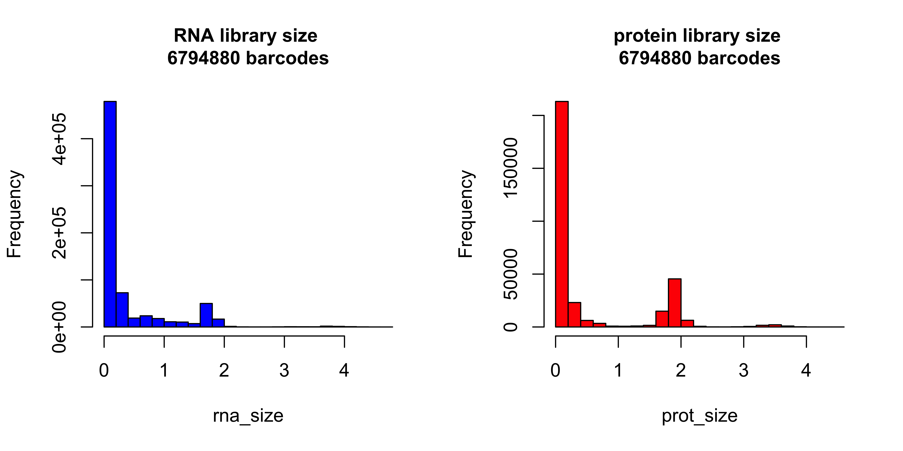
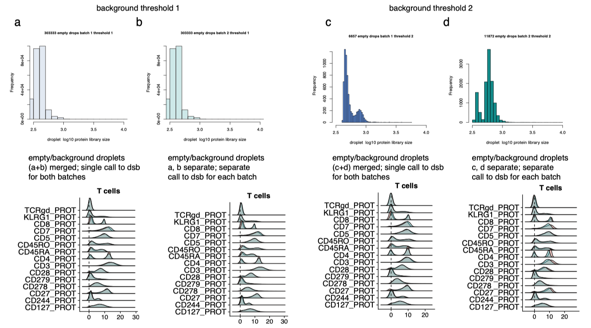

<!-- README.md is generated from README.Rmd. Please edit that file -->

# dsb: an R package for normalizing and denoising CITE-seq protein data <a href='https://mattpm.github.io/dsb'></a>

Please see all documentation provided below in this readme including
installation instructions, usage tutorials for multiple types of
experiments, FAQ section for common questions. If you have a question,
please open an issue on the github site <https://github.com/niaid/dsb>
so that the community can benefit. Package maintainer / code: Matt Mulè
(matthew.mule at nih.gov, permanent: mattmule at gmail. General contact:
John Tsang (john.tsang at
nih.gov)

<!-- badges: start -->

<!-- [](https://travis-ci.org/MattPM/dsb) -->

<!-- badges: end -->

dsb (**d**enoised and **s**caled by **b**ackground) is a lightweight R
package for normalizing and denoising protein expression data from
droplet based single cell experiments (CITE-seq, REAP-seq, Mission Bio
Tapestri etc.). The dsb package was developed in [John Tsang’s Lab
NIH-NIAID](https://www.niaid.nih.gov/research/john-tsang-phd) by Matt
Mulè, Andrew Martins and John Tsang. If you use dsb or find the noise
modeling results in our paper useful please consider citing the dsb
preprint.  
[**the dsb
preprint**](https://www.biorxiv.org/content/10.1101/2020.02.24.963603v1)
provides details of the dsb method.  
[**a reproducible workflow**](https://github.com/niaid/dsb_manuscript)
provides all code + data for reproducing results and figures reported in
the the dsb paper.  
In addition [**our paper on baseline immune
states**](https://doi.org/10.1038/s41591-020-0769-8) in Nature Medicine
shows utility of dsb for CITE-seq protein clustering, cluster
annotation, modeling and
visualization.

<a href='https://mattpm.github.io/dsb'></a>

dsb centers the background cell population at zero by removing ambient
noise associated with each protein and removes the technical component
of each cell’s protein library
<a href='https://github.com/niaid/dsb'></a>

Follow tutorial below to integrate dsb with a workflow using *Seurat*
<a href='https://mattpm.github.io/dsb'></a>

Our method is based on control experiments designed to interrogate the
source of background noise in CITE-seq experiments. Please refer to the
details in the
[preprint](https://www.biorxiv.org/content/10.1101/2020.02.24.963603v1).
Briefly, we discovered:

1)  A major source of background noise in CITE-seq data comes from
    ambient, unbound antibody encapsulated in droplets.

2)  Empty droplets (containing mRNA and protein reads but not a cell)
    outnumber cell-containing droplets by 10-100 fold due to Poisson
    distributed cell encapsulation; based on exeriments and modeling,
    these empty drops capture the *ambient component* of background
    noise.

3)  Cell-to-cell technical variations due to e.g. stochastic differences
    in cell lyis and capture, RT efficiency, sequencing depth, and
    non-specific antibody binding can be estimated and removed by
    defining the “technical component” of *each cell’s* protein library.
    We define the technical component as the shared variance component
    associated with isotype antibody controls and the cell’s background
    protein population defined with a Gaussian mixture model.

## Installation and quick overview with pre-loaded package data

Here we normalize raw counts of cells (columns) by proteins (rows) of a
pre-loaded sparse matrix ‘cells\_citeseq\_mtx’. We estimate the ambient
component of noise with background/empty droplets containing raw protein
counts ‘empty\_drop\_citeseq\_mtx’ and we also define and remove the
‘technical component’ of each cell’s protein library. This is all
implemented in the function **DSBNormalizeProtein()**.

``` r
# install dsb package directly from github: 
require(devtools); devtools::install_github(repo = 'MattPM/dsb')
library(dsb)

# define a vector of the names of the isotype controls 
isotypes = rownames(cells_citeseq_mtx)[67:70]

# normalize raw protein data with dsb
adt_norm = DSBNormalizeProtein(
  # raw CITE-seq protein count matrices (rows = protein, columns = cells)
  cell_protein_matrix = cells_citeseq_mtx,# 1: cell-containing droplets
  empty_drop_matrix = empty_drop_citeseq_mtx, # 2: empty/background droplets
  
  # Step II arguments 
  denoise.counts = TRUE, # recommended (whether to define and remove each cell's technical component) 
  use.isotype.control = TRUE, # whether to use isotype controls to define cell technical components (highly recommended)
  isotypecontrol.name.vec = isotypes # the vector of isotype control proteins defined above 
  )
```

## Tutorial with public 10X genomics data

To follow this example download **RAW (not filtered\!)** **feature /
cellmatrix raw** public 10X CITE-seq data from here:
<https://support.10xgenomics.com/single-cell-gene-expression/datasets/3.0.2/5k_pbmc_protein_v3>.
The steps below use R 3.6 and Seurat version 3. We emphasize that the
normalized protein data and raw RNA data from this workflow can be used
with *any single cell analysis software*. The matrices in this workflow
can be saved in any format to create a Seurat object, Bioconductor’s
SingleCellExperiment object, or an AnnData object in python for
downstream analysis. A suggested workflow is provided below that is
similar to the CITE-seq workflow used in [our paper on baseline immune
states](https://doi.org/10.1038/s41591-020-0769-8)

### Step I: Define cell-containing and background droplets starting from the *raw* Cell Ranger output

The raw output from a count aligner such as Cell Ranger is a sparse
matrix of **all possible cell barcodes** (columns) vs genes/proteins
(rows). In all CITE-seq datasets, there are 10-100 fold more “empty”
drops with detectable ambient RNA + protein than cell containing
droplets. Below we examine the distribution of library size across all
cells for the protein and mRNA assays in order to define background
noise droplets and the cell containing droplets based on clear
boundaries between populations.

``` r
library(Seurat) # not a dependency, only used for example workflow below
library(tidyverse) # not a dependency, only used for visualizations below
library(dsb)

# read raw data using the Seurat helper function "Read10X"
raw = Read10X("data/10x_data/10x_pbmc5k_V3/raw_feature_bc_matrix/")

# Define separate RNA and protein sparse matrix  
prot = raw$`Antibody Capture`
rna = raw$`Gene Expression`

# calculate qc stats for each droplet 
# Do not create Seurat object at this step, it will be too large to load into memory
rna_size = log10(Matrix::colSums(rna))
prot_size = log10(Matrix::colSums(prot))
ngene = Matrix::colSums(rna > 0)
mtgene = grep(pattern = "^MT-", rownames(rna), value = TRUE)
propmt = Matrix::colSums(rna[mtgene, ]) / Matrix::colSums(rna)
md = as.data.frame(cbind(propmt, rna_size, ngene, prot_size))
md$bc = rownames(md)

# histogram to estimate cells and background-cells are a tiny fraction of drops with log 10 protien lib size > 3
par(mfrow=c(1,2))
hist(rna_size, col = "blue", cex.main = 1, main = paste0("RNA library size \n", nrow(md), " barcodes"))
hist(prot_size, col = "red", cex.main = 1, main = paste0("protein library size \n", nrow(md), " barcodes"))
```

*The rightmost peaks that are barely visible \> 3 are the
cell-containing droplets*
<a href='https://github.com/niaid/dsb'></a>

In this example, we define the background droplets as the major peak in
the background distribution between 1.4 and 2.5 log total protein
counts. One could also use the entire population of droplets from 0 to
2.5 with little impact on normalized values (see the paper for details).
In addition, we add mRNA QC based filters as typically done in single
cell workflows to remove potential low quality cells. Potential low
quality cells are also removed from the empty droplet matrix. The
library size distribution of the cells (orange) and background droplets
(blue) used for normalization are
highlighted.

``` r
# define a vector of background / empty droplet barcodes based on protein library size and mRNA content  
background_drops = md[md$prot_size < 2.5 & md$prot_size > 1.4 & md$ngene < 80, ]$bc
negative_mtx_rawprot = prot[ , background_drops] %>%  as.matrix()

# define a vector of cell-containing droplet barcodes based on protein library size and mRNA content 
positive_cells = md[md$prot_size > 2.8 & md$ngene < 3000 & md$ngene > 200 & propmt <0.2, ]$bc
cells_mtx_rawprot = prot[ , positive_cells] %>% as.matrix()
```

<a href='https://mattpm.github.io/dsb'></a>

### Step II: normalize the cell containing droplets with the DSBNormalizeProtein Function.

``` r
#normalize protein data for the cell containing droplets with the dsb method. 
dsb_norm_prot = DSBNormalizeProtein(
                           cell_protein_matrix = cells_mtx_rawprot,
                           empty_drop_matrix = negative_mtx_rawprot,
                           denoise.counts = TRUE,
                           use.isotype.control = TRUE,
                           isotype.control.name.vec = rownames(cells_mtx_rawprot)[30:32]
                           )
```

The function returns a matrix of normalized protein values can be
integrated with any single cell analysis software, we provide an example
with Seurat
below.

## Step III: integration with Seurat

``` r
# Create Seurat object filter raw protein, RNA and metadata to only include cell-containing droplets 
count_rna = raw$`Gene Expression`[ ,positive_cells]
count_prot = raw$`Antibody Capture`[ ,positive_cells]

md = md %>% 
  rownames_to_column("bc") %>% 
  filter(bc %in% positive_cells) %>% 
  column_to_rownames('bc')

# create Seurat object * note min.cells ins a gene filter not a cell filter, we alerady filtered cells in steps above
s = CreateSeuratObject(counts = count_rna, meta.data = md, assay = "RNA", min.cells = 20)

# add DSB normalized "dsb_norm_prot" protein data to the seurat object 
s[["CITE"]] = CreateAssayObject(data = dsb_norm_prot)
```

## Suggested Step IV: Protein based clustering + cluster annotation

  - This is similar to the workflow used in our paper
    <https://www.nature.com/articles/s41591-020-0769-8> where we
    analyzed mRNA states *within* the interpretable clusters defined by
    dsb normalized protein
data.

<!-- end list -->

``` r
# define Euclidean distance matrix on dsb normalized protein data (without isotype controls)
dsb = s@assays$CITE@data[1:29, ]
p_dist = dist(t(dsb))
p_dist = as.matrix(p_dist)

# Cluster using Seurat 
s[["p_dist"]] = FindNeighbors(p_dist)$snn
s = FindClusters(s, resolution = 0.5, graph.name = "p_dist")
```

## Suggested Step V: cluster annotation based on average dsb normalized protein values

dsb normalized values aid in interpretation of clustering results since
the background cell population is centered around 0 for each protein and
the positive values lie on an interpretable scale. The values for each
cell represent the log number of standard deviations of a given protein
from the expected noise as reflected by the protein distribution in
empty droplets +/- the residual of the fitted model to the
cell-intrinsic technical component.

``` r
# calculate the average of each protein separately for each cluster 
prots = rownames(s@assays$CITE@data)
adt_plot = adt_data %>% 
  group_by(seurat_clusters) %>% 
  summarize_at(.vars = prots, .funs = mean) %>% 
  column_to_rownames("seurat_clusters") %>% 
  t() %>% 
  as.data.frame()
# plot a heatmap of the averaged dsb normalized values for each cluster
pheatmap::pheatmap(adt_plot, color = viridis::viridis(25, option = "B"), 
                   fontsize_row = 8, border_color = NA, width = 5, height = 5 )
```

<a href='https://mattpm.github.io/dsb'></a>

### Visualization of single cells on the interpretable dsb scale

UMAP and tSNE plots can be useful as a visualization tools or for
cluster annotation guides to view the protein levels across single
cells. Note one could also calculate UMAP embeddings directly with
*Seurat*, *scater* etc.

``` r
library(reticulate); use_virtualenv("r-reticulate")
library(umap)

# set umap config
config = umap.defaults
config$n_neighbors = 40
config$min_dist = 0.4

# run umap
ump = umap(t(s2_adt3), config = config)
umap_res = ump$layout %>% as.data.frame() 
colnames(umap_res) = c("UMAP_1", "UMAP_2")

# save results dataframe 
df_dsb = cbind(s@meta.data, umap_res, as.data.frame(t(s@assay$CITE@data)))
# visualizatons below were made directly from the data frame df_dsb above with ggplot
```

<a href='https://mattpm.github.io/dsb'></a>

## Quickstart V2 dsb with background rescaling only (applicable if isotype controls were not used)

If isotype controls were not included in the experiment, we recommend
setting the denoise.counts argument to FALSE which results in *not*
defining the technical component of each cell’s protein library. The
values of the normalized matrix returned are the number of standard
deviations above the expected ambient noise captured by empty droplets.
The background mean for each cell inferred via a per-cell gaussian
mixture model can alternatively be used alone to define the cell’s
technical component, however this assumes the background mean has no
expected biological variation. In our analysis, across single cells the
background mean has weak but significant correlation with the foreground
mean, calculating the eigenvector (i.e. the primary latent component)
through the background mean and isotype controls to define the technical
component for each cell anchors component of the background mean
associated with noise (this is the default
method).

``` r
dsb_rescaled = DSBNormalizeProtein(cell_protein_matrix = cells_citeseq_mtx,
                                   empty_drop_matrix = empty_drop_citeseq_mtx, 
                                   # only run dsb-rescaled do not denoise each cell's technical component
                                   denoise.counts = FALSE)
```

## How else can background/empty droplets be defined?

If the experiment is sample multiplexed with barcoding (i.e. hashing,
multiseq, demuxlet), demultiplexing functions define a “negative” cell
population which can be used to define background. In our data, the
resulting DSB normalized values were nearly identically distributed when
dsb was run with demultiplexing-derived background droplets or protein
library size defined (as shown above) background droplets. [HTODemux
function in
Seurat](https://satijalab.org/seurat/v3.1/hashing_vignette.html)
[deMULTIplex function from
Multiseq](https://github.com/chris-mcginnis-ucsf/MULTI-seq)
[demuxlet](https://github.com/statgen/demuxlet)

As with the workflow above, droplets with high RNA content should be
eliminated from the the background droplet estimate. In addition, these
functions should be run to demultiplex the **raw** output from cell
ranger with *partial thresholding* (shown below) prior to
demultiplexing. This has multiple benefits: including more empty drops
robustifies the background population estimated by the k-medoids
function implemented in Seurat::HTODemux. More negatives will also
result in more droplets defined by the function as “negative” which will
increase the confidence in the estimate of background used by
dsb.

## Example workflow with *Seurat* using dsb in conjunction with background defined by sample demultiplexing functions

``` r
# raw = path to cell ranger outs/raw_feature_bc_matrix ; 

# slightly subset negative drops to include all with 5 unique mRNAs
seurat_object = CreateSeuratObject(raw, min.genes = 5)

# demultiplex 
seurat_object = HTODemux(seurat_object, assay = "HTO", positive.quantile = 0.99)
Idents(seurat_object) = "HTO_classification.global"

# subset empty drop/background and cells 
neg_object = subset(seurat_object, idents = "Negative")
singlet_object = subset(seurat_object, idents = "Singlet")

# non sparse CITEseq data store more efficiently in a regular matrix
neg_adt_matrix = GetAssayData(neg_object, assay = "CITE", slot = 'counts') %>% as.matrix()
positive_adt_matrix = GetAssayData(singlet_object, assay = "CITE", slot = 'counts') %>% as.matrix()

# normalize the data with dsb
dsb_norm_prot = DSBNormalizeProtein(cell_protein_matrix = positive_adt_matrix,
                                    empty_drop_matrix = neg_adt_matrix)

# now add the normalized dat back to the object (the singlets defined above as "object")
singlet_object[["CITE"]] = CreateAssayObject(data = dsb_norm_prot)
```

# FAQ

**I get the error “Error in quantile.default(x, seq(from = 0, to = 1,
length = n)): missing values and NaN’s not allowed if ‘na.rm’ is FALSE”
What should I do?** - (see issue 6) this error occurs during denoising,
(denoise = TRUE) when you have antibodies with 0 counts or close to 0
across *all cells*. To get rid of this error, check the distributions of
the antibodies with e.g. `apply(cells_protein_matrix, 1, quantile)` to
find the protein(s) with basically no counts, then remove these from the
empty drops and the cells. (see issue 5)

**I get a "problem too large or memory exhausted error when I try to
convert to a regular R matrix** - (see issue 10) CITE-seq protein counts
don’t need a sparse representation-very likely this error is because
there are too many negative droplets defined (i.e. over 1 million). You
should be able to normalize datasets with 100,000+ cells and similar
numbers of negative droplets (or less) on a normal 16GB laptop. By
further narrowing in on the major background distribution, one should be
able to convert the cells and background to a normal R matrix which
should run successfully.

**I have 2 batches, should I combine them into a single batch or
normalize each batch hseparately?** - (See issue 12) How much batch
variation there is depends on how much experiment-specific and expected
biological variability there is between the batches. In the dataset used
in the preprint, if we normalized with all background drops and cells in
a single normalization, the resulting dsb normalized values were highly
concordant with when we normalized each batch separately, this held true
with either definition of background drops used (i.e. based on
thresholding with the library size or based on hashing-see below). One
could try both and see which mitigates a the batch variation the most.
See issue 12 for example code to do
this.  
<a href='https://mattpm.github.io/dsb'></a>

**How do I know whether I should set the denoise.counts argument to TRUE
vs FALSE?**  
In nearly all cases this argument should be set to TRUE and we highly
recommend that use.isotype.control is also set to TRUE when using
denoise.counts feature (this is the package default). The denoise.counts
argument specifies whether to remove cell-intrinsic technical noise by
defining and regressing out each cell’s technical component capturing
*cell-intrinsic technical factors* such as efficiency of oligo tag
capture, RT, sequencing depth and non-specific antibody binding among
other variables that contribute technical variations that are not
captured by protein counts in background droplets used in dsb. The only
reason not to use this argument is if the model assumptions used to
define the technical component are not expected to be met by the
particular experiment: denoise.counts models the negative protein
population (µ1) for each cell with a two-component Gaussian mixure,
making the conservative assumption that cells in the experiment should
be negative for a subset of the measured proteins. If you expect all
cells in your experiment express all / a vast majority of proteins
measured, this may not be an optimal assumption. In the paper we show
that the k=2 model provided an optimal fit (first plot below) compared
to other values of k in all 5 external datasets which measured between
just 14 to 86 proteins. The technical component is defined as the
primary latent component (λ) i.e. PC1 through each isotype control value
and µ1 for each cell. In all datasets, correlations between µ1 and 1)
each individual isotype control (second plot) and the average of all
four isotype controls (third plot) were higher than those between the
isotype control themselves suggesting shared variation (average) between
the independently inferred µ1 and isotype controls captured unobserved,
latent factors contributing to technical noise. λ was associated with
the protein library size (last plot, this is also true within protein
defined cell type-see paper) suggesting that the shared component of
variation in these variables reflect technical noise, but the library
size alone should not be used as a normalization factor (as is typical
for mRNA data) due to potential biological contributions and bias in the
small subset of proteins measured relative to the surface proteome (see
paper for detailed
discussion).

<a href='https://mattpm.github.io/dsb'></a>

### NIAID statement

A review of this code has been conducted, no critical errors exist, and
to the best of the authors knowledge, there are no problematic file
paths, no local system configuration details, and no passwords or keys
included in this code. This open source software comes as is with
absolutely no warranty.

### Terms of Use

By using this software, you agree this software is to be used for
research purposes only. Any presentation of data analysis using dsb will
acknowledge the software according to the guidelines below. How to
cite:  
Please cite this software as: 1. Mulè MP, Martins AJ, Tsang JS.
Normalizing and denoising protein expression data from droplet-based
single cell profiling. bioRxiv. 2020;2020.02.24.963603.

Primary author(s): Matt Mulè Organizational contact information:
General: john.tsang AT nih.gov, code: mulemp AT nih.gov  
Date of release: Oct 7 2020  
Version: 0.1.0 License details: see package  
Description: dsb:an R package for normalizing and denoising CITEseq
protein data  
Usage instructions: Provided in this markdown  
Example(s) of usage: Provided in this markdown and vignettes  
Proper attribution to others, when applicable: NA

### code check

``` r
# checked repo for PII and searched for strings with paths 
# code check 
library(lintr)
library(here)
fcn = suppressMessages(list.files(here("R/"), ".r", full.names = TRUE))
vignette = list.files(path = here("vignettes/dsb_normalizing_CITEseq_data.R"))
# code check 
scp = c(fcn, vignette) %>% as.list()
lt = suppressMessages((lapply(scp, lintr::lint)))
```
