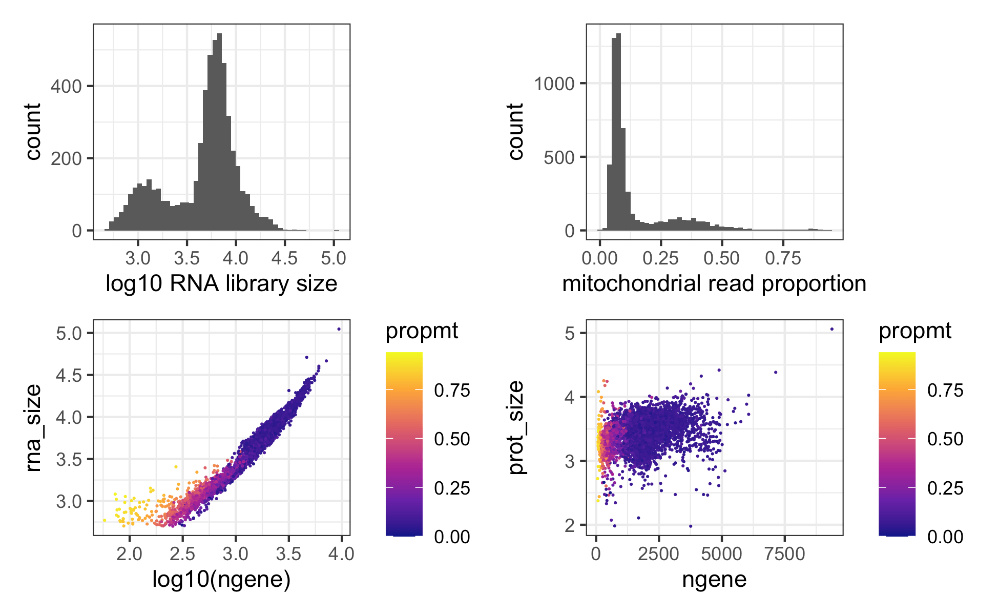
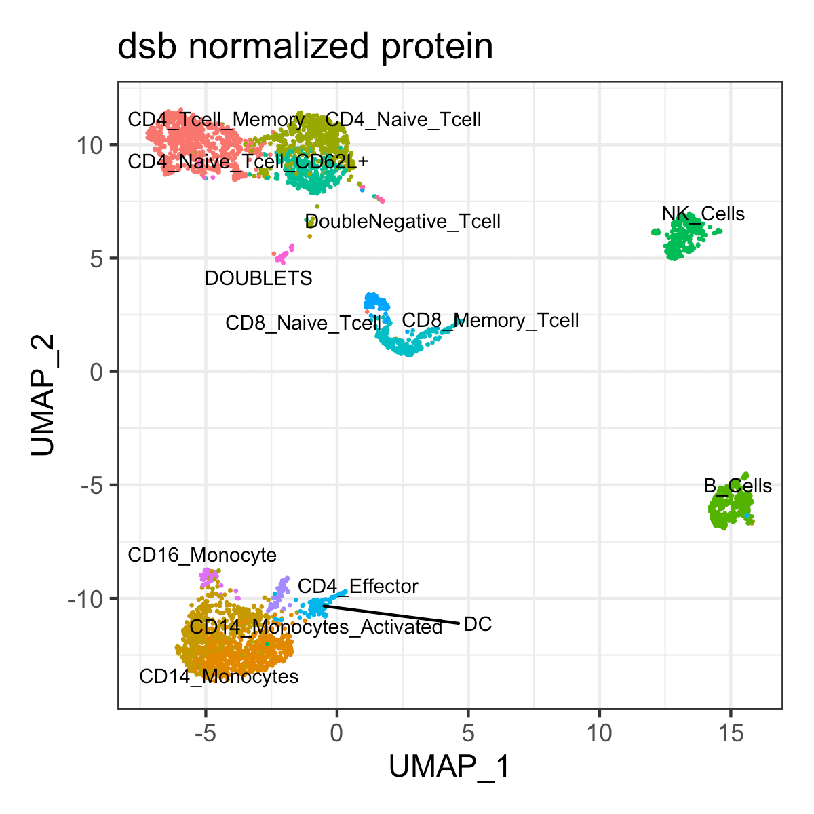
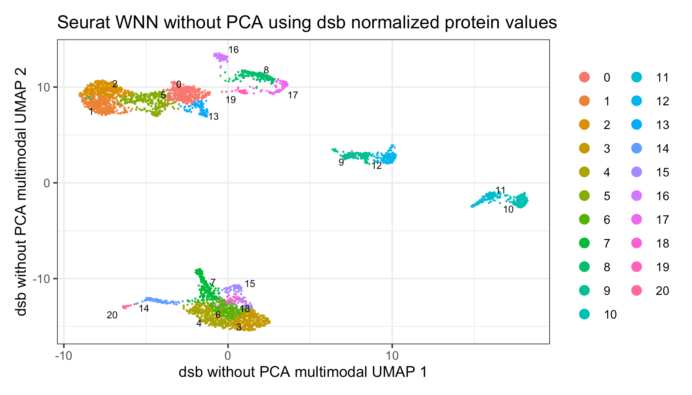
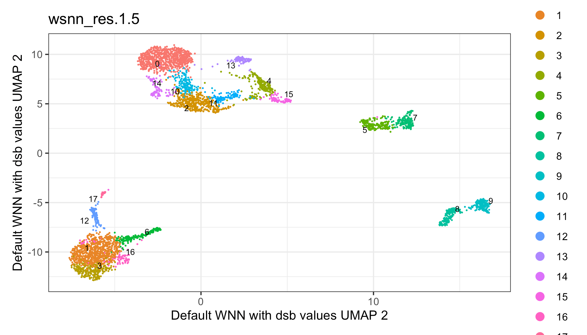

<!-- README.md is generated from README.Rmd. Please edit that file -->

<!-- badges: start -->

[](https://CRAN.R-project.org/package=dsb)
<!-- badges: end -->

# <a href='https://mattpm.github.io/dsb/'></a> dsb: an R package for normalizing and denoising CITE-seq protein data

dsb is available on *CRAN* [latest dsb release on
CRAN](https://CRAN.R-project.org/package=dsb). Install dsb in R with:
`install.packages('dsb')`.

A workflow tutorial is provided below. See the vignette tab on the CRAN
dsb site for full tutorial: [Using dsb to normalize single cell protein
data: analysis workflow and integration with Seurat, Bioconductor and
Scanpy](https://CRAN.R-project.org/package=dsb)

See the
[**preprint**](https://www.biorxiv.org/content/10.1101/2020.02.24.963603v3)
for details on the method and please cite the paper if you use dsb in
your research or found the underlying noise modeling results in our
paper helpful.

## Table of Contents

1.  [Background and motivation](#background_motivation)
2.  [Installation and quick overview](#installation)
3.  [Tutorial with public 10X Genomics data](#tutorial)
4.  [Step 1 Download public data](#step1)
5.  [Step 2 Load RNA and protein alignment (Cell Ranger) data and define
    metadata](#step2)
6.  [Step 3 Quality control on cell-containing and background
    droplets](#step3)
7.  [Step 4 Normalize protein data with the DSBNormalizeProtein
    Function](#step4)
8.  [Integrating dsb with Seurat](#seurat)
9.  [Clustering cells based on dsb normalized protein using
    Seurat](#seurat_clustering)
10. [dsb derived cluster interpretation](#interpretation)
11. [Weighted Nearest Neighbor multimodal clustering using dsb
    normalized values with Seurat](#wnn)
12. [Integrating dsb with Bioconductor](#bioconductor)
13. [Integrating dsb with python/Scanpy](#scanpy)
14. [Using dsb with data lacking isotype controls](#noisotype)
15. [Integrating dsb with sample multiplexing
    experiments](#multiplexing)
16. [Frequently Asked Questions](#faq)

## Background and motivation <a name="background_motivation"></a>

CITE-seq protein data suffers from substantial background noise (for
example, see supplementary fig 5a in [Stoeckius *et. al.* 2017 *Nat.
Methods*](https://static-content.springer.com/esm/art%3A10.1038%2Fnmeth.4380/MediaObjects/41592_2017_BFnmeth4380_MOESM1_ESM.pdf)).
We performed experiments and analysis to dissect protein noise in
CITE-seq data; the dsb method is based on 3 key findings outlined in our
[**preprint**](https://www.biorxiv.org/content/10.1101/2020.02.24.963603v3)

1)  Based on spike in experiments and modeling we found a major source
    of protein background noise comes from ambient, unbound antibody
    encapsulated in droplets.

2)  “Empty” droplets (containing ambient mRNA and antibody but no cell),
    outnumber cell-containing droplets by 10-100 fold and capture the
    *ambient component* of protein background noise.

3)  Cell-to-cell technical variations (i.e. stochastic differences in
    capture, RT efficiency, sequencing depth, and non-specific antibody
    binding) can be estimated and removed through a model of each cell’s
    “technical component” using isotype control counts and per cell
    mixture modeling.

## Installation and quick overview <a name="installation"></a>

Install dsb directly from CRAN using `install.packages('dsb')`.

``` r
install.packages('dsb')
```

Use the `DSBNormalizeProtein()` function to normalize included package
data of a raw protein count matrix `cells_citeseq_mtx` using
background/empty droplet matrix `empty_drop_citeseq_mtx`. Model and
remove the ‘technical component’ of each cell’s protein library by
setting `denoise.counts = TRUE` including isotype controls in
calculating the technical component with `use.isotype.control = TRUE`.

``` r
library(dsb)
adt_norm = DSBNormalizeProtein(
  # cell-containing droplet raw protein count matrix
  cell_protein_matrix = cells_citeseq_mtx, 
  # empty/background droplet raw protein counts
  empty_drop_matrix = empty_drop_citeseq_mtx, 
  
  # recommended step: model + remove the technical component of each cell's protein library
  denoise.counts = TRUE, 
  use.isotype.control = TRUE, 
  isotype.control.name.vec = rownames(cells_citeseq_mtx)[67:70]
  )
```

## Tutorial with public 10X Genomics data <a name="tutorial"></a>

Below we demonstrate dsb using data 10X Genomics data aligned with Cell
Ranger. We define cells and background drops, run QC, normalize protein
with dsb, cluster cells based on dsb normalized protein levels,
interpret clustering results based on dsb values, and finally we use dsb
values directly with Seurat’s Weighted Nearest Neighbor multimodal RNA +
protein clustering algorithm. Wrappers are also provided to integrate
dsb into AnnData (python) and Bioconductor (SingleCellExperiment) data
structures (see table of contents).

## Step 1 Download public data <a name="step1"></a>

Download both the filtered and raw count matrices from Cell Ranger from
this [public 10X Genomics CITE-seq
data](https://support.10xgenomics.com/single-cell-gene-expression/datasets/3.0.2/5k_pbmc_protein_v3_nextgem).

To follow code exactly below without changing paths, download and
uncompress the files ‘Feature / cell matrix (filtered)’ and ‘Feature /
cell matrix (raw)’ which will be automatically renamed
`filtered_feature_bc_matrix` and `raw_feature_bc_matrix` and add them to
a directory `data/` in your working directory.

The **filtered** output is a subset of the raw output that are the cells
estimated by Cell Ranger’s improved cell calling algorithm based on the
[EmptyDrops
algorithm](https://genomebiology.biomedcentral.com/articles/10.1186/s13059-019-1662-y).
One should always set the Cell Ranger `--expect-cells` argument roughly
equal to the estimated cell recovery per lane based on number of cells
loaded in the experiment. The **raw** output is all possible cell
barcodes ranging from 500k-6M barcodes depending on the assay version.
We will filter these barcodes to extract the major background signal.
You can also estimate cells directly from count aligners such as
[CITE-seq-count](https://hoohm.github.io/CITE-seq-Count/) (set the
argument –cells to a value \>2e5 to align background) or
[Kallisto](https://pachterlab.github.io/kallistobustools/).

Your working directory should now be
structured:  
data/  
  |\_filtered\_feature\_bc\_matrix  
  |\_raw\_feature\_bc\_matrix

## Step 2 Load RNA and protein alignment (Cell Ranger) data and define metadata <a name="step2"></a>

Here we use the convenience function from Seurat `Read10X` which will
automatically detect multiple assays and create two element list `Gene
Expression` and `Antibody Capture`.

``` r
# load packages used in this vignette 
suppressMessages(library(dsb))
suppressMessages(library(Seurat))
suppressMessages(library(tidyverse))

# read raw data using the Seurat function "Read10X" 
raw = Seurat::Read10X("data/raw_feature_bc_matrix/")
cells = Seurat::Read10X("data/filtered_feature_bc_matrix/")

# define a vector of cell-containing barcodes and remove them from unfiltered data 
stained_cells = colnames(cells$`Gene Expression`)
background = setdiff(colnames(raw$`Gene Expression`), stained_cells)

# split the data into separate matrices per assay 
prot = raw$`Antibody Capture`
rna = raw$`Gene Expression`

# create metadata of droplet QC stats used in standard scRNAseq processing
rna_size = log10(Matrix::colSums(rna))
prot_size = log10(Matrix::colSums(prot))
ngene = Matrix::colSums(rna > 0)
mtgene = grep(pattern = "^MT-", rownames(rna), value = TRUE)
propmt = Matrix::colSums(rna[mtgene, ]) / Matrix::colSums(rna)
md = as.data.frame(cbind(propmt, rna_size, ngene, prot_size))
md$bc = rownames(md)
md$droplet_class = ifelse(test = md$bc %in% stained_cells, yes = 'cell', no = 'background')

# filter barcodes to only include those with data for both assays 
md = md %>% dplyr::filter(rna_size > 0 & prot_size > 0 )
```

## Step 3 Quality control on cell-containing and background droplets <a name="step3"></a>

The plot below shows the number of detected genes vs the protein library
size for cells vs background drops. One can also define the cells vs
background drops directly by thresholding on a plot like this if using a
different count aligner that does not provide filtered cell output.

``` r
ggplot(md, aes(x = log10(ngene), y = prot_size )) +
  theme_bw() + 
  geom_bin2d(bins = 300) + 
  scale_fill_viridis_c(option = "C") + 
  facet_wrap(~droplet_class) 
```


We next further filter cells based on thresholds calculated from quality
control metrics as in any standard scRNAseq analysis, e.g. see [Luecken
*et. al.* 2019 *Mol Syst
Biol*](https://www.embopress.org/doi/full/10.15252/msb.20188746).

``` r
cellmd = md %>% filter(droplet_class == 'cell')
plot_aes = list(theme_bw(), geom_point(shape = 21 , stroke = 0, size = 0.7), scale_fill_viridis_c(option = "C"))
p1 = ggplot(cellmd, aes(x = rna_size )) + geom_histogram(bins = 50) + theme_bw() + xlab("log10 RNA library size")
p2 = ggplot(cellmd, aes(x = propmt)) + geom_histogram(bins = 50) + theme_bw() + xlab("mitochondrial read proportion")
p3 = ggplot(cellmd, aes(x = log10(ngene), y = rna_size, fill = propmt )) + plot_aes
p4 = ggplot(cellmd, aes(x = ngene, y = prot_size, fill = propmt )) + plot_aes
p1+p2+p3+p4
```

 Note cells with the smaller
library size are mostly naive CD4 T cells which are small in size and
naturally have less mRNA content.

``` r
# calculate statistical thresholds for droplet filtering. 
rna_size_min = median(cellmd$rna_size) - (3*mad(cellmd$rna_size))
rna_size_max = median(cellmd$rna_size) + (3*mad(cellmd$rna_size))
prot_size_min = median(cellmd$prot_size) - (3*mad(cellmd$prot_size))
prot_size_max = median(cellmd$prot_size) + (3*mad(cellmd$prot_size))

# filter rows based on droplet qualty control metrics
positive_cells = cellmd[
    cellmd$prot_size > prot_size_min & 
    cellmd$prot_size < prot_size_max & 
    cellmd$propmt < 0.14 &  
    cellmd$rna_size > rna_size_min & 
    cellmd$rna_size < rna_size_max, ]$bc
cells_mtx_rawprot = as.matrix(prot[ , positive_cells])
```

Sanity check: are the number of cells passing QC in line with the
expected recovery from the experiment?

``` r
length(positive_cells)
```

*\[1\] 4096 *

Yes. After quality control above we have 4096 cells which is in line
with the ~5000 cells loaded in this experiment.

We also filter background droplets to remove potential spurious cells
(drops with high mRNA content) and use the major peak in the background
distribution.

``` r
# define a vector of background droplet barcodes based on protein library size and mRNA content
background_drops = md[md$prot_size > 1.5 & md$prot_size < 3 & md$ngene < 100, ]$bc
negative_mtx_rawprot = as.matrix(prot[ , background_drops])
```

## Optional step; remove proteins without staining

While dsb will handle noisy proteins, some proteins in an experiment may
not work for bioinformatic reasons or may target a very rare cell
population that was absent in the experiment. This is especially true as
panels increase in size. Proteins without counts on the stained cells
should be removed prior to normalization.

``` r
# calculate quantiles of the raw protein matrix 
d1 = data.frame(pmax = apply(cells_mtx_rawprot, 1, max)) %>% 
  rownames_to_column('prot') %>% arrange(pmax) %>% head() 
```

prot pmax  
CD34\_TotalSeqB 4  
CD80\_TotalSeqB 60  
CD274\_TotalSeqB 75  
IgG2b\_control\_TotalSeqB 90  
IgG2a\_control\_TotalSeqB 95  
IgG1\_control\_TotalSeqB 112

In this experiment, the stem cell marker CD34 has essentially no data (a
maximum UMI value of 4 across all cells in the experiment). We therefore
remove it from cell and background matrices. In many cases, removing
proteins is not necessary.

``` r
# remove non staining CD34 protein 
prot_names = rownames(cells_mtx_rawprot)
cells_mtx_rawprot = cells_mtx_rawprot[!prot_names == 'CD34_TotalSeqB', ]
negative_mtx_rawprot = negative_mtx_rawprot[!prot_names == 'CD34_TotalSeqB', ]
```

## Step 4 Normalize protein data with the DSBNormalizeProtein Function <a name="step4"></a>

For data with isotype control proteins, set `denoise.counts = TRUE` and
`use.isotype.control = TRUE` and provide a vector containing names of
isotype control proteins (the rownames of the protein matrix that are
isotype controls). For data without isotype controls, see the vignette
section *Using dsb with data lacking isotype
controls*.

``` r
#normalize protein data for the cell containing droplets with the dsb method. 
dsb_norm_prot = DSBNormalizeProtein(
  cell_protein_matrix = cells_mtx_rawprot, 
  empty_drop_matrix = negative_mtx_rawprot, 
  denoise.counts = TRUE, 
  use.isotype.control = TRUE, 
  isotype.control.name.vec = rownames(cells_mtx_rawprot)[29:31] 
  )
# note: normalization takes ~ 20 seconds
# system.time()
# user  system elapsed 
#  20.799   0.209  21.783 
```

The function returns a matrix of normalized protein values which can be
integrated with any single cell analysis software. We provide an example
with Seurat, Bioconductor and Scanpy below.  
*optional QC step* Denoising can result in very small negative values
for a protein on just a handful of cells which can impact the range of
normalized values returned by dsb. Very negative values correspond to
very low expression and it can be helpful to convert all dsb normalized
values \< -10 to 0 for interpretation / visualization purposes. (see
FAQ). Again this is not always a necessary
step.

``` r
dsb_norm_prot = apply(dsb_norm_prot, 2, function(x){ ifelse(test = x < -10, yes = 0, no = x)}) 
```

## Integrating dsb with Seurat <a name="seurat"></a>

``` r
# filter raw protein, RNA and metadata to only include cell-containing droplets 
cells_rna = rna[ ,positive_cells]
md2 = md[positive_cells, ]

# create Seurat object !note: min.cells is a gene filter, not a cell filter
s = Seurat::CreateSeuratObject(counts = cells_rna, meta.data = md2, 
                               assay = "RNA", min.cells = 20)

# add dsb normalized matrix "dsb_norm_prot" to the "CITE" assay data slot
s[["CITE"]] = Seurat::CreateAssayObject(data = dsb_norm_prot)
```

This object can be used in downstream analysis using Seurat (note the
data should *not* be further normalized with CLR after adding dsb
values).

## Clustering cells based on dsb normalized protein using Seurat <a name="seurat_clustering"></a>

Here we will cluster the cells and annotate them based on dsb normalized
protein levels. This is similar to the workflows used in our paper
[Kotliarov *et. al.* 2020 *Nat.
Medicine*](https://doi.org/10.1038/s41591-020-0769-8). We first run
spectral clustering using Seurat directly on the dsb normalized protein
values **without** reducing dimensionality of the cells x protein matrix
with
PCA.

``` r
# cluster and run umap (based directly on dsb normalized values without istype controls )
prots = rownames(s@assays$CITE@data)[1:28]

s = FindNeighbors(object = s, dims = NULL, assay = 'CITE', 
                  features = prots, k.param = 30, verbose = FALSE)

# direct graph clustering 
s = FindClusters(object = s, resolution = 1, algorithm = 3, graph.name = 'CITE_snn', verbose = FALSE)

# umap for visualization only; (this is optional)
s = RunUMAP(object = s, assay = "CITE", features = prots, seed.use = 1990,
            min.dist = 0.2, n.neighbors = 30, verbose = FALSE)
```

## dsb derived cluster interpretation <a name="interpretation"></a>

A heatmap of average dsb normalized values in each cluster are helpful
for annotating clusters. dsb values are interpretable as the number of
standard deviations of each protein from the expected noise from
reflected by the protein’s distribution in empty droplets, +/- the
residual of the fitted model to the cell-intrinsic technical component.

``` r
# make results dataframe 
d = cbind(s@meta.data, as.data.frame(t(s@assays$CITE@data)), s@reductions$umap@cell.embeddings)

# calculate the median protein expression separately for each cluster 
adt_plot = d %>% 
  dplyr::group_by(CITE_snn_res.1) %>% 
  dplyr::summarize_at(.vars = prots, .funs = median) %>% 
  tibble::remove_rownames() %>% 
  tibble::column_to_rownames("CITE_snn_res.1") 

# plot a heatmap of the average dsb normalized values for each cluster
pheatmap::pheatmap(t(adt_plot), 
                   color = viridis::viridis(25, option = "B"), 
                   fontsize_row = 8, border_color = NA)
```


Annotate cell type based on median dsb normalized protein level per
cluster.

``` r
clusters = c(0:13)
celltype = c("CD4_Tcell_Memory", # 0 
              "CD14_Monocytes", #1
              "CD14_Monocytes_Activated", #2
              "CD4_Naive_Tcell", #3
              "B_Cells", #4
              "NK_Cells", #5
              "CD4_Naive_Tcell_CD62L+", #6
              "CD8_Memory_Tcell", #7
              "DC", #8
              "CD8_Naive_Tcell", #9
              "CD4_Effector", #10
              "CD16_Monocyte", #11
              "DOUBLETS", #12
              "DoubleNegative_Tcell" #13
              )
s@meta.data$celltype = plyr::mapvalues(x = s@meta.data$CITE_snn_res.1, from = clusters, to = celltype)

# plot 
Seurat::DimPlot(s, reduction = 'umap', group.by = 'celltype',
              label = TRUE, repel = TRUE, label.size = 2.5, pt.size = 0.1) + 
  theme_bw() + NoLegend() + ggtitle('dsb normalized protein')
```



## Weighted Nearest Neighbor multimodal clustering using dsb normalized values with Seurat <a name="wnn"></a>

Below we demonstrate using Seurat’s weighted nearest neighbors
multimodal clustering method with dsb normalized values as input for the
protein assay. The performance of this algorithm is better on larger
datasets but we demonstrate here on this small dataset as an example.

Of note, the default recommendation of the WNN method is to first
compress both the ADT and mRNA data into principal components. For a
dataset with a smaller number of proteins, we have found that just using
the dsb normalized cells x protein directly rather than compressing the
ADT data into principal components can improve the resulting clusters
and interpretation of the joint embedding. Datasets generated with
recently available pre-titrated panels consisting of more than 100 or
200 proteins may benefit more from dimensionality reduction with PCA.

Below, examples are provided for using both the dsb normalized protein
values directly as well as the dsb normalized values compressed into
principal components (the default WNN method). Again, this algorithm is
more powerful on datasets with a greater number of cells.

``` r
# use pearson residuals as normalized values for pca 
DefaultAssay(s) = "RNA"
s = NormalizeData(s, verbose = FALSE) %>% 
  FindVariableFeatures(selection.method = 'vst', verbose = FALSE) %>% 
  ScaleData(verbose = FALSE) %>%
  RunPCA(verbose = FALSE)

# set up dsb values to use in WNN analysis 
DefaultAssay(s) = "CITE"
# hack seurat to use normalized protein values as a dimensionality reduction object.
VariableFeatures(s) = prots

# run true pca to initialize dr pca slot for WNN 
s = ScaleData(s, assay = 'CITE', verbose = FALSE)
s = RunPCA(s, reduction.name = 'pdsb', features = VariableFeatures(s), verbose = FALSE)

# make matrix of norm values to add as dr embeddings
pseudo = t(s@assays$CITE@data)[,1:29]
pseudo_colnames = paste('pseudo', 1:29, sep = "_")
colnames(pseudo) = pseudo_colnames
# add to object 
s@reductions$pdsb@cell.embeddings = pseudo

# run WNN 
s = FindMultiModalNeighbors(
  object = s,
  reduction.list = list("pca", "pdsb"),
  weighted.nn.name = "dsb_wnn", 
  knn.graph.name = "dsb_knn",
  modality.weight.name = "dsb_weight",
  snn.graph.name = "dsb_snn",
  dims.list = list(1:30, 1:29), 
  verbose = FALSE
)

s = FindClusters(s, graph.name = "dsb_knn", algorithm = 3, resolution = 1.5,
                 random.seed = 1990,  verbose = FALSE)
s = RunUMAP(s, nn.name = "dsb_wnn", reduction.name = "dsb_wnn_umap", 
            reduction.key = "dsb_wnnUMAP_", seed.use = 1990, verbose = FALSE)

# plot 
p1 = Seurat::DimPlot(s, reduction = 'dsb_wnn_umap', group.by = 'dsb_knn_res.1.5',
              label = TRUE, repel = TRUE, label.size = 2.5, pt.size = 0.1) + 
  theme_bw() + 
  xlab('dsb protein RNA multimodal UMAP 1') + 
  ylab('dsb protein RNA multimodal UMAP 2') + 
  ggtitle('WNN using dsb normalized protein values')

p1
```



Visualize the results with a heatmap of mRNA and protein.

``` r
# create multimodal heatmap 
vf = VariableFeatures(s,assay = "RNA")

Idents(s) = "dsb_knn_res.1.5"
DefaultAssay(s)  = "RNA"
rnade = FindAllMarkers(s, features = vf, only.pos = TRUE)
gene_plot = rnade %>% filter(avg_log2FC > 1 ) %>%  group_by(cluster) %>% top_n(3) %$% gene %>% unique 

s@meta.data$celltype_subcluster = paste(s@meta.data$celltype, s@meta.data$dsb_knn_res.1.5)

d = cbind(s@meta.data, 
          # protein 
          as.data.frame(t(s@assays$CITE@data)), 
          # mRNA
          as.data.frame(t(as.matrix(s@assays$RNA@data[gene_plot, ]))),
          s@reductions$umap@cell.embeddings)

# combined data 
adt_plot = d %>% 
  dplyr::group_by(dsb_knn_res.1.5) %>% 
  dplyr::summarize_at(.vars = c(prots, gene_plot), .funs = median) %>% 
  tibble::remove_rownames() %>% 
  tibble::column_to_rownames("dsb_knn_res.1.5") 


# make a combined plot 
suppressMessages(library(ComplexHeatmap))
# protein heatmap 
prot_col = circlize::colorRamp2(breaks = seq(-10,30, by = 2), colors = viridis::viridis(n = 18, option = "B", end = 0.95))
p1 = Heatmap(t(adt_plot)[prots, ], name = "protein",col = prot_col, use_raster = T,
             row_names_gp = gpar(color = "black", fontsize = 5))

# mRNA heatmap 
mrna = t(adt_plot)[gene_plot, ]
rna_col = circlize::colorRamp2(breaks = c(-2,-1,0,1,2), colors = colorspace::diverge_hsv(n = 5))
p2 = Heatmap(t(scale(t(mrna))), name = "mRNA", col = rna_col, use_raster = T, 
             clustering_method_columns = 'average',
             column_names_gp = gpar(color = "black", fontsize = 7), 
             row_names_gp = gpar(color = "black", fontsize = 5))

ht_list = p1 %v% p2
draw(ht_list)
```

 One can also use the
default implementation of Seurat’s WNN analysis with principal
components based dsb normalized values as input.

``` r
# use pearson residuals as normalized values for pca 
DefaultAssay(s) = "RNA"
s = NormalizeData(s, verbose = FALSE) %>% 
  FindVariableFeatures(selection.method = 'vst', verbose = FALSE) %>% 
  ScaleData(verbose = FALSE) %>%
  RunPCA(verbose = FALSE)

# set up dsb values to use in WNN analysis (do not normalize with CLR, use dsb normalized values)
DefaultAssay(s) = "CITE"
VariableFeatures(s) = prots
s = s %>% ScaleData() %>% RunPCA(reduction.name = 'apca')

# run WNN 
s = FindMultiModalNeighbors(
  s, reduction.list = list("pca", "apca"), 
  dims.list = list(1:30, 1:18), 
  modality.weight.name = "RNA.weight"
)

# cluster 
s <- RunUMAP(s, nn.name = "weighted.nn", reduction.name = "wnn.umap", reduction.key = "wnnUMAP_")
s <- FindClusters(s, graph.name = "wsnn", algorithm = 3, resolution = 1.5, verbose = FALSE, random.seed = 1990)

p1 = Seurat::DimPlot(s, reduction = 'wnn.umap', group.by = 'wsnn_res.1.5',
              label = TRUE, repel = TRUE, label.size = 2.5, pt.size = 0.1) + 
  theme_bw() + 
  xlab('Default WNN with dsb values UMAP 1') + 
  ylab('Default WNN with dsb values UMAP 2') 
  
p1
```



See Vignettes for additional topics:  
**Integrating dsb with Bioconductor**  
**Integrating dsb with python/Scanpy**  
**Using dsb with data lacking isotype controls**  
**Integrating dsb with sample multiplexing experiments** **dsb step by
step detailed demonstration** **outlier handling with quantile
clipping** **returning internal stats used by dsb** **Frequently Asked
Questions**
