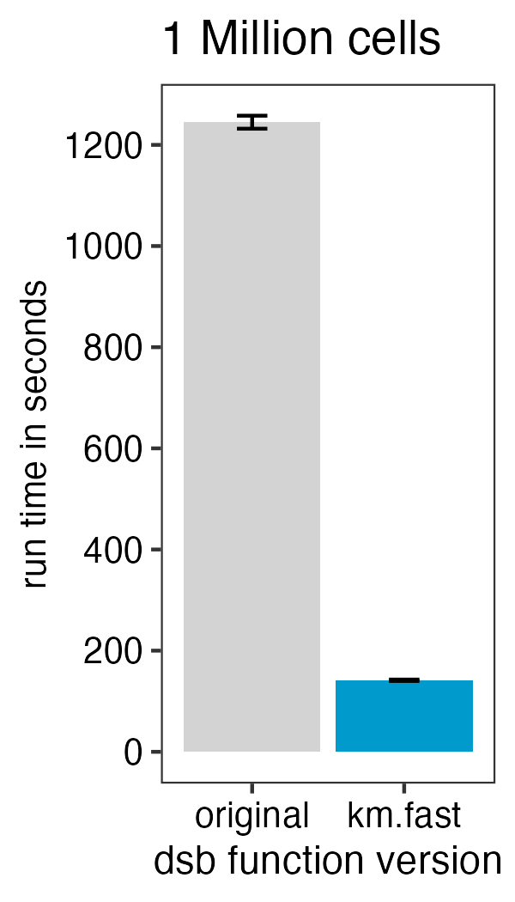
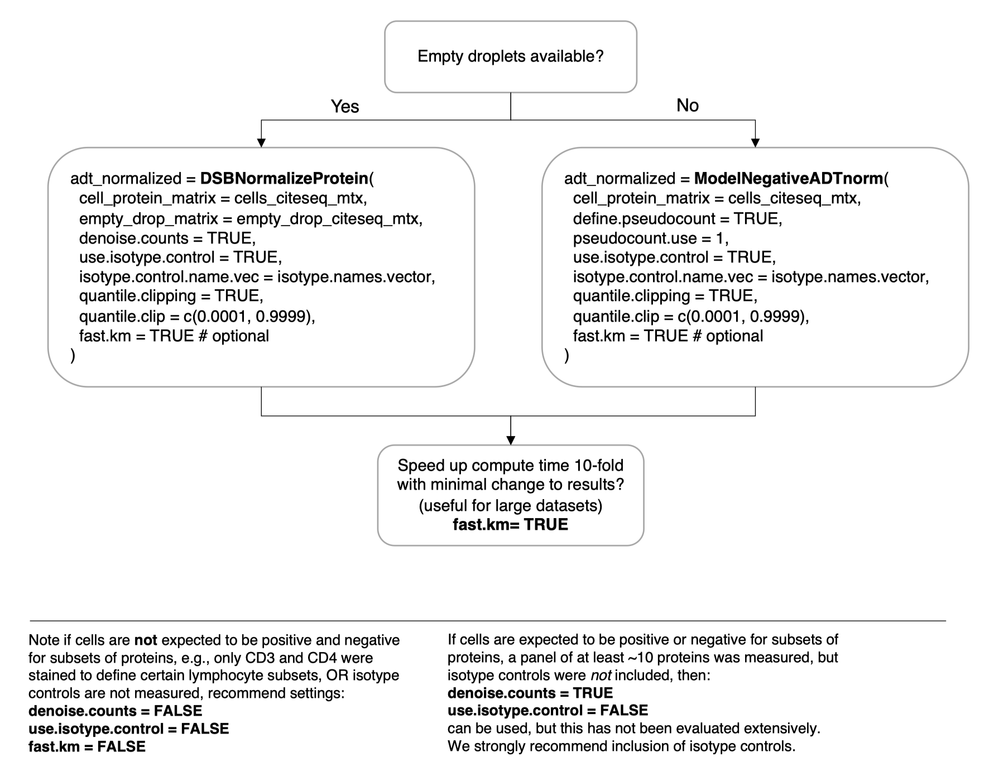

<!-- README.md is generated from README.Rmd. Please edit that file -->
<!-- badges: start -->

[](https://CRAN.R-project.org/package=dsb)
<!-- badges: end -->

# <a href='https://CRAN.R-project.org/package=dsb/'></a> dsb: Normalize and denoise antibody-derived-tag data from CITE-seq, ASAP-seq, TEA-seq and related assays.

The dsb R package is available on [**CRAN: latest dsb
release**](https://CRAN.R-project.org/package=dsb)  
To install in R use `install.packages('dsb')` <br>

[**Mulè, Martins, and Tsang, Nature Communications
(2022)**](https://www.nature.com/articles/s41467-022-29356-8) describes
our deconvolution of ADT noise sources and development of dsb. <br>

#### Vignettes:

1.  [**Using dsb in an end-to-end CITE-seq
    workflow**](https://CRAN.R-project.org/package=dsb/vignettes/end_to_end_workflow.html)  
2.  [**Using dsb if empty drops are not
    available**](https://CRAN.R-project.org/package=dsb/vignettes/no_empty_drops.html)  
3.  [**How the dsb method
    works**](https://CRAN.R-project.org/package=dsb/vignettes/understanding_dsb.html)  
4.  [**Using the dsb method in
    Python**](https://muon.readthedocs.io/en/latest/omics/citeseq.html)  
5.  [**Frequently Asked
    Questions**](https://CRAN.R-project.org/package=dsb/vignettes/additional_topics.html)
    <br>

See notes on [**upstream processing before dsb**](#otheraligners)

[**Recent Publications**](#pubications) Check out recent publications
that used dsb for ADT normalization.

The functions in this package return standard R matrix objects that can
be added to any data container like a `SingleCellExperiment`, `Seurat`,
or `AnnData` related python objects.

## Background and motivation <a name="background_motivation"></a>

[**Our paper**](https://www.nature.com/articles/s41467-022-29356-8)
combined experiments and computational approaches to find ADT protein
data from CITE-seq and related assays are affected by substantial
background noise. We observed that ADT reads from empty droplets—often
more than tenfold the number of cell-containing droplets—closely match
levels in unstained spike-in cells, and can also serve as a readout of
protein-specific ambient noise. We also remove cell-to-cell technical
variation by estimating a conservative adjustment factor derived from
isotype control levels and per cell background derived from a per cell
mixture model. The 2.0 release of dsb includes faster compute times and
functions for normalization on datasets without empty drops.

## Installation and quick overview <a name="installation"></a>

The default method is carried out in a single step with a call to the
`DSBNormalizeProtein()` function.  
`cells_citeseq_mtx` - a raw ADT count matrix `empty_drop_citeseq_mtx` -
a raw ADT count matrix from non-cell containing empty / background
droplets.  
`denoise.counts = TRUE` - define and remove the ‘technical component’ of
each cell’s protein library.  
`use.isotype.control = TRUE` - include isotype controls in the modeled
dsb technical component.

``` r
# install.packages('dsb')
library(dsb)

isotype.names = c("MouseIgG1kappaisotype_PROT", "MouseIgG2akappaisotype_PROT", 
                  "Mouse IgG2bkIsotype_PROT", "RatIgG2bkIsotype_PROT")

adt_norm = DSBNormalizeProtein(
  cell_protein_matrix = cells_citeseq_mtx, 
  empty_drop_matrix = empty_drop_citeseq_mtx, 
  denoise.counts = TRUE, 
  use.isotype.control = TRUE, 
  isotype.control.name.vec = isotype.names, 
  fast.km = TRUE # optional
  )
```

## Datasets without empty drops

Not all datasets have empty droplets available, for example those
downloaded from online repositories where only processed data are
included. We provide a method to approximate the background distribution
of proteins based on data from cells alone. Please see the vignette
[Normalizing ADTs if empty drops are not
available](https://CRAN.R-project.org/package=dsb/vignettes/no_empty_drops.html)
for more details.

``` r
adt_norm = ModelNegativeADTnorm(
  cell_protein_matrix = cells_citeseq_mtx, 
  denoise.counts = TRUE, 
  use.isotype.control = TRUE, 
  isotype.control.name.vec = isotype.names, 
  fast.km = TRUE # optional
  )
```

## 10-fold faster compute time with dsb 2.0

To speed up the function 10-fold with minimal impact on the results from
those in the default function set `fast.km = TRUE` with either the
`DSBNormalizeProtein` or `ModelNegativeADTnorm` functions. See the new
vignette on this topic.



## What settings should I use?

See the simple visual guide below. Please search the resolved issues on
github for questions or open a new issue if your use case has not been
addressed.



### Upstream read alignment to generate raw ADT files prior to dsb <a name="otheraligners"></a>

Any alignment software can be used prior to normalization with dsb. To
use the `DSBNormalizeProtein` function described in the manuscript, you
need to define cells and empty droplets from the alignment files. Any
alignment pipeline can be used. Some examples guides below:

#### Cell Ranger

See the [“end to end”
vignette](https://CRAN.R-project.org/package=dsb/vignettes/end_to_end_workflow.html)
for information on defining cells and background droplets from the
output files created from Cell Ranger as in the schematic below.  
Please note *whether or not you use dsb*, to define cells using the
`filtered_feature_bc_matrix` file from Cell Ranger, you need to properly
set the `--expect-cells` argument to roughly your estimated cell
recovery per lane based on how many cells you loaded. see [the note from
10X about
this](https://support.10xgenomics.com/single-cell-gene-expression/software/pipelines/latest/algorithms/overview#cell_calling).
The default value of 3000 is likely not suited to most modern
experiments.

``` bash
# Cell Ranger alignment
cellranger count --id=sampleid\
--transcriptome=transcriptome_path\
--fastqs=fastq_path\
--sample=mysample\
--expect-cells=10000\  
```

See end to end vignette for detailed information on using Cell Ranger
output.  


#### CITE-seq-Count

Important: set the `-cells` argument in `CITE-seq-Count` to ~ 200000.
This aligns the top 200000 barcodes per lane by ADT library size.  
[CITE-seq-count
documentation](https://hoohm.github.io/CITE-seq-Count/Running-the-script/)

``` bash
# CITE-seq-Count alignment
CITE-seq-Count -R1 TAGS_R1.fastq.gz  -R2 TAGS_R2.fastq.gz \
 -t TAG_LIST.csv -cbf X1 -cbl X2 -umif Y1 -umil Y2 \
  -cells 200000 -o OUTFOLDER
```

#### Alevin

I recommend following the comprehensive tutorials by Tommy Tang for
using Alevin, DropletUtils and dsb for CITE-seq normalization.  
[ADT alignment with
Alevin](https://divingintogeneticsandgenomics.com/post/how-to-use-salmon-alevin-to-preprocess-cite-seq-data/)  
[DropletUtils and dsb from Alevin
output](https://divingintogeneticsandgenomics.com/post/part-4-cite-seq-normalization-using-empty-droplets-with-the-dsb-package/)  
[Alevin
documentation](https://salmon.readthedocs.io/en/latest/alevin.html)

#### Kallisto bustools pseudoalignment

I recommend checking out the tutorials and example code below to
understand how to use kallisto bustools outputs with dsb.  
[kallisto bustools tutorial by Sarah
Ennis](https://github.com/Sarah145/scRNA_pre_process)  
[dsb normalization using kallisto outputs by Terkild Brink
Buus](https://github.com/Terkild/CITE-seq_optimization/blob/master/Demux_Preprocess_Downsample.md)  
[kallisto bustools
documentation](https://www.kallistobus.tools/tutorials/kb_kite/python/kb_kite/)

Example script

``` bash
kb count -i index_file -g gtf_file.t2g -x 10xv3 \
-t n_cores  -o output_dir \
input.R1.fastq.gz input.R2.fastq.gz
```

After alignment define cells and background droplets empirically with
protein and mRNA based thresholding as outlined in the main tutorial.

### Selected publications using dsb <a name="pubications"></a>

From other groups <br> [Singhaviranon *Nature Immunology*
2025](https://doi.org/10.1038/s41590-024-02044-z) <br> [Yayo *Nature*
2024](https://doi.org/10.1038/s41586-024-07944-6) <br> [Izzo et
al. *Nature* 2024](https://doi.org/10.1038/s41586-024-07388-y) <br>
[Arieta et al. *Cell* 2023](https://doi.org/10.1016/j.cell.2023.04.007)
<br> [Magen et al. *Nature Medicine*
2023](https://doi.org/10.1038/s41591-023-02345-0) <br> [COMBAT
consortium *Cell* 2021](https://doi.org/10.1016/j.cell.2022.01.012) <br>
[Jardine et al. *Nature*
2021](https://doi.org/10.1038/s41586-021-03929-x) <br> [Mimitou et
al. *Nature Biotechnology*
2021](https://doi.org/10.1038/s41587-021-00927-2) <br>

From the Tsang lab <br> [Mulè et al. *Immunity*
2024](https://mattpm.net/man/pdf/natural_adjuvant_immunity_2024.pdf)
<br> [Sparks et al. *Nature*
2023](https://doi.org/10.1038/s41586-022-05670-5) <br> [Liu et
al. *Cell* 2021](https://doi.org/10.1016/j.cell.2021.02.018) <br>
[Kotliarov et al. *Nature Medicine*
2020](https://doi.org/10.1038/s41591-020-0769-8) <br>

**Topics covered in other vignettes on CRAN**  
Integrating dsb with Bioconductor, integrating dsb with python/Scanpy  
Using dsb with data lacking isotype controls  
integrating dsb with sample multiplexing experiments  
using dsb on data with multiple batches  
using a different scale / standardization based on empty droplet
levels  
Returning internal stats used by dsb  
outlier clipping with the quantile.clipping argument  
other FAQ
