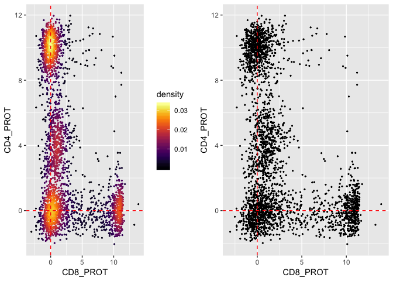

<!-- README.md is generated from README.Rmd. Please edit that file -->

# dsb

## An R package for normalizing and denoising CITEseq data

<!-- badges: start -->

<!-- badges: end -->

This package was developed at [John Tsang’s
Lab](https://www.niaid.nih.gov/research/john-tsang-phd) by Matt Mulè and
Andrew Martins. The package implements our normalization and denoising
method for CITEseq data. Technical discussion of how the method works
can be found in [the biorxiv preprint](https://biorxiv.org) We utilized
the dsb package to normalize CITEseq data reported in this paper
[](https://)

In [the biorxiv preprint](https://biorxiv.org), comparing unstained
control cells and empty droplets we found the major contribotor to
background noise in CITEseq data is unbound antibody captured and
sequenced in droplets. DSB corrects for this background by leveraging
empty droplets which serve as a “built in” noise measurement in any
droplet capture single cell platform (e.g. 10X, dropseq, indrop).

In addition we define a per-cell denoising covariate to account for the
technical component of library size differences between cells which
removes spurious cluster formation derived from globally dimcells
clustering together.

## installation

You can install the released version of dsb in your R session with the
command
below

``` r
# this is analagous to install.packages("package), you need the package devtools to install a package from a github repository like this one. 
require(devtools)
#> Loading required package: devtools
#devtools::install_github(repo = 'MattPM/dsb')
```

## quickstart

``` r
# load package and normalize the example raw data 
library(dsb)


# normalize
normalized_matrix = DSBNormalizeProtein(cell_protein_matrix = cells_citeseq_mtx,
                                        empty_drop_matrix = empty_drop_citeseq_mtx)
```

## The full version (recommended)

By default dsb defines the per cell denoising covariate by fitting a
gaussian mixture model to the log + 10 counts of each cell and defining
the noise ocvariates the mean. We reccomend including the counts from
isotype controls in each cell in the denoising covariates.

``` r

# get the empty cells from demultiplexing with 


# define a vector of the isotype controls in the data 
isotypes = c("Mouse IgG2bkIsotype_PROT", "MouseIgG1kappaisotype_PROT","MouseIgG2akappaisotype_PROT", "RatIgG2bkIsotype_PROT")

normalized_matrix = DSBNormalizeProtein(cell_protein_matrix = cells_citeseq_mtx,
                                        empty_drop_matrix = empty_drop_citeseq_mtx,
                                        use.isotype.control = TRUE,
                                        isotype.control.name.vec = isotypes)
```

# visualize distributions of CD4 and CD8

plot the DSB normalized CITEseq data.

**Note, there is NO jitter added to these points for visualization these
are the unmodified normalized
counts**

``` r
# plot this and avoid plotting by adding a density gradient on the points <-  this is helpful when there are many thousands of cells. 
# this density function is from this blog post: https://slowkow.com/notes/ggplot2-color-by-density/
get_density = function(x, y, ...) {
  dens <- MASS::kde2d(x, y, ...)
  ix <- findInterval(x, dens$x)
  iy <- findInterval(y, dens$y)
  ii <- cbind(ix, iy)
  return(dens$z[ii])
}

library(ggplot2)
data.plot = normalized_matrix %>% t %>%
  as.data.frame() %>% 
  dplyr::select(CD4_PROT, CD8_PROT) 
data.plot = data.plot %>%   dplyr::mutate(density = get_density(data.plot$CD4_PROT, data.plot$CD8_PROT, n = 100)) 

# plot with and without density gradient
p1 = ggplot(data.plot, aes(x = CD8_PROT, y = CD4_PROT, color = density)) +
  geom_point(size = 0.4) +
  geom_vline(xintercept = 0, color = "red", linetype = 2) + 
  geom_hline(yintercept = 0, color = "red", linetype = 2) + 
  viridis::scale_color_viridis(option = "B") +  
  scale_shape_identity() 
p2 = ggplot(data.plot, aes(x = CD8_PROT, y = CD4_PROT)) +
  geom_point(size = 0.4) +
  geom_vline(xintercept = 0, color = "red", linetype = 2) + 
  geom_hline(yintercept = 0, color = "red", linetype = 2) 

cowplot::plot_grid(p1,p2)
```



The plots above show the actual protein distributions. There is no
artificial jitter added to points.

\#How do I get the empty droplets?

there are a number of ways to get the empty drops. If you are using cell
hashing, when you demultiplex the cells, you get a vector of empty or
Negative droplets.

HTODemux function in Seurat:
<https://satijalab.org/seurat/v3.1/hashing_vignette.html>

deMULTIplex function from Multiseq (this is now also implemented in
Seurat). <https://github.com/chris-mcginnis-ucsf/MULTI-seq>

If you’re not multiplexing you can simply get a vector of negative
droplets from the cells you would remove.
<https://genomebiology.biomedcentral.com/articles/10.1186/s13059-019-1662-y>

## Simple example workflow (Seurat Version 3)

``` r

# get the ADT counts using Seurat version 3 
seurat_object = HTODemux(seurat_object, assay = "HTO", positive.quantile = 0.99)
Idents(seurat_object) = "HTO_classification.global"
neg_object = subset(seurat_object, idents = "Negative")
singlet_object = subset(seurat_object, idents = "Singlet")


# non sparse CITEseq data actually store better in a regular materix so the as.matrix() call is not memory intensive.
neg_adt_matrix = GetAssayData(neg_object, assay = "CITE", slot = 'raw.data') %>% as.matrix()
positive_adt_matrix = GetAssayData(singlet_object, assay = "CITE", slot = 'raw.data') %>% as.matrix()


# normalize the data with dsb
# make sure you've run devtools::install_github(repo = 'MattPM/dsb')
normalized_matrix = DSBNormalizeProtein(cell_protein_matrix = positive_adt_matrix,
                                        empty_drop_matrix = neg_adt_matrix)


# now add the normalized dat back to the object (the singlets defined above as "object")
singlet_object = SetAssayData(object = singlet_object, slot = "CITE", new.data = normalized_matrix)
```

In reality you might want to confirm the cells called as “Negative” have
low RNA / gene content to be certain there are no contaminating cells.

Also it is not necessary but we reccomend demultiplexing with teh raw
output from cellranger rather than the processed output because the raw
(i.e. outs/raw\_feature\_bc\_matrix) will have more empty droplets from
which the HTODemux function will be able to estimate the negative
population = it is not required but in general these functions perform
better with more negative droplets. This will also have the advantage of
creating more droplets to use as built protein background controls in
the DSB function.

## example workflow Seurat version 2

``` r

# get the ADT counts using Seurat version 3 
seurat_object = HTODemux(seurat_object, assay = "HTO", positive.quantile = 0.99)

neg = seurat_object %>%
  SetAllIdent(id = "hto_classification_global") %>% 
  SubsetData(ident.use = "Negative") 

singlet = seurat_object %>%
  SetAllIdent(id = "hto_classification_global") %>% 
  SubsetData(ident.use = "Singlet") 

# get negative and positive ADT data 
neg_adt_matrix = neg@assay$CITE@raw.data %>% as.matrix()
pos_adt_matrix = singlet@assay$CITE@raw.data %>% as.matrix()


# normalize the data with dsb
# make sure you've run devtools::install_github(repo = 'MattPM/dsb')
normalized_matrix = DSBNormalizeProtein(cell_protein_matrix = pos_adt_matrix,
                                        empty_drop_matrix = neg_adt_matrix)


# add the assay to the Seurat object 
singlet = SetAssayData(object = singlet, slot = "CITE", new.data = normalized_matrix)
```

## Get empty drops if you’re not sample multiplexing

you can simply get a vector of negative droplets from the cells you
would remove. There are also more robust ways to detect empty droplets
<https://genomebiology.biomedcentral.com/articles/10.1186/s13059-019-1662-y>

here is a crude way to get some likely empty droplets assuming
seurat\_object is a object with most cells (i.e. any cell expressing at
least a gene)

``` r
# get the nUMI from a seurat version 3 object 
umi = seurat_object$nUMI

#  Get the nUMI from a Seurat version 2 objec 
umi = seurat_object@meta.data %>% select("nUMI")
mu_umi = mean(umi)
sd_umi = sd(umi)

# calculate a threshold for calling a cell negative 
sub_threshold = mu_umi - (2*sd_umi)


Idents(seurat_object) = "nUMI"


# this negative cell object can be used to define the negative background following the examples above. 
neg = subset(seurat_object, accept.high = sub_threshold)
```
