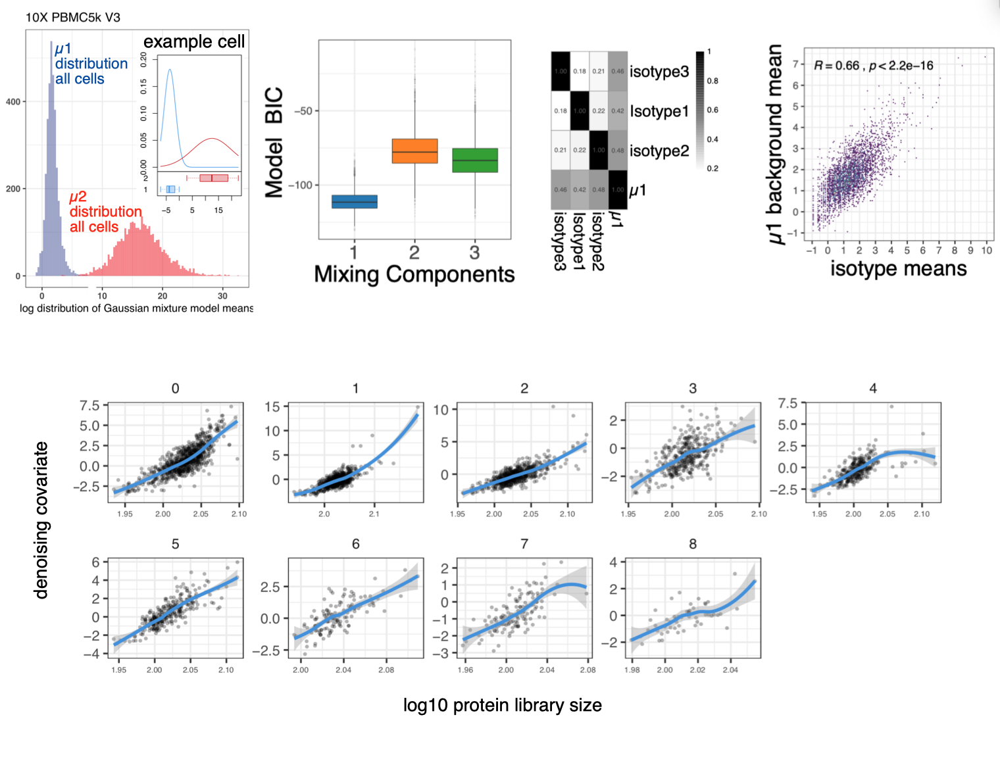

<!-- README.md is generated from README.Rmd. Please edit that file -->

# dsb : an R package for normalizing and denoising CITEseq protein data <a href='https://mattpm.github.io/dsb'></a>

Package maintainer: Matt Mulè  
Package hosted by: National Institutes of Allergy and Infectious
Diseases,
NIH

<!-- badges: start -->

<!-- [](https://travis-ci.org/MattPM/dsb) -->

<!-- badges: end -->

dsb (*d*enoised and *s*caled by *b*ackground) is a lightweight R package
for normalizing and denoising protein expression data from CITE-seq. The
dsb package was developed in [John Tsang’s Lab at the
NIH-NIAID](https://www.niaid.nih.gov/research/john-tsang-phd) by Matt
Mulè, Andrew Martins and John Tsang. If you use dsb or find the noise
modeling results in our paper useful in your research please consider
citing the preprint below.

[our biorxiv
preprint](https://www.biorxiv.org/content/10.1101/2020.02.24.963603v1.full.pdf)
provides details of the dsb method.  
[our Nature Medicine paper](https://doi.org/10.1038/s41591-020-0769-8)
shows the utility of dsb normalized values for CITE-seq clustering,
modeling and visualization

The method is implemented through a single function call to
DSBNormalizeProtein which operates on 2 matrices of raw protein counts:
cells x protein and empty/background droplets x protein. Our method is
based on experiments and analysis of several datasets including control
experiments designed to interrogate the source of background noise in
CITE-seq experiments in which we discovered:

1)  a major source of protein-specific noise in CITE-seq data originates
    from ambient, unbound antibody encapsulated in droplets, which we
    correct for by estimating the expected protein counts detected in
    empty droplets.

2)  cell-to-cell technical noise can be estimated and removed via the
    shared variance component associated with isotype antibody controls
    and background protein counts in each cell.

Below we outline the DSB method starting from raw Cell Ranger output
from a public 10X CITE-seq dataset. We estimate empty/background and
cell-containing droplets, and normalize protein with the
DSBNormalizeProtein function which returns a normalized protein data
that can be integrated with *any single cell analysis software*. We also
show a suggested workflow for protein based clustering directly on DSB
Normalized values, dimensionality reduction, and visualization using R
and
Seurat.

<a href='https://mattpm.github.io/dsb'></a>

## Installation and quick overview with pre-loaded package data

<a href='https://mattpm.github.io/dsb'></a>

``` r
# install dsb package directly from github: 
require(devtools); devtools::install_github(repo = 'MattPM/dsb')
library(dsb)

# define isotype controls 
isotypes = rownames(cells_citeseq_mtx)[67:70]
# cells_citeseq_mtx = cells with raw protein counts (loaded with dsb)
# empty_drop_citeseq_mtx = empty/background droplets with raw protein counts(loaded with dsb)

adt_norm = DSBNormalizeProtein(
  # Input = two raw CITE-seq protein count matrices 1) cell-containing droplets, 2) empty droplets
  cell_protein_matrix = cells_citeseq_mtx,
  empty_drop_matrix = empty_drop_citeseq_mtx, 
  
  # Step II arguments 
  denoise.counts = TRUE, # Recommended - denoise each cell's background rescaled values from step I above
  use.isotype.control = TRUE, # whether to utilize isotype controls to define the denoising covariate (highly recommended)
  isotype.control.name.vec = isotypes # a vector with names of isotype control proteins (see above) 
  )
```

## Tutorial Step I: DSB normalize CITE-seq protein data starting from *RAW* cell ranger output

Below, raw protein UMI counts for empty droplets and cells are estimated
using the protein and mRNA library size distributions directly from the
cell ranger (raw) output. These are used as above to normalize the
protein data for cells using the dsb package. Normalized protein data
and raw RNA data can then be used to create a Seurat object,
Bioconductor’s SingleCellExperiment object, or an AnnData object in
python for downstream analysis.

To follow this example download **RAW (not filtered\!)** **feature /
cellmatrix raw** public 10X CITE-seq data from here:
<https://support.10xgenomics.com/single-cell-gene-expression/datasets/3.0.2/5k_pbmc_protein_v3>.
The steps below use R 3.6 and Seurat version 3.

``` r
library(Seurat)
library(tidyverse)
library(dsb)

# read raw data using the Seurat function "Read10X"
raw = Read10X("data/10x_data/10x_pbmc5k_V3/raw_feature_bc_matrix/")

# Define separate RNA and protein sparse matrix  
prot = raw$`Antibody Capture`
rna = raw$`Gene Expression`

# calculate metadata 
rna_size = log10(Matrix::colSums(rna))
prot_size = log10(Matrix::colSums(prot))
ngene = Matrix::colSums(rna > 0)
mtgene = grep(pattern = "^MT-", rownames(rna), value = TRUE)
propmt = Matrix::colSums(rna[mtgene, ]) / Matrix::colSums(rna)
md = as.data.frame(cbind(propmt, rna_size, ngene, prot_size))
md$bc = rownames(md)

# histogram to estimate cells and background-cells are a tiny fraction of drops with log 10 protien lib size > 3
hist(md$log10umiprot[md$log10umiprot < 5], breaks = 100)

# define a vector of background / empty droplet barcodes based on protein library size and mRNA content  
background_drops = md[md$prot_size < 2.5 & md$prot_size > 1.4 & md$ngene < 80, ]$bc
negative_mtx_rawprot = prot[ , background_drops] %>%  as.matrix()

# define a vector of cell-containing droplet barcodes based on protein library size and mRNA content 
positive_cells = md[md$prot_size > 2.8 & md$ngene < 3000 & md$ngene > 200 & propmt <0.2, ]$bc
cells_mtx_rawprot = prot[ , positive_cells] %>% as.matrix()
  
#normalize protein data for the cell containing droplets with the dsb method. 
isotypes = rownames(pos_prot)[30:32]
dsb_norm_prot = DSBNormalizeProtein(
                           cell_protein_matrix = cells_mtx_rawprot,
                           empty_drop_matrix = negative_mtx_rawprot,
                           denoise.counts = TRUE,
                           use.isotype.control = TRUE,
                           isotype.control.name.vec = isotypes
                           )
```

The DSB normalized protein matrix can be integrated with any single cell
analysis software, we provide an example with Seurat
below.

## Step II: integration with Seurat

``` r
# Create Seurat object filter raw protein, RNA and metadata to only include cell-containing droplets 
count_rna = raw$`Gene Expression`[ ,positive_cells]
count_prot = raw$`Antibody Capture`[ ,positive_cells]

md = md %>% 
  rownames_to_column("bc") %>% 
  filter(bc %in% positive_cells) %>% 
  column_to_rownames('bc')

# create Seurat object * note min.cells ins a gene filter not a cell filter, we alerady filtered cells in steps above
s = CreateSeuratObject(counts = count_rna, meta.data = md, assay = "RNA", min.cells = 20)

# add DSB normalized "dsb_norm_prot" protein data to the seurat object 
s[["CITE"]] = CreateAssayObject(data = dsb_norm_prot)
```

## Suggested Step III: Protein based clustering + cluster annotation

  - This is similar to the workflow used in our paper
    <https://www.nature.com/articles/s41591-020-0769-8> where we
    analyzed mRNA states *within* the interpretable clusters defined by
    clustering on DSB normalized protein data (see next
section).

<!-- end list -->

``` r
# define Euclidean distance matrix on dsb normalized protein data (without isotype controls)
dsb = s@assays$CITE@data[1:29, ]
p_dist = dist(t(dsb))
p_dist = as.matrix(p_dist)

# Cluster using Seurat 
s[["p_dist"]] = FindNeighbors(p_dist)$snn
s = FindClusters(s, resolution = 0.5, graph.name = "p_dist")
```

## Suggested Step IV: cluster annotation based on DSB normalized protein values

DSB normalized values provide a straightforward comparable value for
each protein in each cluster. They are the log number of standard
deviations (+ / - the cell-intrinsic denoised technical component) from
the expected noise as reflected by the protein distribution in empty
droplets.

``` r

prots = rownames(s@assays$CITE@data)
adt_plot = adt_data %>% 
  group_by(seurat_clusters) %>% 
  summarize_at(.vars = prots, .funs = mean) %>% 
  column_to_rownames("seurat_clusters") %>% 
  t %>% 
  as.data.frame

pheatmap::pheatmap(adt_plot, color = viridis::viridis(25, option = "B"), 
                   fontsize_row = 8, border_color = NA, width = 5, height = 5 )
```

<a href='https://mattpm.github.io/dsb'></a>

### calculate UMAP embedding on DSB normalized protein values and visualize all proteins in single cells on the same interpretable DSB scale

One can also calculate UMAP embeddings and to visualize the
interpretable scale on which DSB places single cell protein expression
levels. Note it is also possible to calculate UMAP embeddings directly
with *Seurat*, *scater* etc. below we use the python umap package called
through reticulate

``` r
library(reticulate); use_virtualenv("r-reticulate")
library(umap)

# set umap config
config = umap.defaults
config$n_neighbors = 40
config$min_dist = 0.4

# run umap
ump = umap(t(s2_adt3), config = config)
umap_res = ump$layout %>% as.data.frame() 
colnames(umap_res) = c("UMAP_1", "UMAP_2")

# save results dataframe 
df_dsb = cbind(s@meta.data, umap_res, as.data.frame(t(s@assay$CITE@data)))
# visualizatons below were made directly from the data frame df_dsb above with ggplot
```

<a href='https://mattpm.github.io/dsb'></a>

### modeling assumptions in background rescaling and cell denoising in 10X data

In this public dataset, the number of estimated cell-free droplets
(\>60,000 drops) with protein provided a robust estimate of the
distribution of each proteins expected noise; this is consistent with
our original report discovering ambient antibody as the major noise
source by comparing unstained control cells and empty droplets. Part of
defining the defining each cell’s technical component, is fitting a
Gaussian mixture model to each cell under the assumption cells will have
a bimodal staining distribution of positive and negative proteins. The
background mean from a Gaussian mixture model with k=2 components
globally had the best fit across single cells comparing 1,2 and 3
component models, consistent with this assumption. The estimated µ1 from
the k=2 model corelated the isotype control mean and individual isotype
contorls. The inferred technical component using isotype controls and µ1
had a positive non-linear relationship with the protein library size
across cell clusters, suggesting this technical component controls for
stochastic technical differences in library sizes between cells, but not
in the 1:1 linear proportion that would be enforced by library size
scaling factors (as are commonly used for mRNA normalization but are not
appropriate for protein due to expected biological variation in library
sizes).

<a href='https://mattpm.github.io/dsb'></a>

## More information: How were background drops defined in the quick example above?

The raw cell ranger output that we loaded contained all possible barcode
sequences based on the 10x genomics Version 3 chemistry most have no
mRNA or protein data, a clear peak based on log protein library size
just under 2 were used to define the background for DSB normalization
(see thresholds used in section I) with an additional filter to remove
droplets with more than 80 unique mRNA. Cells are a tiny fraction of
total droplets with library sizes \> 3 (matching the expected number of
cells based on loading). These are not hard thresholds and can be
calculated with quantile statistics inherent to each dataset depending
on tissue profiled or assay chemistry used.

The full protein library size
distribution:

``` r
hist(log10(Matrix::colSums(rna))[log10(Matrix::colSums(rna)) > 0],breaks = 50,
     main = paste0(ncol(rna)," droplets protein library size distribution "))
```

<a href='https://mattpm.github.io/dsb'></a>

The library size distribution of cells and empty droplets after QC in
part I above (the steps were used above to define negative and poitive
droplets) are shown below with the number of each population shown-this
gives a sense of the large number of barcodes with ambient protein
detected (\> 60,000 empty droplets containing antibody measurements from
which to estimate noise) vs cells ~ 3800 in line with what we expect
from the experiment loading and removal of some cells during
QC.

<a href='https://mattpm.github.io/dsb'></a>

(code used to create plot above shown at the end of this markdown for
reference)

## Quickstart V2 dsb-rescaled

If one does not have isotype control data, we recommend not defining the
technical component of each cell’s protein library and not denoising
counts, simply using the dsb rescaled matrix. The background mean for
each cell inferred via a per-cell gaussian mixture model can
alternatively be used alone to define the cell’s technical component,
but this assumes the background mean has no expected biological
variation. In our analysis, across single cells the background mean has
weak but significant correlation with the foreground mean, calculating
the eigenvector (i.e. the primary latent component) through the
background mean and isotype controls and using that as the technical
component of each cell’s protein library anchors the technical component
of the background mean (this is what was done above and is the default
method used in
DSB).

``` r
dsb_rescaled = DSBNormalizeProtein(cell_protein_matrix = cells_citeseq_mtx,
                                   empty_drop_matrix = empty_drop_citeseq_mtx, 
                                   # only run dsb-rescaled do not denoise each cell's technical component
                                   denoise.counts = FALSE)
```

## How else can background/empty droplets be defined?

1)  As shown above one can define background and cells with library size
    distributions.
2)  If experiment is sample multiplexed with barcoding (i.e. hashing,
    multiseq, demuxlet), demultiplexing functions define a “negative”
    cell population which can be used to define background. In our data,
    the resulting DSB normalized values were nearly identically
    distributed with either definition of background. [HTODemux function
    in Seurat](https://satijalab.org/seurat/v3.1/hashing_vignette.html)
    [deMULTIplex function from
    Multiseq](https://github.com/chris-mcginnis-ucsf/MULTI-seq)
    [demuxlet](https://github.com/statgen/demuxlet)

Before using the demultiplexed negative drops in DSB as the
*empty\_drop\_matrix* argument, negative drops (based on barcode) can be
further QCd to remove drops with high RNA to eliminate potential cells
from the ambient protein estimate. these functions should be run to
demultiplex the **raw** output from cell ranger with slight subsetting
(i.e. outs/raw\_feature\_bc\_matrix - see workflow below) because more
empty drops are included from which to estimate the negative
distribution in the k-medoids function Seurat uses internally, this will
also result in more background droplets defined as negative which will
increase the confidence in the estimate of background used by dsb.

**see 10x data vignette discussed above and shown here
<https://github.com/MattPM/dsb/issues/9> ** **please see vignettes in
the “articles” tab at <https://mattpm.github.io/dsb/> for a detailed
workflow detailing these
steps**

## Simple example workflow (Seurat Version 3) for experiments with Hashing data

``` r
# raw = path to cell ranger outs/raw_feature_bc_matrix 

# slightly subset negative drops to include all with 5 uniwue mRNA 
seurat_object = CreateSeuratObject(raw, min.genes = 5)

# demultiplex 
seurat_object = HTODemux(seurat_object, assay = "HTO", positive.quantile = 0.99)
Idents(seurat_object) = "HTO_classification.global"

# subset empty drop/background and cells 
neg_object = subset(seurat_object, idents = "Negative")
singlet_object = subset(seurat_object, idents = "Singlet")

# non sparse CITEseq data actually store better in a regular materix so the as.matrix() call is not memory intensive.
neg_adt_matrix = GetAssayData(neg_object, assay = "CITE", slot = 'counts') %>% as.matrix()
positive_adt_matrix = GetAssayData(singlet_object, assay = "CITE", slot = 'counts') %>% as.matrix()

# normalize the data with dsb
dsb_norm_prot = DSBNormalizeProtein(cell_protein_matrix = positive_adt_matrix,
                                    empty_drop_matrix = neg_adt_matrix)

# now add the normalized dat back to the object (the singlets defined above as "object")
singlet_object[["CITE"]] = CreateAssayObject(data = dsb_norm_prot)
```

# FAQ

**I get the error “Error in quantile.default(x, seq(from = 0, to = 1,
length = n)): missing values and NaN’s not allowed if ‘na.rm’ is FALSE”
What should I do?** - (see issue 6) this error occurs during denoising,
(denoise = TRUE) when you have antibodies with 0 counts or close to 0
across *all cells*. To get rid of this error, check the distributions of
the antibodies with e.g. `apply(cells_protein_matrix, 1, quantile)` to
find the protein(s) with basically no counts, then remove these from the
empty drops and the cells. (see issue 5)

**I get a "problem too large or memory exhausted error when I try to
convert to a regular R matrix** - (see issue 10) CITE-seq protein counts
don’t need a sparse representation-very likely this error is because
there are too many negative droplets defined (i.e. over 1 million). You
should be able to normalize datasets with 100,000+ cells and similar
numbers of negative droplets (or less) on a normal 16GB laptop. By
further narrowing in on the major background distribution, one should be
able to convert the cells and background to a normal R matrix which
should run successfully.

**I have 2 batches, should I combine them into a single batch or
normalize each batc hseparately?** - (See issue 12) How much batch
variation there is depends on how much experiment-specific and expected
biological variability there is between the batches. In the dataset used
in the preprint, if we normalized with all background drops and cells in
a single normalization, the resulting dsb normalized values were highly
concordant with when we normalized each batch separately, this held true
with either definition of background drops used (i.e. based on
thresholding with the library size or based on hashing-see below). One
could try both and see which mitigates a the batch variation the most.
See issue 12 for example code to do
this.  
<a href='https://mattpm.github.io/dsb'></a>

### NIAID statement

A review of this code has been conducted, no critical errors exist, and
to the best of the authors knowledge, there are no problematic file
paths, no local system configuration details, and no passwords or keys
included in this code. This open source software comes as is with
absolutely no warranty.

### Terms of Use

By using this software, you agree this software is to be used for
research purposes only. Any presentation of data analysis using dsb will
acknowledge the software according to the guidelines below. How to
cite:  
Please cite this software as: 1. Mulè MP, Martins AJ, Tsang JS.
Normalizing and denoising protein expression data from droplet-based
single cell profiling. bioRxiv. 2020;2020.02.24.963603.

Primary author(s): Matt Mulè Organizational contact information:
General: john.tsang AT nih.gov, code: mulemp AT nih.gov  
Date of release: Oct 7 2020  
Version: 0.1.0 License details: see package  
Description: dsb:an R package for normalizing and denoising CITEseq
protein data  
Usage instructions: Provided in this markdown  
Example(s) of usage: Provided in this markdown and vignettes  
Proper attribution to others, when applicable: NA

### code check

``` r

# checked repo for PII and searched for strings with paths 

# code check 
library(lintr)
library(here)
fcn = suppressMessages(list.files(here("R/"), ".r", full.names = TRUE))
vignette = list.files(path = here("vignettes/dsb_normalizing_CITEseq_data.R"))
# code check 
scp = c(fcn, vignette) %>% as.list()
lt = suppressMessages((lapply(scp, lintr::lint)))

# ignoring 80 character line warning - this is not applicable to documentation can't break lines with roxygen syntax 
```
