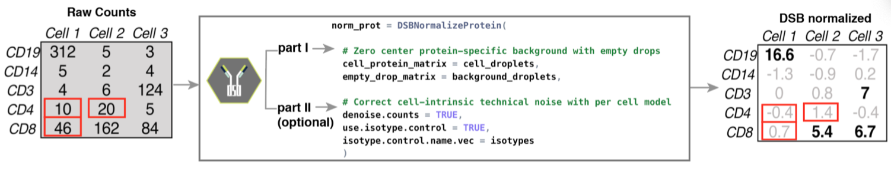

<!-- README.md is generated from README.Rmd. Please edit that file -->

# <a href='https://mattpm.github.io/dsb/'></a> dsb: an R package for normalizing and denoising CITE-seq protein data

**For detailed vignette on usage, tutorials with code for standard or
sample multiplexed experiments with Seurat and integration with
Bioconductor and Scanpy as well as FAQ, please see the vignette in the
vignettes folder
above\!**

<!-- badges: start -->

<!-- badges: end -->

<a href='https://mattpm.github.io/dsb//'></a>

dsb (**d**enoised and **s**caled by **b**ackground) is a lightweight R
package developed in [John Tsang’s
Lab](https://www.niaid.nih.gov/research/john-tsang-phd) (NIH-NIAID) by
Matt Mulè, Andrew Martins and John Tsang. Through control experiments
and computational modeling designed to interrogate sources of noise in
antibody-based protein data from droplet single cell experiments, we
developed and validated dsb for removing noise and normalizing protein
data from single cell methods such as CITE-seq, REAP-seq, and Mission
Bio Tapestri.

[**See the dsb *Biorxiv*
preprint**](https://www.biorxiv.org/content/10.1101/2020.02.24.963603v1)
for details on the
method.

<a href='https://github.com/niaid/dsb/'></a>  
Follow tutorial below to use dsb in a workflow with Seurat or integrate
with Bioconductor or Scanpy.

## Background and motivation for the dsb method

CITE-seq protein data suffers from substantial background noise (for
example, see supplementary fig 5a in [Stoeckius *et. al.* 2017 *Nat.
Methods*](https://static-content.springer.com/esm/art%3A10.1038%2Fnmeth.4380/MediaObjects/41592_2017_BFnmeth4380_MOESM1_ESM.pdf)).
We performed experiments and analysis to dissect this noise and the dsb
method is based on 3 key findings outlined in our paper.

1)  Based on unstained control experiments and modeling we found a major
    source of protein background noise comes from ambient, unbound
    antibody encapsulated in droplets.

2)  “Empty” droplets (containing ambient mRNA and antibody but no cell),
    outnumber cell-containing droplets by 10-100 fold and capture the
    *ambient component* of protein background noise.

3)  Cell-to-cell technical variations such as stochastic differences in
    cell lysis/capture, RT efficiency, sequencing depth, and
    non-specific antibody binding can be estimated and removed by
    defining the “technical component” of each cell’s protein library.
    [**Please consider citing the dsb
    preprint**](https://www.biorxiv.org/content/10.1101/2020.02.24.963603v1)
    if you use this package or find the protein noise modeling results
    useful. If you have a question please first see the FAQ section of
    the vignette then open an issue on the github site
    <https://github.com/niaid/dsb/> so the community can benefit.

## Installation and quick overview with pre-loaded package data

Use the `DSBNormalizeProtein()` function to  
1\) normalize raw protein counts of a cells (columns) by proteins (rows)
matrix `cells_citeseq_mtx` estimating the ambient component of noise
with `empty_drop_citeseq_mtx`, a matrix of background/empty droplets. 2)
model and remove the ‘technical component’ of each cell’s protein
library by setting `denoise.counts = TRUE` and include isotype controls
in the calculation of the technical component with `use.isotype.control
= TRUE`.

``` r
# install dsb package directly from github: 
require(devtools); devtools::install_github(repo = 'MattPM/dsb')
library(dsb)

adt_norm = DSBNormalizeProtein(
  # remove ambient protien noise reflected in counts from empty droplets 
  cell_protein_matrix = cells_citeseq_mtx, # cell-containing droplet raw protein count matrix
  empty_drop_matrix = empty_drop_citeseq_mtx, # empty/background droplet raw protein counts
  
  # recommended step II: model and remove the technical component of each cell's protein library
  denoise.counts = TRUE, # (default = TRUE); run step II  
  use.isotype.control = TRUE, # (default = TRUE): use isotype controls to define technical components. 
  isotype.control.name.vec = rownames(cells_citeseq_mtx)[67:70] # vector of isotype control names
  )
```

## Tutorial with public 10X genomics data

Download **RAW (*not* filtered\!)** *feature / cellmatrix raw* from
[public 10X Genomics CITE-seq data
here](https://support.10xgenomics.com/single-cell-gene-expression/datasets/3.0.2/5k_pbmc_protein_v3).
The tutorial below uses use R 3.6. We emphasize normalized protein data
and raw RNA data from this workflow at step III can be used with Seurat,
Bioconductor or Python’s AnnData class in Scanpy. We use a convenience
function from Seurat `Read10X` to load the raw data. We then provide a
suggested workflow after normalization with dsb based on the CITE-seq
analysis used in our paper on baseline immune system states: [Kotliarov
*et. al.* 2020 *Nat.
Medicine*](https://doi.org/10.1038/s41591-020-0769-8).

Please see **multiplexing experiments section** if your experiment used
superloading/demultiplexing and **FAQ section** for guidance if you have
multiple 10X lanes and or
batches.

### Step Ia: load **raw** count alignment (e.g. Cell Ranger) output and define cell metadata variables

Below we load the **raw** output from the Cell Ranger count alignment.
The raw output is a sparse matrix of **possible cell barcodes** vs
proteins / mRNA. The number of cell barcodes ranges 500k-6M depending on
the kit/chemistry version.

``` r
library(dsb)
library(Seurat) # Seurat Version 3 used below for the Read10X function 
library(tidyverse) # used for ggplot and %>% (tidyverse is not a dsb dependency) 

# read raw data using the Seurat function "Read10X" 
raw = Read10X("data/10x_data/10x_pbmc5k_V3/raw_feature_bc_matrix/")

# Read10X formats the output as a list for the ADT and RNA assays: split this list 
prot = raw$`Antibody Capture`
rna = raw$`Gene Expression`

# create a metadata dataframe of simple qc stats for each droplet 
rna_size = log10(Matrix::colSums(rna))
prot_size = log10(Matrix::colSums(prot))
ngene = Matrix::colSums(rna > 0)
mtgene = grep(pattern = "^MT-", rownames(rna), value = TRUE)
propmt = Matrix::colSums(rna[mtgene, ]) / Matrix::colSums(rna)
md = as.data.frame(cbind(propmt, rna_size, ngene, prot_size))
md$bc = rownames(md)
```

### Step Ib: Quality control and defining cell-containing and background droplets

Now that we loaded the raw output, we define cells and background
droplets. Methods for defining droplets depend on the experiment design.
The number of droplets you define as cell-containing should be in line
with the number of cells loaded and the expected cell recovery. In this
experiment, 5000 cells were loaded in a single 10X lane. In the protein
library size histogram below, large peaks \< 1 and ~2 contain \> 30,000
and 60,000 drops respectively. The smaller peaks \> 3 (for both mRNA and
protein) contain ~5000 drops and therefore **the rightmost peaks \> 3
are the cell-containing droplets** we next perform quality control as in
any single cell preprocessing workflow. Again, see multiplexing
experiments section and FAQ if you have many lanes / batches and or
superloading.

``` r
p1 = ggplot(md[md$rna_size > 0, ], aes(x = rna_size)) + geom_histogram(fill = "dodgerblue") + ggtitle("RNA library size \n distribution")
p2 = ggplot(md[md$prot_size> 0, ], aes(x = prot_size)) + geom_density(fill = "firebrick2") + ggtitle("Protein library size \n distribution")
cowplot::plot_grid(p1, p2, nrow = 1)
```

<a href='https://github.com/niaid/dsb/'></a>

Below we define background droplets as the major peak in the background
distribution between 1.4 and 2.5 log total protein counts-note one could
also define the empty/ background droplets as the entire population from
0 to 2.5 with little impact on normalized values (see the dsb paper
section on sensitivity analysis to different definitions of background
for details). In addition, we add mRNA quality control-based filters to
remove potential low quality cells from both the background drops and
the cells as you would in any scRNAseq workflow (e.g. see Seurat
tutorials and [Luecken *et. al.* 2019 *Mol Syst
Biol*](https://www.embopress.org/doi/full/10.15252/msb.20188746)).

``` r
# define a vector of background / empty droplet barcodes based on protein library size and mRNA content
background_drops = md[md$prot_size > 1.4 & md$prot_size < 2.5 & md$ngene < 80, ]$bc
negative_mtx_rawprot = prot[ , background_drops] %>% as.matrix()

# define a vector of cell-containing droplet barcodes based on protein library size and mRNA content 
positive_cells = md[md$prot_size > 2.8 & md$ngene < 3000 & md$ngene > 200 & propmt <0.2, ]$bc
cells_mtx_rawprot = prot[ , positive_cells] %>% as.matrix()
```

Check: are the number of cells in line with the expected recovery from
the experiment?

``` r
length(positive_cells)
```

\[1\] 3481

Yes. After quality control above we have 3481 cells which is in line
with the 5000 cells loaded in this experiment and closely matches the
estimated cells from the filtered output from cell ranger (not shown).
The protein library size distribution of the cells (orange) and
background droplets (blue) used for normalization are highlighted below.
\>67,000 negative droplets are used to estimate the ambient background
for normalizing the 3,481 single cells. (see FAQ for code to generate
this plot
below)  
<a href='https://mattpm.github.io/dsb/'></a>

### Step II: normalize protein data with the DSBNormalizeProtein Function.

If you have isotype control proteins, set `denoise.counts = TRUE` and
`use.isotype.control = TRUE` and provide a vector containing names of
isotype control proteins (the rownames of the protein matrix that are
isotype controls). For example, in this experiment, rows 30:32 of the
data are the isotype control proteins so we set
`isotype.control.name.vec = rownames(cells_mtx_rawprot)[30:32]`. If you
don’t have Isotype controls see the section ‘Quick overview for
experiments without isotype
controls’.

``` r
#normalize protein data for the cell containing droplets with the dsb method. 
dsb_norm_prot = DSBNormalizeProtein(
  cell_protein_matrix = cells_mtx_rawprot, # cell containing droplets
  empty_drop_matrix = negative_mtx_rawprot, # estimate ambient noise with the background drops 
  denoise.counts = TRUE, # model and remove each cell's technical component
  use.isotype.control = TRUE, # use isotype controls to define the technical component
  isotype.control.name.vec = rownames(cells_mtx_rawprot)[30:32] # names of isotype control abs
  )
```

The function returns a matrix of normalized protein values which can be
integrated with any single cell analysis software. We provide an example
with Seurat, Bioconductor and Scanpy
below.

# Integrated workflow with Seurat

### Step III (option a) Integrate with Seurat

``` r
# filter raw protein, RNA and metadata to only include cell-containing droplets 
cells_rna = rna[ ,positive_cells]
md = md[positive_cells, ]

# create Seurat object with cell-containing drops (min.cells is a gene filter, not a cell filter)
s = Seurat::CreateSeuratObject(counts = cells_rna, meta.data = md, assay = "RNA", min.cells = 20)

# add DSB normalized "dsb_norm_prot" protein data to a assay called "CITE" created in step II 
s[["CITE"]] = Seurat::CreateAssayObject(data = dsb_norm_prot)
```

This object can be used in downstream analysis using Seurat.

### Suggested Step IV: Protein based clustering + cluster annotation

This is similar to the workflow used in our paper [Kotliarov *et. al.*
2020 *Nat. Medicine*](https://doi.org/10.1038/s41591-020-0769-8) where
we analyzed mRNA states *within* interpretable clusters defined by dsb
normalized protein data. We first run spectral clustering using Seurat
directly on the dsb normalized protein values **without** reducing
dimensionality of the cells x protein matrix with
PCA.

``` r
# define Euclidean distance matrix on dsb normalized protein data (without isotype controls)
dsb = s@assays$CITE@data[1:29, ]
p_dist = dist(t(dsb))
p_dist = as.matrix(p_dist)

# Cluster using Seurat 
s[["p_dist"]] = Seurat::FindNeighbors(p_dist)$snn
s = Seurat::FindClusters(s, resolution = 0.5, graph.name = "p_dist")
```

### Suggested Step V: cluster annotation based on average dsb normalized protein values

A heatmap of average dsb normalized values in each cluster help in
annotating clusters results. The values for each cell represent the
number of standard deviations of each protein from the expected noise
from reflected by the protein’s distribution in empty droplets, +/- the
residual of the fitted model to the cell-intrinsic technical component.

``` r
# calculate the average of each protein separately for each cluster 
prots = rownames(s@assays$CITE@data)
adt_plot = adt_data %>% 
  group_by(seurat_clusters) %>% 
  summarize_at(.vars = prots, .funs = mean) %>% 
  column_to_rownames("seurat_clusters") 
# plot a heatmap of the average dsb normalized values for each cluster
pheatmap::pheatmap(t(adt_plot), color = viridis::viridis(25, option = "B"), fontsize_row = 8, border_color = NA)
```

<a href='https://mattpm.github.io/dsb/'></a>

### Visualization of single cell protein levels on the interpretable dsb scale

Dimensionality reduction plots can sometimes be useful visualization
tools, for example to guide cluster annotation similar to the averaged
values above. Below we calculate UMAP embeddings for each cell directly
on the dsb normalized protein values-we recommend this rather than using
principal components for tSNE or UMAP. We then create a combined
dataframe with the UMAP embeddings, dsb normalized protein values, and
all cell metadata variables. This ‘tidy’ dataframe can be used for
further statistical modeling or for visualization with base R functions
or ggplot.

``` r
library(reticulate); use_virtualenv("r-reticulate")
library(umap)

# set umap config
config = umap.defaults
config$n_neighbors = 40
config$min_dist = 0.4

# run umap directly on dsb normalized values
ump = umap(t(s2_adt3), config = config)
umap_res = as.data.frame(ump$layout)
colnames(umap_res) = c("UMAP_1", "UMAP_2")

# save results dataframe 
df_dsb = cbind(s@meta.data, umap_res, as.data.frame(t(s@assay$CITE@data)))
```

*Additional topics covered in the vignette*  
**Multiplexing Experiments**  
**Multi-lane / multi-batch processing**  
**Integration with Bioconductor**  
**Integration with Scanpy**  
**FAQ**

### NIAID statement

A review of this code has been conducted, no critical errors exist, and
to the best of the authors knowledge, there are no problematic file
paths, no local system configuration details, and no passwords or keys
included in this code. This open source software comes as is with
absolutely no warranty.

### Terms of Use

By using this software, you agree this software is to be used for
research purposes only. Any presentation of data analysis using dsb will
acknowledge the software according to the guidelines below. How to
cite:  
Please cite this software as: 1. Mulè MP, Martins AJ, Tsang JS.
Normalizing and denoising protein expression data from droplet-based
single cell profiling. bioRxiv. 2020;2020.02.24.963603.

Primary author(s): Matt Mulè Andrew Martins and John Tsang  
Organizational contact information: General: john.tsang AT nih.gov,
code: mulemp AT nih.gov  
Date of release: Oct 7 2020  
Version: 0.1.0 License details: see package  
Description: dsb:an R package for normalizing and denoising CITEseq
protein data  
Usage instructions: Provided in this markdown  
Example(s) of usage: Provided in this markdown and vignettes  
Proper attribution to others, when applicable: NA

### code check

``` r
# checked repo for PII and searched for strings with paths 
# code check 
library(lintr)
library(here)
fcn = suppressMessages(list.files(here("R/"), ".r", full.names = TRUE))
vignette = list.files(path = here("vignettes/dsb_normalizing_CITEseq_data.R"))
# code check 
scp = c(fcn, vignette) %>% as.list()
lt = suppressMessages((lapply(scp, lintr::lint)))
```
