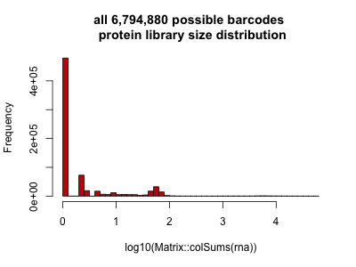

<!-- README.md is generated from README.Rmd. Please edit that file -->

# dsb : an R package for normalizing and denoising CITEseq protein data <a href='https://mattpm.github.io/dsb'></a>

<!-- badges: start -->

<!-- [](https://travis-ci.org/MattPM/dsb) -->

<!-- badges: end -->

**DSB was recently used in [this informative preprint on optomizing
CITE-seq
experiments](https://www.biorxiv.org/content/10.1101/2020.06.15.153080v1)**

dsb is a lightweight R package and is the first dedicated method for
normalizing and denoising protein expression data from CITE-seq
experiments. The method was developed in [John Tsang’s
Lab](https://www.niaid.nih.gov/research/john-tsang-phd) by Matt Mulè,
Andrew Martins and John Tsang. Details of the method can be found in
[the biorxiv
preprint](https://www.biorxiv.org/content/10.1101/2020.02.24.963603v1.full.pdf).
We utilized the dsb package to normalize CITEseq data reported in [our
Nature Medicine paper on baseline immune
states](https://doi.org/10.1038/s41591-020-0769-8).

As described in our
[preprint](https://www.biorxiv.org/content/10.1101/2020.02.24.963603v1.full.pdf)
in experiments comparing unstained control cells and empty droplets we
found a major contributor to background noise in CITE-seq protein data
is unbound antibodies encapsulated and sequenced in droplets. dsb
corrects for this background by leveraging empty droplets, which serve
as a “built in” measurement expected protein-specific background noise.
In an optional highly recommended step, we also define and regress out
cell-to-cell technical variation by defining the primary latent noise
component of that cell’s protein library to account for several
potential sources of cell-intrinsic technical noise – see preprint for
details.

Below we outline a simple workflow starting from raw Cell Ranger output
from a public 10X CITE-seq dataset. We estimate empty/background and
cell-containing droplets, and normalize protein with the
DSBNormalizeProtein function, providing a normalized and denoised
protein data matrix on an interpretable scale for all single cells and
proteins. This can be integrated with any single cell analysis
software-below we demonstrate a suggested workflow for protein based
clustering directly on DSB Normalized values, dimensionality reduction,
and visualization of this example dataset using
Seurat.

<a href='https://mattpm.github.io/dsb'></a>

## Installation and quickstart with bulit-in mini datasat

<!-- # -->

``` r
# this is analagous to install.packages("package), you need the package devtools to install a package from a github repository like this one. 
require(devtools); devtools::install_github(repo = 'MattPM/dsb')
library(dsb)

# quick example - RUN dsb on package example data 
norm_mtx = DSBNormalizeProtein(cell_protein_matrix = cells_citeseq_mtx,
                               empty_drop_matrix = empty_drop_citeseq_mtx)
```

## Workflow Step I: DSB normalize CITE-seq protein data starting from *RAW* cell ranger output

With this workflow, a matrix of protein counts for empty droplets and
cells are estimated using the protein and mRNA library size
distributions of the raw cell ranger output. These are used to normalize
the protein data for cells using the dsb package. This normalized (and
raw) protein data and raw RNA data can then be used to create a Seurat
object or any object in various single cell analysis software
ecosystems, for example, Bioconductor’s SingleCellExperiment object, or
the anndata class in Python. (see following setion for instructions)

To follow this example load the RAW (not filtered\!) **feature /
cellmatrix raw** public 10X CITE-seq data from here:
<https://support.10xgenomics.com/single-cell-gene-expression/datasets/3.0.2/5k_pbmc_protein_v3>

The steps below use R 3.6 and Seurat version 3.

``` r
# R 3.6 Seurat V 3 
library(Seurat)
library(tidyverse)
library(dsb)
# library(magrittr)

# read raw data using the Seurat function "Read10X"
raw = Read10X("data/10x_data/10x_pbmc5k_V3/raw_feature_bc_matrix/")

# Define separate RNA and protein sparse matrix  
prot = raw$`Antibody Capture`
rna = raw$`Gene Expression`

# calculate metadata 
mtgene = grep(pattern = "^MT-", rownames(rna), value = TRUE)
pctmt = Matrix::colSums(rna[mtgene, ])/Matrix::colSums(rna)
log10umi = log10(Matrix::colSums(rna))
log10umiprot = log10(Matrix::colSums(prot))
nGene = Matrix::colSums(rna > 0)

# combine into metadata 
md = as.data.frame(cbind(pctmt, log10umi, nGene, log10umiprot))

# histogram to estimate cells and background-cells are a tiny fraction of drops with log 10 protien lib size > 3
hist(md$log10umiprot[md$log10umiprot < 5], breaks = 100)

# define a vector of background / empty droplet barcodes based on protein library size and mRNA content  
neg_drops2 = md %>%
  rownames_to_column("bc") %>% 
  filter(log10umiprot < 2.5 & log10umiprot > 1.4)  %>% 
  filter(nGene < 80) # %$% bc
neg_drops2 = neg_drops2$bc
neg_prot2 = prot[ , neg_drops2] %>%  as.matrix()

# define a vector of cell-containing droplet barcodes based on protein library size and mRNA content 
positive_cells = md %>%
  rownames_to_column("bc") %>% 
  filter(log10umiprot > min_cell_logprotumi) %>% 
  filter(nGene < 3000 & nGene > 200) %>% 
  filter(pctmt < 0.2) # %$% bc
positive_cells = positive_cells$bc
cells_prot = prot[ , positive_cells] %>% as.matrix()

#normalize protein data for the cell containing droplets with the dsb method. 
isotypes = rownames(pos_prot)[30:32]
mtx2 = DSBNormalizeProtein(cell_protein_matrix = cells_prot,
                           empty_drop_matrix = neg_prot2,
                           denoise.counts = TRUE,
                           use.isotype.control = TRUE,
                           isotype.control.name.vec = isotypes)
```

The DSB normalized proetin matrix can be integrated with any single cell
analysis software, we provide an example with Seurat
below.

## Potential step II: integration with Seurat

``` r
# filter raw protein, RNA and metadata ton only include the cell containing droplets 
count_rna = raw$`Gene Expression`[ ,positive_cells]
count_prot = raw$`Antibody Capture`[ ,positive_cells]
md = md %>% 
  rownames_to_column("bc") %>% 
  filter(bc %in% positive_cells) %>% 
  column_to_rownames('bc')

# create Seurat object * note min.cells ins a gene filter not a cell filter, we alerady filtered cells in steps above
s = CreateSeuratObject(counts = count_rna, meta.data = md, assay = "RNA", min.cells = 20)

# add DSB normalized "dsb_norm_prot" protein data to the seurat object 
s[["CITE"]] = CreateAssayObject(data = dsb_norm_prot)
```

## Suggested Step III: Protein based clustering + cluster annotation

  - This is similar to the workflow used in our paper
    <https://www.nature.com/articles/s41591-020-0769-8> where mRNA state
    *within* the interpretable clusters defined using DSB nromalized
    protein data were used to assess the cellular origin and circuitry
    of baseline immune signatures.

<!-- end list -->

``` r

# define euclidean distance matrix on dsb normalized protein data (without isotype controls)
dsb = s@assays$CITE@data[1:29, ]
p_dist = dist(t(dsb))
p_dist = as.matrix(p_dist)

# Cluster using Seurat 
s[["p_dist"]] = FindNeighbors(p_dist)$snn
s = FindClusters(s, resolution = 0.5, graph.name = "p_dist")
```

# Suggested Step IV: cluster annotation with DSB normalized proetin value

DSB normalized vlaues provide a straightforward comparable value for
each protein in each cluster. They are the log number of standard
deviations (+ / - the cell-intrinsic denoised technical component) from
the expected noise as reflected by the protein distribution in empty
droplets.

``` r

prots = rownames(s@assays$CITE@data)
adt_plot = adt_data %>% 
  group_by(seurat_clusters) %>% 
  summarize_at(.vars = prots, .funs = mean) %>% 
  column_to_rownames("seurat_clusters") %>% 
  t %>% 
  as.data.frame

pheatmap::pheatmap(adt_plot, color = viridis::viridis(25, option = "B"), 
                   fontsize_row = 8, border_color = NA, width = 5, height = 5 )
```

<a href='https://mattpm.github.io/dsb'></a>

### calculate UMAP embedding on DSB normalized protein values and visualize all proteins in single cells on the same interpretable DSB scale

One can also calculate UMAP embeddings and to visualize the
interpretable scale on which DSB places single cell protein expression
levels. Note it is also possible to calculate UMAP embeddings directly
with *Seurat*, *scater* etc. below we use the python umap package called
through reticulate

``` r
library(reticulate); use_virtualenv("r-reticulate")
library(umap)

# set umap config
config = umap.defaults
config$n_neighbors = 40
config$min_dist = 0.4

# run umap
ump = umap(t(s2_adt3), config = config)
umap_res = ump$layout %>% as.data.frame() 
colnames(umap_res) = c("UMAP_1", "UMAP_2")

# save results dataframe 
df_dsb = cbind(s@meta.data, umap_res, as.data.frame(t(s@assay$CITE@data)))

# visualize (code at end of document )
```

<a href='https://mattpm.github.io/dsb'></a>

``` r

## Note

# if link breaks on niaid migration replace: 
# <a href='https://mattpm.github.io/dsb'></a>
# with: 
#

### MPM 
```

## More information: How were background drops defined in the quick example above?

The raw cell ranger output that we loaded contained all possible barcode
sequences based on the 10x genomics Version 3 chemistry - a vast
majority have little to no data, the second largest major peak of ~
50,000 droplets centered around 2 in log 10 space were used to define
the background. In the code above, we defined empty drop background with
an additional step to remove potential very low quality cells from the
is background distribution with an RNA based filter. Droplets with
ambient RNA dn protein mus have \< 80 unique mRNAs (wehreas cels must
have a minimum of 200) these are not hard thresholds and can be
calculated with quantile statistics inherent to each dataset depending
on tissue profield or assay chemistry used.

The full protein library size
distribution:

``` r
hist(log10(Matrix::colSums(rna))[log10(Matrix::colSums(rna)) > 0],breaks = 50,
     main = "6,794,880 droplets protein library size distribution ")
```

<a href='https://mattpm.github.io/dsb'></a>

Only 5,000 cells are expected to be recovered from this experiment =
these represent a tiny fraction of the total droplets- the peak around 2
is the major background distribution and the cells are are in the
population barely visible in this histogram \> 3.

The library size distribution of cells and empty droplets after QC
(these steps were used above to define negative an pisitve droplets
shown for reference) are shown below with the number of each population
shown = this gives a sense of the umber of barcodes represtignig
droplete with ambient protein , \> 50,000 vs cells ~ 3800 in line with
what we expect from the experiment loading and QC.

``` r
neg_drops2 = md %>%
  rownames_to_column("bc") %>% 
  filter(log10umiprot < 2.5 & log10umiprot > 1.4)  %>% 
  filter(nGene < 80) # %$% bc
neg_drops2 = neg_drops2$bc
neg_prot2 = prot[ , neg_drops2] %>%  as.matrix()

# define a vector of cell-containing droplet barcodes based on protein library size and mRNA content 
positive_cells = md %>%
  rownames_to_column("bc") %>% 
  filter(log10umiprot > min_cell_logprotumi) %>% 
  filter(nGene < 3000 & nGene > 200) %>% 
  filter(pctmt < 0.2) # %$% bc
positive_cells = positive_cells$bc
cells_prot = prot[ , positive_cells] %>% as.matrix()
```

<a href='https://mattpm.github.io/dsb'></a>

(code used to create plot above shown at the end of this markdown for
reference)

## Quickstart V2 using example data; removing background as captured by data from empty droplets without count denoising.

If one does not have isotype control data, we recommend not defining the
technical component of each cell’s protein library and not denoising
counts, the background mean for each cell inferred via a per-cell
gaussian mixture model can alternatively be used alone to define the
cell’s technical component, but this assumes the background mean has no
expected biological variation. In our analysis, the background mean per
cell has weak but significant correlation with the foreground mean,
calculating the eigenvector (i.e. the primary latent component) theough
the background mean and isotype controls and using that as the technical
component of each cell’s protein library anchors the technical component
of the background mean (this is what was done above and is the default
behavior of DSB)

``` r
# load package and normalize the example raw data 
library(dsb)
# normalize
normalized_matrix = DSBNormalizeProtein(cell_protein_matrix = cells_citeseq_mtx,
                                        empty_drop_matrix = empty_drop_citeseq_mtx)
```

## Visualization of protein distributions on package example data.

**Note, there is NO jitter added to these points for visualization;
these are the unmodified normalized counts**

``` r

library(ggplot2)
data.plot = normalized_matrix %>% 
  t %>%
  as.data.frame() %>% 
  dplyr::select(CD4_PROT, CD3_PROT, CD8_PROT, CD27_PROT, CD19_PROT, CD16_PROT, CD11c_PROT, CD45RO_PROT, CD45RA_PROT) 

mg_layer = list(theme_bw(), 
                geom_point(size = 0.5, shape = 16, alpha = 0.5) ,  
                geom_density2d(size = 0.3, color = "red") ,
                geom_vline(xintercept = 0) ,
                geom_hline(yintercept = 0) , 
                ggtitle("DSB normalized (example data)"))

p1 = ggplot(data.plot, aes(x = CD19_PROT, y = CD3_PROT)) + mg_layer
p2 = ggplot(data.plot, aes(x = CD8_PROT, y = CD4_PROT)) + mg_layer
p3 = ggplot(data.plot, aes(CD45RO_PROT, y = CD3_PROT)) + mg_layer
p4 = ggplot(data.plot, aes(CD16_PROT, y = CD11c_PROT)) + mg_layer
p5 = cowplot::plot_grid(p1,p2, p3,p4, nrow = 1)
p5
```


## How do I get the empty droplets?

If you don’t have hashing data, you can define the negative drops as
shown above in the vignette using 10X data. If you have hashing data,
demultiplexing functions define a “negative” cell population which can
be used to define background. In our data, the resulting DSB normalized
values were nearly identicaly distributed with either definition of
background.

HTODemux function in Seurat:
<https://satijalab.org/seurat/v3.1/hashing_vignette.html>

deMULTIplex function from Multiseq (this can also now be implemented in
Seurat). <https://github.com/chris-mcginnis-ucsf/MULTI-seq>

In practice, one would want also want to confirm that the cells called
as “negative” indeed have low RNA / gene content to be certain that
there are no contaminating cells. Also, we recommend hash demultiplexing
with partial *raw* output from cellranger
(i.e. outs/raw\_feature\_bc\_matrix) which contains all barcodes and
will have more empty droplets from which the HTODemux function or
related functions will be able to estimate the negative distribution =
this is crucial for these functions internally and they can error out
when using the filtered\_bc\_matrix.

**see 10x data vignette discussed above and shown here
<https://github.com/MattPM/dsb/issues/9> ** **please see vignettes in
the “articles” tab at <https://mattpm.github.io/dsb/> for a detailed
workflow detailing these
steps**

## Simple example workflow (Seurat Version 3) for experiments with Hashing data

``` r

# get the ADT counts using Seurat version 3 
#raw = read10X()
seurat_object = CreateSeuratObject(raw, min.genes = 5)
seurat_object = HTODemux(seurat_object, assay = "HTO", positive.quantile = 0.99)
Idents(seurat_object) = "HTO_classification.global"
neg_object = subset(seurat_object, idents = "Negative")
singlet_object = subset(seurat_object, idents = "Singlet")

# non sparse CITEseq data actually store better in a regular materix so the as.matrix() call is not memory intensive.
neg_adt_matrix = GetAssayData(neg_object, assay = "CITE", slot = 'counts') %>% as.matrix()
positive_adt_matrix = GetAssayData(singlet_object, assay = "CITE", slot = 'counts') %>% as.matrix()

# normalize the data with dsb
normalized_matrix = DSBNormalizeProtein(cell_protein_matrix = positive_adt_matrix,
                                        empty_drop_matrix = neg_adt_matrix)

# now add the normalized dat back to the object (the singlets defined above as "object")
singlet_object = SetAssayData(object = singlet_object, slot = "CITE", new.data = normalized_matrix)
```

## Simple example workflow Seurat version 2 for experiments with hashing data

``` r

# get the ADT counts using Seurat version 3 
seurat_object = HTODemux(seurat_object, assay = "HTO", positive.quantile = 0.99)

neg = seurat_object %>%
  SetAllIdent(id = "hto_classification_global") %>% 
  SubsetData(ident.use = "Negative") 

singlet = seurat_object %>%
  SetAllIdent(id = "hto_classification_global") %>% 
  SubsetData(ident.use = "Singlet") 

# get negative and positive ADT data 
neg_adt_matrix = neg@assay$CITE@raw.data %>% as.matrix()
pos_adt_matrix = singlet@assay$CITE@raw.data %>% as.matrix()


# normalize the data with dsb
# make sure you've run devtools::install_github(repo = 'MattPM/dsb')
normalized_matrix = DSBNormalizeProtein(cell_protein_matrix = pos_adt_matrix,
                                        empty_drop_matrix = neg_adt_matrix)


# add the assay to the Seurat object 
singlet = SetAssayData(object = singlet, slot = "CITE", new.data = normalized_matrix)
```

# Reference

## Code used to create library size distribution of the droplets included in DSB normalization shown in quickstart section

``` r

plot_layer = list(theme_bw() , 
                  ggsci::scale_fill_d3(), ggsci::scale_color_d3() ,
                  geom_histogram(aes(y=..count..), alpha=0.5, bins = 50,position="identity"),
                  geom_density(alpha = 0.5), 
                  ylab("Number of Drops"),  xlab("log10 protein library size"), 
                  theme(axis.title.x = element_text(size = 14)),
                  theme(plot.title = element_text(face = "bold",size = 14)),
                  theme(legend.position = c(0.8, 0.7), legend.margin = margin(0,0,0,0))
)
pv = md %>% rownames_to_column("bc") %>% filter(bc %in% colnames(pos_prot)) %>% mutate(class = "cell_containing")
nv = md %>% rownames_to_column("bc") %>% filter(bc %in% colnames(neg_prot2)) %>% mutate(class = "background")
ddf = rbind(pv, nv)
p = ggplot(ddf, aes(x = log10umiprot, fill = class, color = class )) +
  ggtitle(paste0(
    project_title, " Threshold 2 \n", 
    "theoretical max barcodes = ", bcmax, "\n", 
    "cell containing drops after QC = ", ncol(pos_prot), "\n",
    "negative droplets = ", ncol(neg_prot2)
  )) + plot_layer
xtop = axis_canvas(p, axis = "x") + geom_density(data = ddf, aes(x = log10umiprot, fill = class)) + ggsci::scale_fill_d3(alpha = 0.5)
p2 = insert_xaxis_grob(p, xtop, grid::unit(.4, "null"), position = "top")
p3 = ggdraw(p2)
```

## code used for UMAP visualization

``` r

index1 = colnames(df_dsb)[13]; index2 = colnames(df_dsb)[ncol(df_dsb)]
dsb = df_dsb %>% gather(prot, DSB, index1:index2)

# cluster umap plots 
centers = df_dsb %>% dplyr::group_by(clusters) %>% 
  summarize(UMAP_1 = median(UMAP_1), UMAP_2 = median(UMAP_2))
p = ggplot(dsb, aes(x = UMAP_1, y = UMAP_2)) + 
  theme_minimal() + 
  geom_point(mapping = aes(color = clusters),  shape = 16, alpha = 0.3, show.legend = FALSE) + 
  ggsci::scale_color_d3(palette = "category20") + 
  ggrepel::geom_text_repel(data = centers, box.padding = 0.5,  mapping = aes(label = clusters, size = 2.3, fontface = "bold"), show.legend = FALSE) 
# ggsave(p, filename = paste0(figpath, project_title, "clusters.png"), width = 3.3, height = 3.4)


prot_plot = c("CD19_TotalSeqB", "CD3_TotalSeqB", "CD14_TotalSeqB",  "CD4_TotalSeqB" , "CD56_TotalSeqB", "CD8a_TotalSeqB")
plotsub = dsb %>% filter(DSB > -5) %>% filter(DSB < 40) 
plotsub_spread = plotsub %>% spread(prot, DSB, drop = TRUE)
plotsub_spread =  na.omit(plotsub_spread)
outliers_removed = dim(df_dsb)[1] - dim(plotsub_spread)[1]
stats10x$outliers_removed_for_Vis = outliers_removed
p = ggplot(plotsub %>% filter(prot %in% prot_plot), aes(x = UMAP_1, y = UMAP_2, color = DSB)) +
  geom_point(shape = 16) + 
  theme(legend.key.size = unit(0.8, units = "cm"), 
        legend.title = element_text(size = 18, face = "bold"),
        legend.text = element_text(size = 20, face = "bold")) + 
  scale_color_viridis_c(option = "B") +
  facet_wrap(~ prot,nrow = 2) +
  theme(strip.background = element_blank(), strip.text = element_text(size = 15, face = "bold")) + 
  theme(legend.position = "right")
# ggsave(p, filename = paste0(figpath, project_title, "clusters_DSBdist.png"), width = 12, height = 7.4)
```

### notes // NIAID

A review of this code has been conducted, no critical errors exist, and
to the best of the authors knowledge, there are no problematic file
paths, no local system configuration details, and no passwords or keys
included in this code.

Primary author(s): Matt Mulè  
Organizational contact information: General: john.tsang AT nih.gov,
code: mulemp AT nih.gov  
Date of release: Oct 7 2020  
Version: NA  
License details: NA  
Description: code to reproduce analysis of manuscript  
Usage instructions: Provided in this markdown  
Example(s) of usage: NA  
Proper attribution to others, when applicable: NA

### code check

``` r

# checked repo for PII and searched for strings with paths 

# code check 
library(lintr)
library(here)
fcn = suppressMessages(list.files(here("R/"), ".r", full.names = TRUE))
vignette = list.files(path = here("vignettes/dsb_normalizing_CITEseq_data.R"))
# code check 
scp = c(fcn, vignette) %>% as.list()
lt = suppressMessages((lapply(scp, lintr::lint)))
))
# ignoring 80 character line warning - this is not applicable to functuon documentation cannot break lines with roxygen syntax 
```
