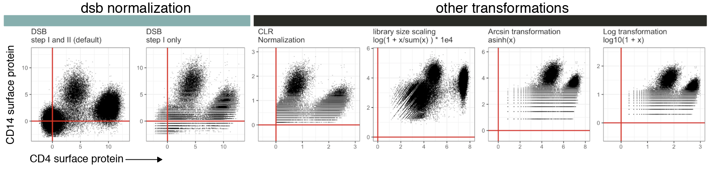
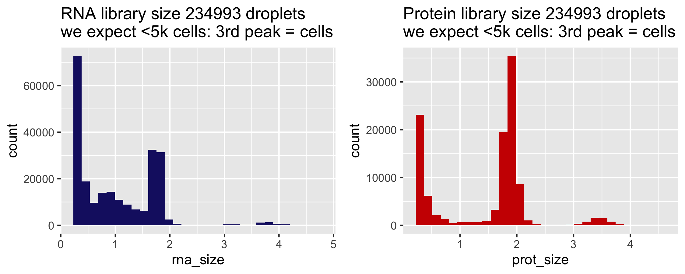
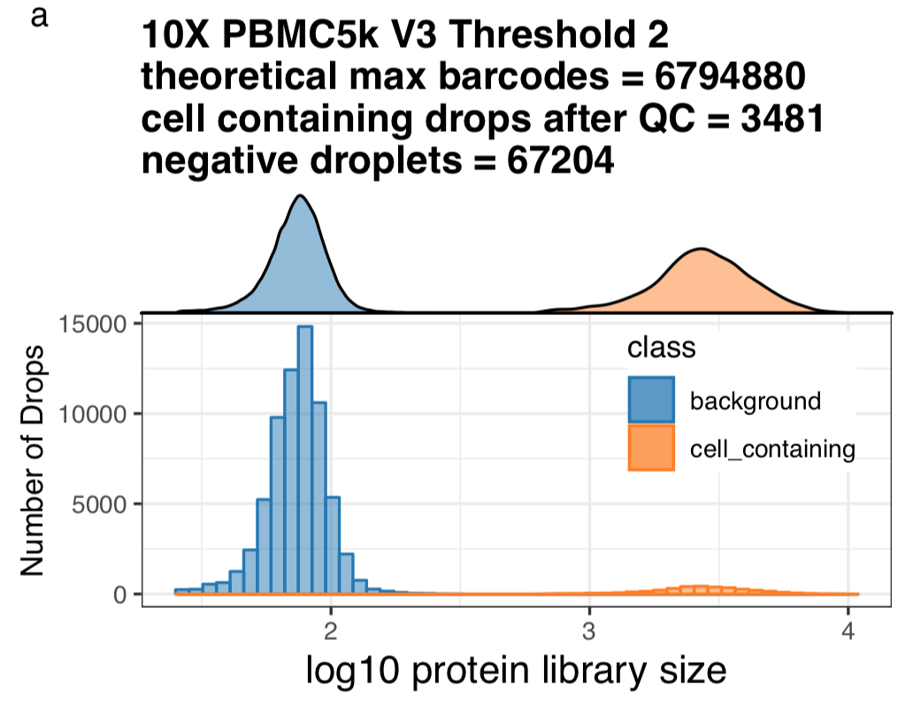
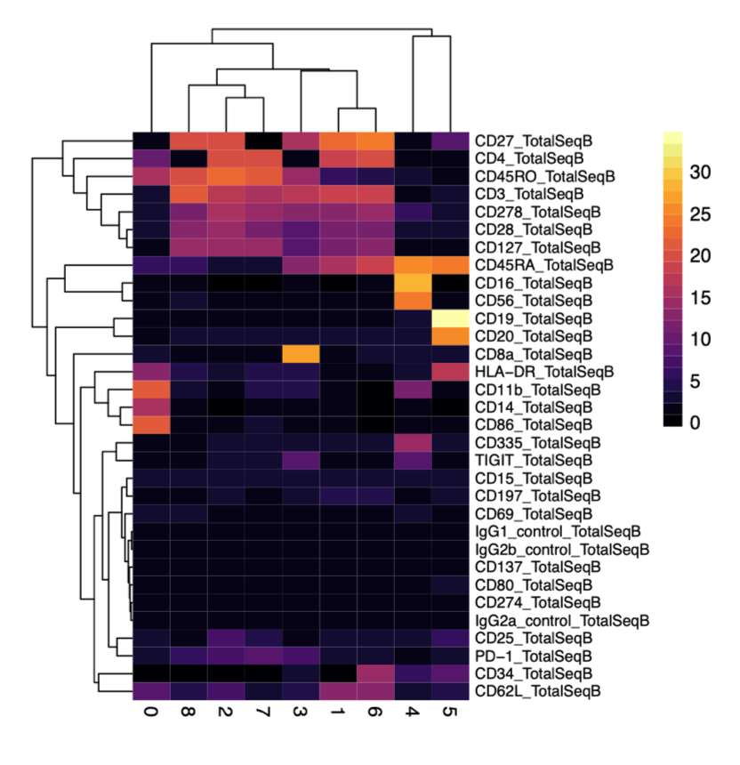
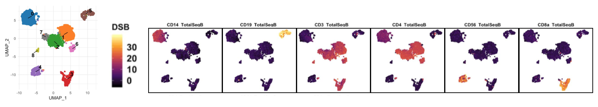
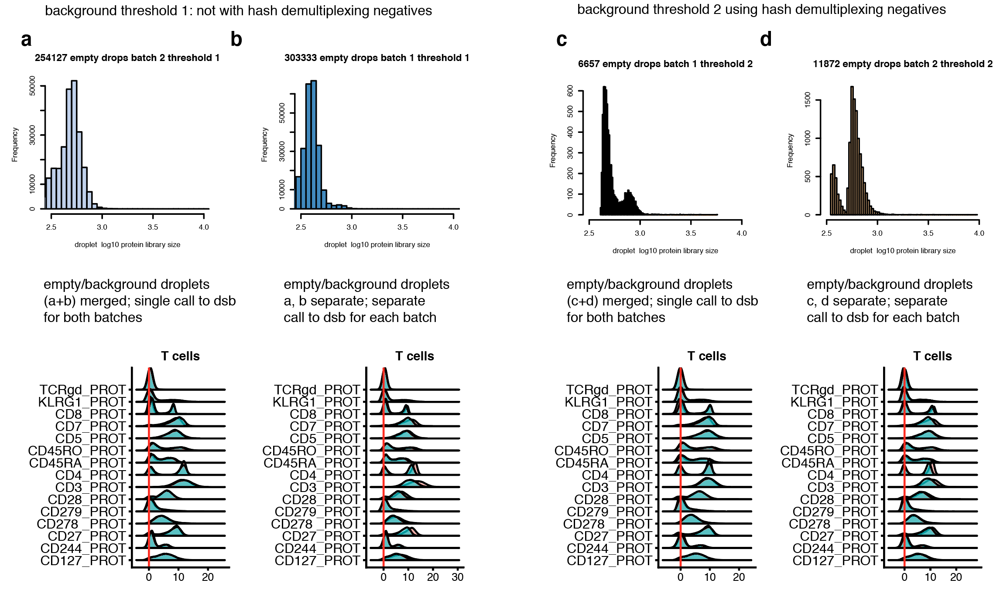

```{r, include = FALSE}
knitr::opts_chunk$set(
  collapse = TRUE,
  comment = "#>",
  fig.path = "man/figures/README-",
  out.width = "100%"
)
```
dsb (**d**enoised and **s**caled by **b**ackground) is a lightweight R package developed in [John Tsang's Lab](https://www.niaid.nih.gov/research/john-tsang-phd) (NIH-NIAID) for removing noise and normalizing protein data from single cell methods such as CITE-seq, REAP-seq, and Mission Bio Tapestri. [**See the dsb *Biorxiv* preprint**](https://www.biorxiv.org/content/10.1101/2020.02.24.963603v1) for  details on the method and please consider citing the paper if you use this package or find the protein noise modeling results useful.  

This vignette outlines how to use dsb to normalize droplet-based single cell protein data from antibody counts and how to integrate the normalized values in an analysis workflow using Seurat, as well as integration with Bioconductor and Scanpy. If you have a question please first see the FAQ section then open an issue on the github site https://github.com/niaid/dsb/ so the community can benefit. 

<a href='https://github.com/niaid/dsb/'></a>  

## Background and motivation for the dsb method  
CITE-seq protein data suffers from substantial background noise (for example, see supplementary fig 5a in [Stoeckius *et. al.* 2017 *Nat. Methods*](https://static-content.springer.com/esm/art%3A10.1038%2Fnmeth.4380/MediaObjects/41592_2017_BFnmeth4380_MOESM1_ESM.pdf)). We performed experiments and analysis to dissect this noise and the dsb method is based on 3 key findings outlined in our paper.   

1) Based on unstained control experiments and modeling we found a major source of protein background noise comes from ambient, unbound antibody encapsulated in droplets. 

2) "Empty" droplets (containing ambient mRNA and antibody but no cell), outnumber cell-containing droplets by 10-100 fold and capture the *ambient component* of protein background noise. 

3) Cell-to-cell technical variations such as stochastic differences in cell lysis/capture, RT efficiency, sequencing depth, and non-specific antibody binding can be estimated and removed by defining the "technical component" of each cell's protein library.  

## Installation and quick overview with pre-loaded package data 

Use the `DSBNormalizeProtein()` function to  
1) normalize raw protein counts of a cells (columns) by proteins (rows) matrix `cells_citeseq_mtx` estimating the ambient component of noise with `empty_drop_citeseq_mtx`, a matrix of background/empty droplets.
2) model and remove the 'technical component' of each cell's protein library by setting `denoise.counts = TRUE` and include isotype controls in the calculation of the technical component with `use.isotype.control = TRUE`. 

```{r,eval = FALSE}
# install dsb package
library(dsb)

adt_norm = DSBNormalizeProtein(
  # remove ambient protien noise reflected in counts from empty droplets 
  cell_protein_matrix = cells_citeseq_mtx, # cell-containing droplet raw protein count matrix
  empty_drop_matrix = empty_drop_citeseq_mtx, # empty/background droplet raw protein counts
  
  # recommended step II: model and remove the technical component of each cell's protein library
  denoise.counts = TRUE, # model and remove each cell's technical component
  use.isotype.control = TRUE, # use isotype controls to define the technical component
  isotype.control.name.vec = rownames(cells_citeseq_mtx)[67:70] # vector of isotype control names
  )
```


## Tutorial with public 10X genomics data
Download **RAW (*not* filtered!)** *feature / cellmatrix raw* from [public 10X Genomics CITE-seq data here](https://support.10xgenomics.com/single-cell-gene-expression/datasets/3.0.2/5k_pbmc_protein_v3). The tutorial below uses use R 3.6. We emphasize normalized protein data and raw RNA data from this workflow at step III can be used with Seurat, Bioconductor or Python's AnnData class in Scanpy. We use a convenience function from Seurat `Read10X` to load the raw data. We then provide a suggested workflow after normalization with dsb based on the CITE-seq analysis used in our paper on baseline immune system states: [Kotliarov *et. al.* 2020 *Nat. Medicine*](https://doi.org/10.1038/s41591-020-0769-8).  

Please see **multiplexing experiments section** if your experiment used superloading/demultiplexing and **FAQ section** for guidance if you have multiple 10X lanes and or batches.

### Step Ia: load **raw** count alignment (e.g. Cell Ranger) output and define cell metadata variables  

Below we load the **raw** output from the Cell Ranger count alignment. The raw output is a sparse matrix of **possible cell barcodes** vs proteins / mRNA. The number of cell barcodes ranges 500k-6M depending on the kit/chemistry version.

```{r, eval = FALSE}
library(dsb)
library(Seurat) # Seurat Version 3 used below for the Read10X function 
library(tidyverse) # used for ggplot and %>% (tidyverse is not a dsb dependency) 

# read raw data using the Seurat function "Read10X" 
raw = Read10X("data/10x_data/10x_pbmc5k_V3/raw_feature_bc_matrix/")

# Read10X formats the output as a list for the ADT and RNA assays: split this list 
prot = raw$`Antibody Capture`
rna = raw$`Gene Expression`

# create a metadata dataframe of simple qc stats for each droplet 
rna_size = log10(Matrix::colSums(rna))
prot_size = log10(Matrix::colSums(prot))
ngene = Matrix::colSums(rna > 0)
mtgene = grep(pattern = "^MT-", rownames(rna), value = TRUE)
propmt = Matrix::colSums(rna[mtgene, ]) / Matrix::colSums(rna)
md = as.data.frame(cbind(propmt, rna_size, ngene, prot_size))
md$bc = rownames(md)
```

### Step Ib: Quality control and defining cell-containing and background droplets 

Now that we loaded the raw output, we define cells and background droplets.  Methods for defining droplets depend on the experiment design. The number of droplets you define as cell-containing should be in line with the number of cells loaded and the expected cell recovery. In this experiment, 5000 cells were loaded in a single 10X lane. In the protein library size histogram below, large peaks < 1 and ~2 contain > 30,000 and 60,000 drops respectively. The smaller peaks > 3 (for both mRNA and protein) contain ~5000 drops and therefore **the rightmost peaks > 3 are the cell-containing droplets** we next perform quality control as in any single cell preprocessing workflow. Again, see multiplexing experiments section and FAQ if you have many lanes / batches and or superloading. 

```{r, eval = FALSE}
p1 = ggplot(md[md$rna_size > 0, ], aes(x = rna_size)) + geom_histogram(fill = "dodgerblue") + ggtitle("RNA library size \n distribution")
p2 = ggplot(md[md$prot_size> 0, ], aes(x = prot_size)) + geom_density(fill = "firebrick2") + ggtitle("Protein library size \n distribution")
cowplot::plot_grid(p1, p2, nrow = 1)
```
<a href='https://github.com/niaid/dsb/'></a>  

Below we define background droplets as the major peak in the background distribution between 1.4 and 2.5 log total protein counts-note one could also define the empty/ background droplets as the entire population from 0 to 2.5 with little impact on normalized values (see the dsb paper section on sensitivity analysis to different definitions of background for details). In addition, we add mRNA quality control-based filters to remove potential low quality cells from both the background drops and the cells as you would in any scRNAseq workflow (e.g. see Seurat tutorials and [Luecken *et. al.* 2019 *Mol Syst Biol*](https://www.embopress.org/doi/full/10.15252/msb.20188746)).   

```{r, eval = FALSE}
# define a vector of background / empty droplet barcodes based on protein library size and mRNA content
background_drops = md[md$prot_size > 1.4 & md$prot_size < 2.5 & md$ngene < 80, ]$bc
negative_mtx_rawprot = prot[ , background_drops] %>% as.matrix()

# define a vector of cell-containing droplet barcodes based on protein library size and mRNA content 
positive_cells = md[md$prot_size > 2.8 & md$ngene < 3000 & md$ngene > 200 & propmt <0.2, ]$bc
cells_mtx_rawprot = prot[ , positive_cells] %>% as.matrix()

```

Check: are the number of cells in line with the expected recovery from the experiment? 

```{r, eval = FALSE}
length(positive_cells)
```

[1] 3481   

Yes. After quality control above we have 3481 cells which is in line with the 5000 cells loaded in this experiment and closely matches the estimated cells from the filtered output from cell ranger (not shown). The protein library size distribution of the cells (orange) and background droplets (blue) used for normalization are highlighted below. >67,000 negative droplets are used to estimate the ambient background for normalizing the 3,481 single cells. (see FAQ for code to generate this plot below)    
<a href='https://mattpm.github.io/dsb/'></a>

### Step II: normalize protein data with the DSBNormalizeProtein Function. 

If you have isotype control proteins, set `denoise.counts = TRUE` and `use.isotype.control = TRUE` and provide a vector containing names of isotype control proteins (the rownames of the protein matrix that are isotype controls). For example, in this experiment, rows 30:32 of the data are the isotype control proteins so we set `isotype.control.name.vec = rownames(cells_mtx_rawprot)[30:32]`. If you don't have Isotype controls see the section 'Quick overview for experiments without isotype controls'.  

```{r, eval = FALSE}
#normalize protein data for the cell containing droplets with the dsb method. 
dsb_norm_prot = DSBNormalizeProtein(
  cell_protein_matrix = cells_mtx_rawprot, # cell containing droplets
  empty_drop_matrix = negative_mtx_rawprot, # estimate ambient noise with the background drops 
  denoise.counts = TRUE, # model and remove each cell's technical component
  use.isotype.control = TRUE, # use isotype controls to define the technical component
  isotype.control.name.vec = rownames(cells_mtx_rawprot)[30:32] # names of isotype control abs
  )
```

The function returns a matrix of normalized protein values which can be integrated with any single cell analysis software. We provide an example with Seurat, Bioconductor and Scanpy below.  

# Integrated workflow with Seurat  

### Step III (option a) Integrate with Seurat
```{r, eval = FALSE}
# filter raw protein, RNA and metadata to only include cell-containing droplets 
cells_rna = rna[ ,positive_cells]
md = md[positive_cells, ]

# create Seurat object with cell-containing drops (min.cells is a gene filter, not a cell filter)
s = Seurat::CreateSeuratObject(counts = cells_rna, meta.data = md, assay = "RNA", min.cells = 20)

# add DSB normalized "dsb_norm_prot" protein data to a assay called "CITE" created in step II 
s[["CITE"]] = Seurat::CreateAssayObject(data = dsb_norm_prot)
```

This object can be used in downstream analysis using Seurat.

### Suggested Step IV: Protein based clustering + cluster annotation  
This is similar to the workflow used in our paper [Kotliarov *et. al.* 2020 *Nat. Medicine*](https://doi.org/10.1038/s41591-020-0769-8) where we analyzed mRNA states *within* interpretable clusters defined by dsb normalized protein data. We first run spectral clustering using Seurat directly on the dsb normalized protein values **without** reducing dimensionality of the cells x protein matrix with PCA.  
```{r, eval = FALSE}
# define Euclidean distance matrix on dsb normalized protein data (without isotype controls)
dsb = s@assays$CITE@data[1:29, ]
p_dist = dist(t(dsb))
p_dist = as.matrix(p_dist)

# Cluster using Seurat 
s[["p_dist"]] = Seurat::FindNeighbors(p_dist)$snn
s = Seurat::FindClusters(s, resolution = 0.5, graph.name = "p_dist")
```

### Suggested Step V: cluster annotation based on average dsb normalized protein values  
A heatmap of average dsb normalized values in each cluster help in annotating clusters results. The values for each cell represent the number of standard deviations of each protein from the expected noise from reflected by the protein's distribution in empty droplets, +/- the residual of the fitted model to the cell-intrinsic technical component. 

```{r, eval = FALSE}
# calculate the average of each protein separately for each cluster 
prots = rownames(s@assays$CITE@data)
adt_plot = adt_data %>% 
  group_by(seurat_clusters) %>% 
  summarize_at(.vars = prots, .funs = mean) %>% 
  column_to_rownames("seurat_clusters") 
# plot a heatmap of the average dsb normalized values for each cluster
pheatmap::pheatmap(t(adt_plot), color = viridis::viridis(25, option = "B"), fontsize_row = 8, border_color = NA)

```
<a href='https://mattpm.github.io/dsb/'></a>

### Visualization of single cell protein levels on the interpretable dsb scale

Dimensionality reduction plots can sometimes be useful visualization tools, for example to guide cluster annotation similar to the averaged values above. Below we calculate UMAP embeddings for each cell directly on the dsb normalized protein values-we recommend this rather than using principal components for tSNE or UMAP. We then create a combined dataframe with the UMAP embeddings, dsb normalized protein values, and all cell metadata variables. This 'tidy' dataframe can be used for further statistical modeling or for visualization with base R functions or ggplot. 
```{r, eval = FALSE}
library(reticulate); use_virtualenv("r-reticulate")
library(umap)

# set umap config
config = umap.defaults
config$n_neighbors = 40
config$min_dist = 0.4

# run umap directly on dsb normalized values
ump = umap(t(s2_adt3), config = config)
umap_res = as.data.frame(ump$layout)
colnames(umap_res) = c("UMAP_1", "UMAP_2")

# save results dataframe 
df_dsb = cbind(s@meta.data, umap_res, as.data.frame(t(s@assay$CITE@data)))

# visualizatons below were made directly from the data frame df_dsb above with ggplot
```
<a href='https://mattpm.github.io/dsb/'></a>  

# Integration with Bioconductor and Scanpy 

### Step III (option b): integration with Bioconductor's SingleCellExperiment class
Rather than Seurat you may wish to use the SingleCellExperiment class  to use Bioconductor packages - this can be accomplished with this alternative to step III above using the following code. To use Bioconductor's language, we store raw protein values in an 'alternative Experiment' in a SingleCellExperiment object containing RNA counts. We add the dsb normalized protein matrix created in step II in the `logcounts` 'assay' of the protein 'alternative experiment'. 
```{r, eval=FALSE}
library(SingleCellExperiment)
sce = SingleCellExperiment(assays = list(counts = cells_rna), colData = md)
dsb_adt = SummarizedExperiment(as.matrix(count_prot))
altExp(sce, "CITE") = dsb_adt
logcounts(altExp(sce)) = dsb_norm_prot
```
### Step III (option c): integration with Scanpy using python's AnnData class  
You can also use dsb normalized values with the AnnData class in Python by following steps 1 and 2 above to load data, define drops and normalize with dsb in R. The simplest option is then to use reticulate to create the AnnData object from dsb denoised and normalized protein values as well as raw RNA data. That object can then be imported into a python session. Anndata are not structured as separate assays; we therefore need to merge the RNA and protein data. See the current [Scanpy CITE-seq workflow](https://scanpy-tutorials.readthedocs.io/en/latest/cite-seq/pbmc5k.html) and more on [interoperability between Scanpy Bioconductor and Seurat](https://theislab.github.io/scanpy-in-R/) 

```{r, eval = FALSE}
library(reticulate); sc = import("scanpy")

# merge dsb-normalized protein and raw RNA data 
combined_dat = rbind(count_rna, dsb_norm_prot)
s[["combined_data"]] = CreateAssayObject(data = combined_dat)

# create Anndata Object 
adata_seurat = sc$AnnData(
    X   = t(GetAssayData(s,assay = "combined_data")),
    obs = seurat@meta.data,
    var = GetAssay(seurat)[[]]
    )
```

## Quick overview for experiments without isotype controls 

If isotype controls are not included, you can run dsb correcting ambient background without cell denoising. We only recommend setting `denoise.counts = FALSE` if isotype controls were not included in the experiment which results in *not* defining the technical component of each cell's protein library. The values of the normalized matrix returned are the number of standard deviations above the expected ambient noise captured by empty droplets.   

### no isotype controls - option 1 (recommended)  
```{r, eval = FALSE}
# suggested workflow if isotype controls are not included 
dsb_rescaled = DSBNormalizeProtein(cell_protein_matrix = cells_citeseq_mtx,
                                   empty_drop_matrix = empty_drop_citeseq_mtx, 
                                   # do not denoise each cell's technical component
                                   denoise.counts = FALSE)
```

### no isotype controls - option 2  (for experiments without isotype controls)
This is **not** recommended unless you confirm that µ1 and µ2  are not correlated. The background mean for each cell inferred via a per-cell gaussian mixture model (µ1) can theoretically be used alone to define the cell's technical component, however this assumes the background mean has no expected biological variation. In our data the background mean had weak but significant correlation with the foreground mean (µ2) across single cells (see the paper). Isotype controls anchor the component of the background mean associated with noise. If µ1 and µ2 are not correlated, it is more reasonable to assume using µ1 alone may not remove biological signal. **See FAQ for code to manually check the correlation between µ1 and µ2**

```{r, eval = FALSE}

dsb_rescaled = dsb::DSBNormalizeProtein(cell_protein_matrix = cells_citeseq_mtx,
                                   empty_drop_matrix = empty_drop_citeseq_mtx, 
                                   # denoise with background mean only 
                                   denoise.counts = TRUE, 
                                   use.isotype.control = FALSE)

```

# Multiplexing experiments using barcoding antibodies or genomic barcoding
In multiplexing experiments with cell superloading, demultiplexing functions define a "negative" cell population which can then be used to define background droplets for dsb. In our data, dsb normalized values were nearly identically distributed when dsb was run with background defined by demultiplexing functions or protein library size (see the paper). 
[HTODemux (Seurat)](https://satijalab.org/seurat/v3.1/hashing_vignette.html)
[deMULTIplex (Multiseq)](https://github.com/chris-mcginnis-ucsf/MULTI-seq)
[demuxlet](https://github.com/statgen/demuxlet)

## Example workflow using dsb with background defined by sample demultiplexing functions
As in step Ia we load the **raw** output from cell ranger. Prior to demultiplexing we use the `min.genes` argument in the `Seurat::Read10X` function to partially threshold out some background drops yet still retain sufficient (often > 80,000 droplets per 10X lane depending on experiment) from which to estimate the background. This balances memory strain when demultiplexing tens of thousands of cells with requirements of the `Seurat::HTODemux` function to have sufficient empty drops to estimate the background population of each Hash antibody. Importantly, the HTODemux function may not converge if the cell ranger filtered output was loaded since there will not be sufficient negative drops to estimate the background for each hashing antibody. Increasing the number of drops used in demultiplexing will result in more droplets defined by the function as "negative" which can increase the confidence in the estimate of background used by dsb. 

```{r, eval=FALSE}
# raw = Read10X see above -- path to cell ranger outs/raw_feature_bc_matrix ; 

# partial thresholding to slightly subset negative drops include all with 5 unique mRNAs
seurat_object = CreateSeuratObject(raw, min.genes = 5)

# demultiplex (positive.quantile can be tuned to dataset depending on size)
seurat_object = HTODemux(seurat_object, assay = "HTO", positive.quantile = 0.99)
Idents(seurat_object) = "HTO_classification.global"

# subset empty drop/background and cells 
neg_object = subset(seurat_object, idents = "Negative")
singlet_object = subset(seurat_object, idents = "Singlet")

# non sparse CITEseq data store more efficiently in a regular matrix
neg_adt_matrix = GetAssayData(neg_object, assay = "CITE", slot = 'counts') %>% as.matrix()
positive_adt_matrix = GetAssayData(singlet_object, assay = "CITE", slot = 'counts') %>% as.matrix()

# normalize the data with dsb
dsb_norm_prot = DSBNormalizeProtein(
                           cell_protein_matrix = cells_mtx_rawprot,
                           empty_drop_matrix = negative_mtx_rawprot,
                           denoise.counts = TRUE,
                           use.isotype.control = TRUE,
                           isotype.control.name.vec = rownames(cells_mtx_rawprot)[30:32])

# now add the normalized dat back to the object (the singlets defined above as "object")
singlet_object[["CITE"]] = CreateAssayObject(data = dsb_norm_prot)

```

# Frequently Asked Questions 
**I get the error "Error in quantile.default(x, seq(from = 0, to = 1, length = n)): missing values and NaN's not allowed if 'na.rm' is FALSE" What should I do?**
 - (see issue 6 on the dsb github) this error occurs during denoising, (denoise = TRUE) when you have antibodies with 0 counts or close to 0 across *all cells*. To get rid of this error, check the distributions of the antibodies with e.g. `apply(cells_protein_matrix, 1, quantile)` to find the protein(s) with basically no counts, then remove these from the empty drops and the cells. (see issue 5)
 
**I get a "problem too large or memory exhausted error when I try to convert to a regular R matrix**
 - (see issue 10 on the dsb github) CITE-seq protein counts don't need a sparse representation-very likely this error is because there are too many negative droplets defined (i.e. over 1 million). You should be able to normalize datasets with 100,000+ cells and similar numbers of negative droplets (or less) on a normal 16GB laptop. By further narrowing in on the major background distribution, one should be able to convert the cells and background to a normal R matrix which should run successfully. 
 
 **I have multiple "lanes" of 10X data from the same pool of cells, how should I run the workflow above?**

Droplets derived from the same pool of stained cells partitioned across multiple lanes should be normalized together. To do this, you should merge the raw output of each lane, then run step 1 in the workflow-note that since the cell barcode names are the same for each lane in the raw output, you need to add a string to each barcode to identify the lane of origin to make the barcodes have unique names; here is one way to do that: First, add each 10X lane *raw* output from Cell Ranger into a separate directory in a folder "data"  
data  
|_10xlane1  
&nbsp;&nbsp;|_outs  
&nbsp;&nbsp;&nbsp;&nbsp;|_raw_feature_bc_matrix  
|_10xlane2  
&nbsp;&nbsp;|_outs    
&nbsp;&nbsp;&nbsp;&nbsp;|_raw_feature_bc_matrix  

```{r, eval = FALSE}
library(Seurat) # for Read10X helper function

# path_to_reads = here("data/")
umi.files = list.files(path_to_reads, full.names=T, pattern = "10x" )
umi.list = lapply(umi.files, function(x) Read10X(data.dir = paste0(x,"/outs/raw_feature_bc_matrix/")))
prot = rna = list()
for (i in 1:length(umi.list)) {
  prot[[i]] = umi.list[[i]]`Antibody Capture`
  rna[[i]] = umi.list[[i]]`Gene Expression`
  colnames(prot[[i]]) = paste0(colnames(prot[[i]]),"_", i )
  colnames(rna[[i]]) = paste0(colnames(rna[[i]]),"_", i )
}  
prot = do.call(cbind, prot)
rna = do.call(cbind, rna)
# proceed with step 1 in tutorial - define background and cell containing drops for dsb

```

**I have 2 batches, should I combine them into a single batch or normalize each batch separately?**
 - (See issue 12 on the dsb github) How much batch variation there is depends on how much experiment-specific and expected biological variability there is between the batches. In the dataset used in the preprint, if we normalized with all background drops and cells in a single normalization, the resulting dsb normalized values were highly concordant with when we normalized each batch separately, this held true with either definition of background drops used (i.e. based on thresholding with the library size or based on hashing-see below). One could try both and see which mitigates the batch variation the most. See **issue 12** for example code.
<a href='https://mattpm.github.io/dsb/'></a>

**How do I know whether I should set the denoise.counts argument to TRUE vs FALSE?**  
In nearly all cases this argument should be set to TRUE and we highly recommend that use.isotype.control is also set to TRUE when using denoise.counts feature (this is the package default). The denoise.counts argument specifies whether to remove cell-intrinsic technical noise by defining and regressing out *cell-intrinsic technical factors*  that contribute technical variations not captured by protein counts in background droplets used in dsb. The only reason not to use this argument is if the model assumptions used to define the technical component are not expected to be met by the particular experiment: with `denoise.counts = TRUE` dsb models the negative protein population (µ1) for each cell with a two-component Gaussian mixture, making the conservative assumption that cells in the experiment should be negative for a subset of the measured proteins. If you expect all cells in your experiment express all / a vast majority of proteins measured, this may not be an optimal assumption. In the paper we show that the k=2 model provided an optimal fit compared to other values of k in all 5 external datasets which measured between just 14 to 86 proteins. In all datasets, correlations between µ1 and 1) each individual isotype control and 2) the average of all four isotype controls were higher than those between the isotype control themselves suggesting shared variation between the independently inferred µ1 and isotype controls captured unobserved, latent factors contributing to technical noise. λ was associated with the protein library size within protein defined cell types suggesting that the shared component of variation in these variables reflect technical noise, but the library size alone should not be used as a normalization factor (as is typical for mRNA data) due to potential biological contributions and bias in the small subset of proteins measured relative to the surface proteome (see paper for a more detailed discussion). 

**How can I generate a count histogram and marginal density histogram of positive and negative droplet protein distributions like the one in the paper / vignette?**
assuming at step II, after setting thresholds: 
```{r, eval=FALSE}
# at step 3 
pv = md[positive_cells, ]; pv$class = "cell_containing"
nv = md[background_drops, ]; nv$class = "background"
ddf = rbind(pv, nv)
# plot 
p = ggplot(ddf, aes(x = prot_size, fill = class, color = class )) +
  theme_bw() + 
  geom_histogram(aes(y=..count..), alpha=0.5, bins = 50,position="identity")+ 
  ggtitle(paste0("theoretical max barcodes = ", nrow(md), 
                 "\n", "cell containing drops after QC = ", nrow(pv),
                 "\n", "negative droplets = ", nrow(nv))) + 
  theme(legend.position = c(0.8, 0.7))
# add a marginal histogram
xtop = cowplot::axis_canvas(p, axis = "x") +
  geom_density(data = ddf, aes(x = prot_size, fill = class), alpha = 0.5)
# merge plots 
p2 = cowplot::ggdraw(cowplot::insert_xaxis_grob(p, xtop, grid::unit(.4, "null"), position = "top"))

```

**How do I test the correlation between µ1 and µ2 for denoising without isotype controls?**
This refers to Quickstart V2 Option 2 above. To define each cell's technical component as the cell's protein background mean alone without anchoring using isotype controls, confirm µ1 and µ2 have a low correlation: 
```{r, eval=FALSE}
# step 1: confirm low correlation between µ1 and µ2 from the Gaussian mixture.
adtu_log1 = log(empty_drop_citeseq_mtx + 10) 
adt_log1 = log(cells_citeseq_mtx + 10)

# rescale 
mu_u1 = apply(adtu_log1, 1 , mean)
sd_u1 = apply(adtu_log1, 1 , sd)
norm_adt = apply(adt_log1, 2, function(x) (x  - mu_u1) / sd_u1) 

# run per-cellgaussian mixture 
library(mclust)
cm = apply(norm_adt, 2, function(x) {
			g = Mclust(x, G=2, warn = TRUE, verbose = FALSE)  
			return(g) 
		})
# tidy model fit data 
mu1 = lapply(cm, function(x){ x$parameters$mean[1] }) %>% base::unlist(use.names = FALSE)
mu2 = lapply(cm, function(x){ x$parameters$mean[2] }) %>% base::unlist(use.names = FALSE)
# test correlation 
cor.test(mu1, mu2) 
```
