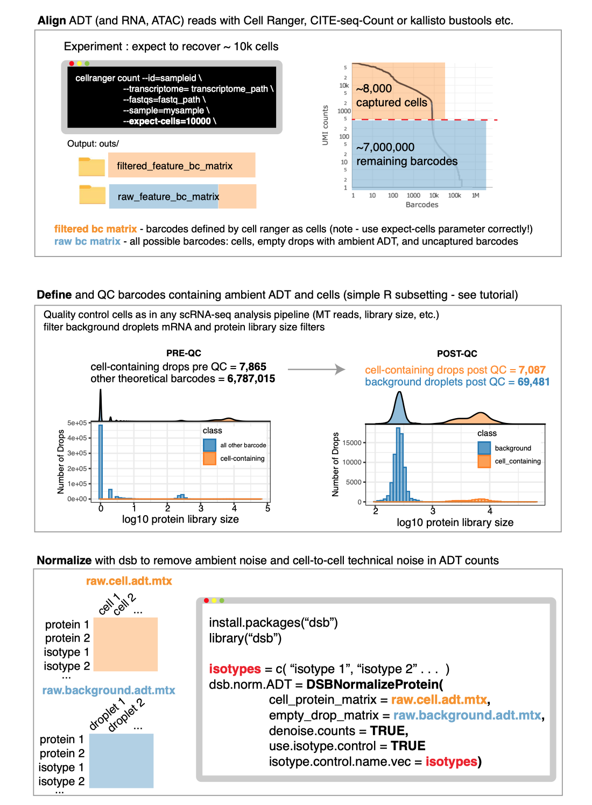
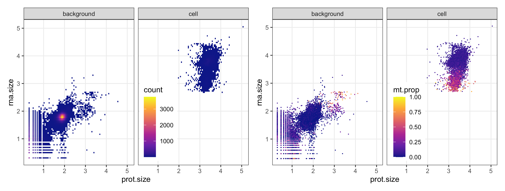
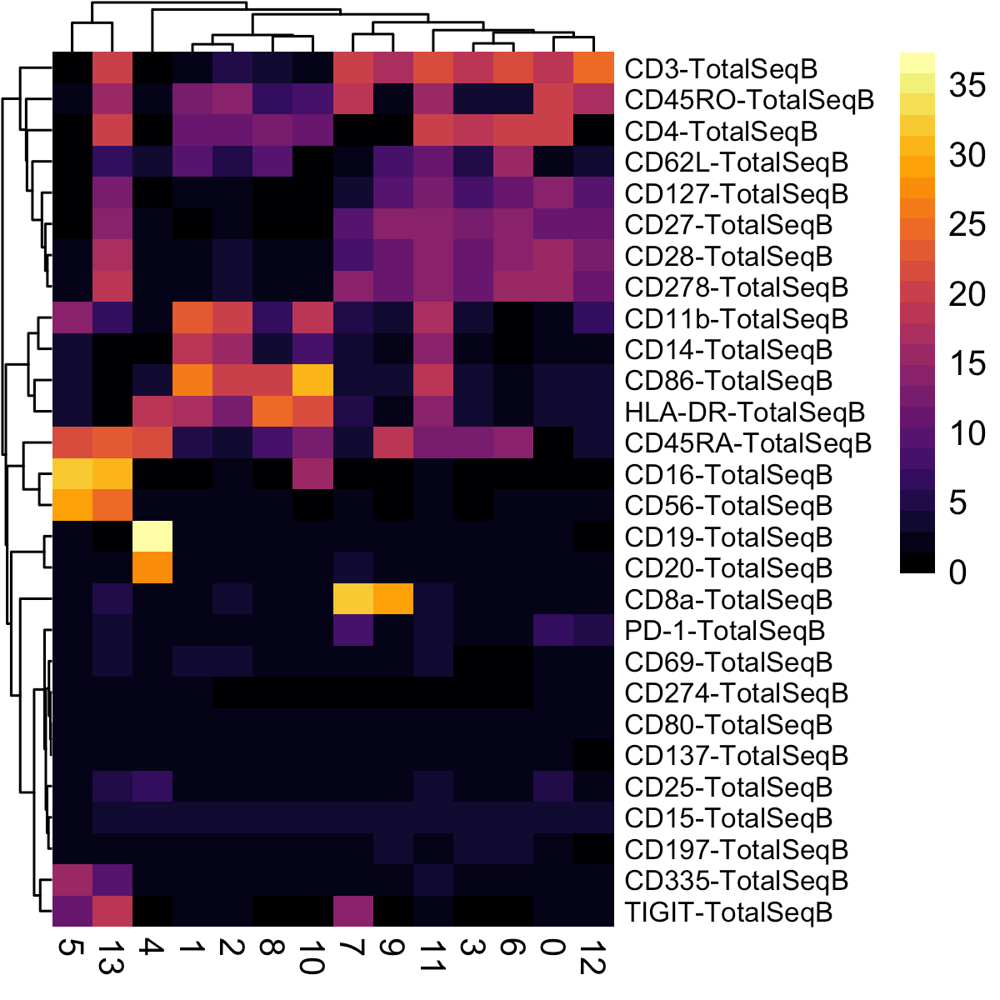
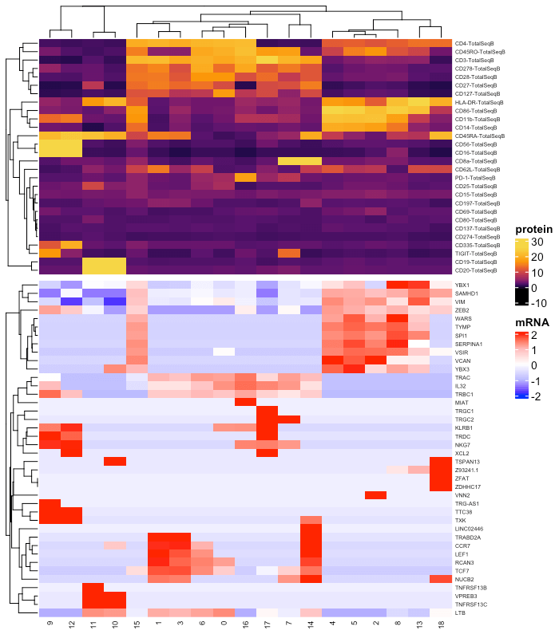

```{r, include = FALSE}
knitr::opts_chunk$set(
  collapse = TRUE,
  eval = FALSE,
  comment = "#>",
  fig.path = "man/figures/README-",
  out.width = "100%"
)
```

Below we demonstrate an end-to-end basic CITE-seq analysis starting from UMI count alignment output files from Cell Ranger. Standard output files from Cell Ranger are perfectly set up to use dsb. Our method is also compatible with any alignment tool; see: [using other alignment tools](#otheraligners). We load unfiltered UMI data containing cells and empty droplets, perform QC on cells and background droplets, normalize with dsb, and demonstrate protein-based clustering and multimodal RNA+Protein joint clustering using dsb normalized values with Seurat's Weighted Nearest Neighbor method. 

Please cite the dsb manuscript if you used our software or found the experimental and modeling derivation of ADT noise sources in our paper helpful:  
[**dsb manuscript**](https://www.biorxiv.org/content/10.1101/2020.02.24.963603v3)  

Recent publications using the dsb method  
[**Recent Publications**](#pubications)  

## Table of Contents
1. [Background and motivation](#background_motivation)
2. [Installation and quick overview](#installation)
3. [Download public 10X Genomics data](#tutorial)
4. [Step 1 A note on alignment of ADTs](#step1)
5. [Step 2 Load RNA and ADT data and define droplet quality control metadata](#step2)
6. [Step 3 Quality control on cell-containing and background droplets](#step3)
7. [Step 4 Normalize protein data with the DSBNormalizeProtein Function](#step4)
8. [Integrating dsb with Seurat](#seurat) 
9. [Clustering cells based on dsb normalized protein using Seurat](#seurat_clustering)
10. [dsb derived cluster interpretation](#interpretation)
11. [Weighted Nearest Neighbor multimodal clustering using dsb normalized values with Seurat](#wnn)

Topics covered in other vignettes on CRAN: **Integrating dsb with Bioconductor, integrating dsb with python/Scanpy, Using dsb with data lacking isotype controls, integrating dsb with sample multiplexing experiments, using dsb on data with multiple batches, advanced usage - using a different scale / standardization based on empty droplet levels, returning internal stats used by dsb, outlier clipping with the quantile.clipping argument, other FAQ.**  

## Background and motivation <a name="background_motivation"></a>  

Protein data derived from sequencing antibody derived tags (ADTs) in CITE-seq and other related assays has substantial background noise. [**Our paper**](https://www.biorxiv.org/content/10.1101/2020.02.24.963603v3) outlines experiments and analysis designed to dissect sources of noise in ADT data we used to developed our method. We found all experiments measuring ADTs capture protein-specific background noise because ADT reads in empty / background drops (outnumbering cell-containing droplets > 10-fold in all experiments) were highly concordant with ADT levels in unstained spike-in cells. We therefore utilize background droplets which capture the *ambient component* of protein background noise to correct values in cells. We also remove technical cell-to-cell variations by defining each cell's dsb "technical component", a conservative adjustment factor derived by combining isotype control levels with each cell's specific background level fitted with a single cell model.  

## Installation and quick overview <a name="installation"></a>

The method is carried out in a single step with a call to the `DSBNormalizeProtein()` function.  
`cells_citeseq_mtx` - a raw ADT count matrix 
`empty_drop_citeseq_mtx` - a raw ADT count matrix from non-cell containing empty / background droplets.  
`denoise.counts = TRUE` - implement step II to define and remove the 'technical component' of each cell's protein library.  
`use.isotype.control = TRUE` - include isotype controls in the modeled dsb technical component.  
```{r, eval = FALSE}
install.packages('dsb')
library(dsb)

adt_norm = DSBNormalizeProtein(
  cell_protein_matrix = cells_citeseq_mtx, 
  empty_drop_matrix = empty_drop_citeseq_mtx, 
  denoise.counts = TRUE, 
  use.isotype.control = TRUE, 
  isotype.control.name.vec = rownames(cells_citeseq_mtx)[67:70]
  )
```


## Download public 10X Genomics data <a name="tutorial"></a>
Download BOTH the Feature / cell matrix (filtered) and Feature / cell matrix (raw) count matrices here: [public 10X Genomics CITE-seq data](https://support.10xgenomics.com/single-cell-gene-expression/datasets/3.0.2/5k_pbmc_protein_v3_nextgem).

## Step 1 A note on alignment of ADTs <a name="step1"></a>

## Download public 10X Genomics data <a name="tutorial"></a>
Download BOTH the Feature / cell matrix (filtered) and Feature / cell matrix (raw) count matrices here: [public 10X Genomics CITE-seq data](https://support.10xgenomics.com/single-cell-gene-expression/datasets/3.0.2/5k_pbmc_protein_v3_nextgem).

To use dsb, we will load ADT and RNA data from cells and empty droplet aligned by Cell Ranger. dsb is also compatible with other aligners see: [how to use Cite-Seq-Count and Kallisto with dsb](#otheraligners). 

## Step 1 A note on alignment of ADTs <a name="step1"></a>

The Cell Ranger `raw_feature_bc_matrix` includes every possible cell barcode (columns) x genes / ADT (rows); about 7 Million barcodes for the V3 assay. A very small subset of those columns in the `raw_feature_bc_matrix` contain cells--those are separately provided in the `filtered_feature_bc_matrix` file. Another subset of the `raw_feature_bc_matrix` contain empty droplets capturing ambient antibodies. Instead of discarding that valuable sequencing data, we extract empty droplets capturing ADT using the code below and use them with dsb. Also please see note on [Cell Ranger filtered output](#cellranger). 

Here is a visual showing for the workflow we will follow starting from alignment and proceeding through QC and normalization  
  

## Step 2 Load RNA and ADT data and define droplet quality control metadata <a name="step2"></a>  

Here we use the convenience function from Seurat `Read10X` which will automatically detect multiple assays and create two element list `Gene Expression` and `Antibody Capture`. 

```{r, eval = FALSE}
library(dsb)

# read raw data using the Seurat function "Read10X" 
raw = Seurat::Read10X("data/raw_feature_bc_matrix/")
cells = Seurat::Read10X("data/filtered_feature_bc_matrix/")

# define cell-containing barcodes and separate cells and empty drops
stained_cells = colnames(cells$`Gene Expression`)
background = setdiff(colnames(raw$`Gene Expression`), stained_cells)

# split the data into separate matrices for RNA and ADT
prot = raw$`Antibody Capture`
rna = raw$`Gene Expression`
```

Now calculate some standard meta data for cells that we will use for quality control using standard approaches used in scRNAseq analysis pipelines.  

```{r, eval = FALSE}
# create metadata of droplet QC stats used in standard scRNAseq processing
mtgene = grep(pattern = "^MT-", rownames(rna), value = TRUE) # used below

md = data.frame(
  rna.size = log10(Matrix::colSums(rna)), 
  prot.size = log10(Matrix::colSums(prot)), 
  n.gene = Matrix::colSums(rna > 0), 
  mt.prop = Matrix::colSums(rna[mtgene, ]) / Matrix::colSums(rna)
)
# add indicator for barcodes Cell Ranger called as cells
md$drop.class = ifelse(rownames(md) %in% stained_cells, 'cell', 'background')

# remove barcodes with no evidence of capture in the experiment
md = md[md$rna.size > 0 & md$prot.size > 0, ]

```

**we now have 103,075 barcodes in `md` with RNA and protein data** only about 7,000 contain cells. With dsb we use a majority of this data instead of discarding everything except the cells.

## Step 3 Quality control cells and background droplets <a name="step3"></a>

To narrow in on the major background droplet population, we visualize the log library size (total reads) of the mRNA and protein. The first two plots from the left help us identify low quality cells (high MT gene content) in both background droplets and the cell droplets. The right two plots show the density of points; yellow areas have more droplets. The major background distribution is clear in the first plot from the left (the yellow area of high density). In the third plot from the left, background drops are colored MT gene proportion so we can see some may be low-quality apoptotic cells. We next set upper and lower cutoffs on the background matrix library size. Note that as shown in Supplementary Fig 7 of our paper, Normalized values are robust to background thresholds used, so long as one does not omit the major background population present in all datasets.


```{r, eval = FALSE}
background_drops = rownames(
  md[ md$prot.size > 1.5 & 
      md$prot.size < 3 & 
      md$rna.size < 2.5, ]
  ) 
background.adt.mtx = as.matrix(prot[ , background_drops])
```

More than 70,000 empty droplets are included after QC. 

We next quality control cells in a similar manner with additional quality control metrics calculated as in any standard scRNAseq analysis, e.g. see [Luecken *et. al.* 2019 *Mol Syst Biol*](https://www.embopress.org/doi/full/10.15252/msb.20188746).    

```{r, eval = FALSE}

# calculate statistical thresholds for droplet filtering.
cellmd = md[md$drop.class == 'cell', ]

# filter drops with + / - 3 median absolute deviations from the median library size
rna.mult = (3*mad(cellmd$rna.size))
prot.mult = (3*mad(cellmd$prot.size))
rna.lower = median(cellmd$rna.size) - rna.mult
rna.upper = median(cellmd$rna.size) + rna.mult
prot.lower = median(cellmd$prot.size) - prot.mult
prot.upper = median(cellmd$prot.size) + prot.mult

# filter rows based on droplet qualty control metrics
qc_cells = rownames(
  cellmd[cellmd$prot.size > prot.lower & 
         cellmd$prot.size < prot.upper & 
         cellmd$rna.size > rna.lower & 
         cellmd$rna.size < rna.upper & 
         cellmd$mt.prop < 0.14, ]
  )
```

Check: are the number of cells passing QC in line with the expected recovery from the experiment? 

```{r, eval = FALSE}
length(qc_cells)
```

**[1] 4096**

Yes. After quality control above we have 4096 cells which is in line with the ~5000 cells loaded in this experiment. 

Now subset the metadata ADT and RNA matrices.  
```{r, eval = FALSE}
cell.adt.raw = as.matrix(prot[ , qc_cells])
cell.rna.raw = rna[ ,qc_cells]
cellmd = cellmd[qc_cells, ]
```

## Optional step; remove proteins without staining 
Proteins without raw data in stained cells (below, the maximum UMI count for one protein was 4, an order of magnitude below even the isotype controls) can be removed from both matrices prior to normalization. In many cases, removing proteins is not necessary, but we recommend checking your raw data.

```{r, eval = FALSE}
# flter 
pm = sort(apply(cell.adt.raw, 1, max))
pm2 = apply(background.adt.mtx, 1, max)
head(pm)
```
prot                      pmax  
CD34_TotalSeqB               4  
CD80_TotalSeqB              60  
CD274_TotalSeqB             75  
IgG2b_control_TotalSeqB     90  

```{r, eval = FALSE}
# remove the non staining protein 
cell.adt.raw  = cell.adt.raw[!rownames(cell.adt.raw) == 'CD34_TotalSeqB', ]
background.adt.mtx = background.adt.mtx[!rownames(background.adt.mtx) == 'CD34_TotalSeqB', ]

```

## Step 4 Normalize protein data with the DSBNormalizeProtein Function <a name="step4"></a>

We are now ready to use dsb to normalize and denoise the ADTs. We normalize the raw ADT matrix before creating a Seurat object since we also use the empty droplets.

The method is carried out in a single step with a call to the `DSBNormalizeProtein()` function.  
`cells_citeseq_mtx` - the raw ADT UMI count matrix containing cells  
`empty_drop_citeseq_mtx` - the raw ADT UMI count matrix containing background droplets  
`denoise.counts` - we set to TRUE (the recommended default) to define and remove technical cell to cell variations. 
`isotype.control.name.vec` - a vector of the isotype control antibodies from the rownames of the raw ADT matrix defined from `rownames(cell.adt.raw)` (see vignettes for data without isotype controls). For data without isotype controls, see the vignette section *Using dsb with data lacking isotype controls*. 

```{r, eval = FALSE}
# define isotype controls 
isotype.controls = c("IgG1_control_TotalSeqB", "IgG2a_control_TotalSeqB", 
                     "IgG2b_control_TotalSeqB")

# normalize and denoise with dsb with 
cells.dsb.norm = DSBNormalizeProtein(
  cell_protein_matrix = cell.adt.raw, 
  empty_drop_matrix = background.adt.mtx, 
  denoise.counts = TRUE, 
  use.isotype.control = TRUE, 
  isotype.control.name.vec = isotype.controls
  )
# note: normalization takes ~ 20 seconds
# system.time()
# user  system elapsed 
#  20.799   0.209  21.783 
```

The function returns a matrix of normalized protein values which can be integrated with any single cell analysis software. We provide an example with Seurat below.  

Advanced users may want to examine internal stats used in dsb, in that case use `return.stats = TRUE`. If the range of values after normalization is large, this is often due to a few low or high magnitude outliers. The simplest way to address these outliers is to clip the maximum values by setting `quantile.clipping = TRUE`. Finally a different pseudocount can be used with `define.pseudocount = TRUE` and `pseudocount.use`. Please see the vignettes on CRAN to learn more about different parameters that can be used in dsb

```{r, eval = FALSE}
# dsb with non-standard options 
cell.adt.dsb.2 = DSBNormalizeProtein(
  cell_protein_matrix = cell.adt.raw,
  empty_drop_matrix = background.adt.mtx,
  denoise.counts = TRUE,
  use.isotype.control = TRUE,
  isotype.control.name.vec = rownames(cell.adt.raw)[29:31],
  define.pseudocount = TRUE,
  pseudocount.use = 1,
  scale.factor = 'mean_subtract',
  quantile.clipping = TRUE,
  quantile.clip = c(0.01, 0.99), 
  return.stats = TRUE
  )


```


## Integrating dsb with Seurat <a name="seurat"></a>  

Create a Seurat object. Make sure to add the dsb normalized matrix `cell.adt.dsb` to the `data` slot, not the `counts` slot. 

```{r, eval = FALSE}
# Seurat workflow 
library(Seurat)

# integrating with Seurat
stopifnot(isTRUE(all.equal(rownames(cellmd), colnames(cell.adt.raw))))
stopifnot(isTRUE(all.equal(rownames(cellmd), colnames(cell.rna.raw))))

# create Seurat object note: min.cells is a gene filter, not a cell filter
s = Seurat::CreateSeuratObject(counts = cell.rna.raw, 
                               meta.data = cellmd,
                               assay = "RNA", 
                               min.cells = 20)

# add dsb normalized matrix "cell.adt.dsb" to the "CITE" data (not counts!) slot
s[["CITE"]] = Seurat::CreateAssayObject(data = cells.dsb.norm)

```

## Clustering cells based on dsb normalized protein using Seurat  <a name="seurat_clustering"></a>

Now we cluster cells based on dsb normalized protein levels. Similar to workflow used in our paper [Kotliarov *et al.* 2020](https://doi.org/10.1038/s41591-020-0769-8) we don't cluster based on principal components from ADT, instead directly using the normalized values.

```{r, eval = FALSE}
# define proteins to use in clustering (non-isptype controls)
prots = rownames(s@assays$CITE@data)[1:28]

# cluster and run umap 
s = Seurat::FindNeighbors(object = s, dims = NULL,assay = 'CITE', 
                          features = prots, k.param = 30, 
                          verbose = FALSE)

# direct graph clustering 
s = Seurat::FindClusters(object = s, resolution = 1, 
                         algorithm = 3, 
                         graph.name = 'CITE_snn', 
                         verbose = FALSE)
# umap (optional)
# s = Seurat::RunUMAP(object = s, assay = "CITE", features = prots,
#                     seed.use = 1990, min.dist = 0.2, n.neighbors = 30,
#                     verbose = FALSE)

# make results dataframe 
d = cbind(s@meta.data, 
          as.data.frame(t(s@assays$CITE@data))
          # s@reductions$umap@cell.embeddings)
          )
```

To see if we recovered the expected cell populations, it is often more informative and interpretable to first look at the summarized (median or mean) protein expression in each cluster--we recommend doing this before trying to look at cells in 2-d visualization plots like umap.   

## dsb derived cluster interpretation <a name="interpretation"></a>  

dsb values are interpretable as the number of standard deviations of each protein from the expected noise (if using the default settings) with additional correction for cell to cell technical variations. One can use this to set a threshold across all proteins for positivity, e.g. expression below 3 or 4 can be deemed unexpressed. If normalized with the same parameters from dsb, the same threshold can be applied across multiple datasets.  
```{r, eval = FALSE}
library(magrittr)
# calculate the median protein expression separately for each cluster 
adt_plot = d %>% 
  dplyr::group_by(CITE_snn_res.1) %>% 
  dplyr::summarize_at(.vars = prots, .funs = median) %>% 
  tibble::remove_rownames() %>% 
  tibble::column_to_rownames("CITE_snn_res.1") 
# plot a heatmap of the average dsb normalized values for each cluster
pheatmap::pheatmap(t(adt_plot), 
                   color = viridis::viridis(25, option = "B"), 
                   fontsize_row = 8, border_color = NA)

```


Now we can cell type based on median dsb normalized protein level per cluster. 
```{r, eval = FALSE}
clusters = c(0:13)
celltype = c("CD4_Tcell_Memory", # 0 
             "CD14_Monocytes", #1
             "CD14_Monocytes_Activated", #2
             "CD4_Naive_Tcell", #3
             "B_Cells", #4
             "NK_Cells", #5
             "CD4_Naive_Tcell_CD62L+", #6
             "CD8_Memory_Tcell", #7
             "DC", #8
             "CD8_Naive_Tcell", #9
             "CD4_Effector", #10
             "CD16_Monocyte", #11
             "DOUBLETS", #12
             "DoubleNegative_Tcell" #13
)

s@meta.data$celltype = plyr::mapvalues(
  x = s@meta.data$CITE_snn_res.1, 
  from = clusters,  to = celltype
  )

# # optional -- dimensionality reduction plot 
# Seurat::DimPlot(s, reduction = 'umap', group.by = 'celltype',
#               label = TRUE, repel = TRUE, label.size = 2.5, pt.size = 0.1) + 
#   theme_bw() + NoLegend() + ggtitle('dsb normalized protein')
```


## Weighted Nearest Neighbor multimodal clustering using dsb normalized values with Seurat <a name="wnn"></a>
Below we demonstrate using Seurat's Weighted Nearest Neighbor multimodal clustering method with dsb normalized values as input for the protein assay. WNN is an excellent way to find fine-grained cell states, especially in larger datasets than this small example data selected for purposes of demonstration. 

Below we demonstrate WNN using dsb normalized and denoised ADT data using the default Seurat implementation by first reducing dimensionality of the protein data with PCA.

### Method 1 -- Seurat WNN default with PCA on dsb normalized protein 

```{r}
# use pearson residuals as normalized values for pca 
DefaultAssay(s) = "RNA"
s = NormalizeData(s, verbose = FALSE) %>% 
  FindVariableFeatures(selection.method = 'vst', verbose = FALSE) %>% 
  ScaleData(verbose = FALSE) %>%
  RunPCA(verbose = FALSE)

# set up dsb values to use in WNN analysis (do not normalize with CLR, use dsb normalized values)
DefaultAssay(s) = "CITE"
VariableFeatures(s) = prots
s = s %>% 
  ScaleData() %>% 
  RunPCA(reduction.name = 'apca', verbose = FALSE)

# run WNN 
s = FindMultiModalNeighbors(
  s, reduction.list = list("pca", "apca"), 
  dims.list = list(1:30, 1:18), 
  modality.weight.name = "RNA.weight", 
  verbose = FALSE
)

# cluster 
s <- FindClusters(s, graph.name = "wsnn", 
                  algorithm = 3, 
                  resolution = 1.5, 
                  verbose = FALSE, 
                  random.seed = 1990)
```


### Method 2 (experimental) -- Seurat WNN with dsb normalized protein directly without PCA  

Below we show a version of WNN where we directly use normalized protein values without PCA compression. We have found this procedure works well for smaller (e.g. less than 30) protein panels, whereas datasets with many cells generated with recently available pre-titrated panels consisting of more than 100 or 200 proteins may benefit more from dimensionality reduction with PCA. 

```{r}
## WNN with dsb values 
# use RNA pearson residuals as normalized values for RNA pca 
DefaultAssay(s) = "RNA"
s = NormalizeData(s, verbose = FALSE) %>% 
  FindVariableFeatures(selection.method = 'vst', verbose = FALSE) %>% 
  ScaleData(verbose = FALSE) %>%
  RunPCA(verbose = FALSE)


# set up dsb values to use in WNN analysis 
DefaultAssay(s) = "CITE"
VariableFeatures(s) = prots

# run true pca to initialize dr pca slot for WNN 
## Not used {
s = ScaleData(s, assay = 'CITE', verbose = FALSE)
s = RunPCA(s, reduction.name = 'pdsb',features = VariableFeatures(s), verbose = FALSE)
# }

# make matrix of normalized protein values to add as dr embeddings
pseudo = t(GetAssayData(s,slot = 'data',assay = 'CITE'))[,1:29]
colnames(pseudo) = paste('pseudo', 1:29, sep = "_")
s@reductions$pdsb@cell.embeddings = pseudo

# run WNN directly using dsb normalized values. 
s = FindMultiModalNeighbors(
  object = s,
  reduction.list = list("pca", "pdsb"),
  weighted.nn.name = "dsb_wnn", 
  knn.graph.name = "dsb_knn",
  modality.weight.name = "dsb_weight",
  snn.graph.name = "dsb_snn",
  dims.list = list(1:30, 1:29), 
  verbose = FALSE
)

# cluster based on the join RNA and protein graph
s = FindClusters(s, graph.name = "dsb_knn", 
                 algorithm = 3, 
                 resolution = 1.5,
                 random.seed = 1990, 
                 verbose = FALSE)
```

Now we define marker genes for each cluster and create an aggregated dataframe for visualization

```{r}
# create multimodal heatmap 
vf = VariableFeatures(s,assay = "RNA")

# find marker genes for the joint clusters 
Idents(s) = "dsb_knn_res.1.5"
DefaultAssay(s)  = "RNA"
rnade = FindAllMarkers(s, features = vf, only.pos = TRUE, verbose = FALSE)
gene_plot = rnade %>% 
  dplyr::filter(avg_log2FC > 1 ) %>%  
  dplyr::group_by(cluster) %>% 
  dplyr::top_n(3) %$% gene %>% unique 


cite_data = GetAssayData(s,slot = 'data',assay = 'CITE') %>% t()
rna_subset = GetAssayData(s,assay = 'RNA',slot = 'data')[gene_plot, ] %>%
  as.data.frame() %>% 
  t() %>% 
  as.matrix()

# combine into dataframe 
d = cbind(s@meta.data, cite_data, rna_subset) 

# calculate the median protein expression per cluster
dat_plot = d %>% 
  dplyr::group_by(dsb_knn_res.1.5) %>% 
  dplyr::summarize_at(.vars = c(prots, gene_plot), .funs = median) %>% 
  tibble::remove_rownames() %>% 
  tibble::column_to_rownames("dsb_knn_res.1.5") 

```

With the aggregated data above we can make a joint heatmap of protein expression and mRNA expression. Below we visualize protein levels on the dsb scale that we used to cluster the cells.

```{r, fig.height=4, fig.width=3}
# make a combined plot 
suppressMessages(library(ComplexHeatmap)); ht_opt$message = FALSE

# protein heatmap 
# protein heatmap 
prot_col = circlize::colorRamp2(breaks = seq(-1,25, by = 1), 
                                colors = viridis::viridis(n = 27, option = "B"))
p1 = Heatmap(t(dat_plot)[prots, ], 
             name = "protein", 
             col = prot_col, 
             use_raster = T,
             row_names_gp = gpar(color = "black", fontsize = 5)
)


# mRNA heatmap 
mrna = t(dat_plot)[gene_plot, ]
rna_col = circlize::colorRamp2(breaks = c(-2,-1,0,1,2), 
                               colors = colorspace::diverge_hsv(n = 5))
p2 = Heatmap(t(scale(t(mrna))), 
             name = "mRNA", 
             col = rna_col,
             use_raster = T, 
             clustering_method_columns = 'average',
             column_names_gp = gpar(color = "black", fontsize = 7), 
             row_names_gp = gpar(color = "black", fontsize = 5))


# combine heatmaps 
ht_list = p1 %v% p2
draw(ht_list)

```



This tutorial is a guide. It cam be modified to fit your needs. Additional vignettes are available on CRAN.

### Some recent publications using dsb <a name="pubications"></a>  
Publications from outside institutes      
[Jardine et al. *Nature* (2021)](https://www.nature.com/articles/s41586-021-03929-x)  
[Mimitou et. al *Nature Biotechnology* (2021)](https://www.nature.com/articles/s41587-021-00927-2)  
[COMBAT consortium et al. *Cell* (2022)](https://www.cell.com/cell/pdf/S0092-8674(22)00070-8.pdf)    

Publications from the Tsang lab  
[Kotliarov et al. *Nature Medicine* (2020)](https://www.nature.com/articles/s41591-020-0769-8)    
[Liu et al. *Cell* (2021)](https://www.cell.com/cell/pdf/S0092-8674(21)00168-9.pdf)  


### using other alignment algorithms <a name="otheraligners"></a>  

dsb was developed prior to 10X Genomics supporting CITE-seq or hashing data and we routinely use other alignment pipelines. 


[**CITE-seq-count documentation**](https://hoohm.github.io/CITE-seq-Count/Running-the-script/)

To use dsb properly with CITE-seq-Count you need to align background. One way to do this is to set the `-cells` argument to ~ 200000. That will align the top 200000 barcodes in terms of ADT library size, making sure you capture the background. 
```{bash, eval = FALSE}
CITE-seq-Count -R1 TAGS_R1.fastq.gz  -R2 TAGS_R2.fastq.gz \
 -t TAG_LIST.csv -cbf X1 -cbl X2 -umif Y1 -umil Y2 \
  -cells 200000 -o OUTFOLDER
```
If you already aligned your mRNA with Cell Ranger or something else but wish to use a different tool like kallisto or Cite-seq-count for ADT alignment, you can provide the latter with  whitelist of cell barcodes to align. A simple way to do this is to extract all barcodes with at least k mRNA where we set k to a tiny number to retain cells *and* cells capturing ambient ADT reads:  
```{r, eval = FALSE}
library(Seurat)
umi = Read10X(data.dir = 'data/raw_feature_bc_matrix/')
k = 3 
barcode.whitelist = 
  rownames(
    CreateSeuratObject(counts = umi,
                       min.features = k,  # retain all barcodes with at least k raw mRNA
                       min.cells = 800, # this just speeds up the function by removing genes. 
                       )@meta.data 
    )

write.table(barcode.whitelist,
file =paste0(your_save_path,"barcode.whitelist.tsv"), 
sep = '\t', quote = FALSE, col.names = FALSE, row.names = FALSE)

```

With the example dataset in the vignette this retains about 150,000 barcodes.

Now you can provide that as an argument to `-wl` in CITE-seq-count to align the ADTs and then proceed with the dsb analysis example. 

```{bash, eval = FALSE}
CITE-seq-Count -R1 TAGS_R1.fastq.gz  -R2 TAGS_R2.fastq.gz \
 -t TAG_LIST.csv -cbf X1 -cbl X2 -umif Y1 -umil Y2 \
  -wl path_to_barcode.whitelist.tsv -o OUTFOLDER
```

This whitelist can also be provided to Kallisto.  
[kallisto bustools documentation](https://www.kallistobus.tools/tutorials/kb_kite/python/kb_kite/)  

```{bash, eval = FALSE}
kb count -i index_file -g gtf_file.t2g -x 10xv3 \
-t n_cores -w path_to_barcode.whitelist.tsv -o output_dir \
input.R1.fastq.gz input.R2.fastq.gz
```

Next one can similarly define cells and background droplets empirically with protein and mRNA based thresholding as outlined in the main tutorial. 

### A note on Cell Ranger --expect-cells <a name="cellranger"></a>  

Note *whether or not you use dsb*, if you want to define cells using the `filtered_feature_bc_matrix` file, you should make sure to properly set the Cell Ranger `--expect-cells` argument roughly equal to the estimated cell recovery per lane based on number of cells you loaded in the experiment. see [the note from 10X about this ](https://support.10xgenomics.com/single-cell-gene-expression/software/pipelines/latest/algorithms/overview#cell_calling). The default value of 3000 is relatively low for modern experiments. Note cells and empty droplets can also be defined directly from the `raw_feature_bc_matrix` using any method, including simple protein and mRNA library size based thresholding because this contains all droplets.

