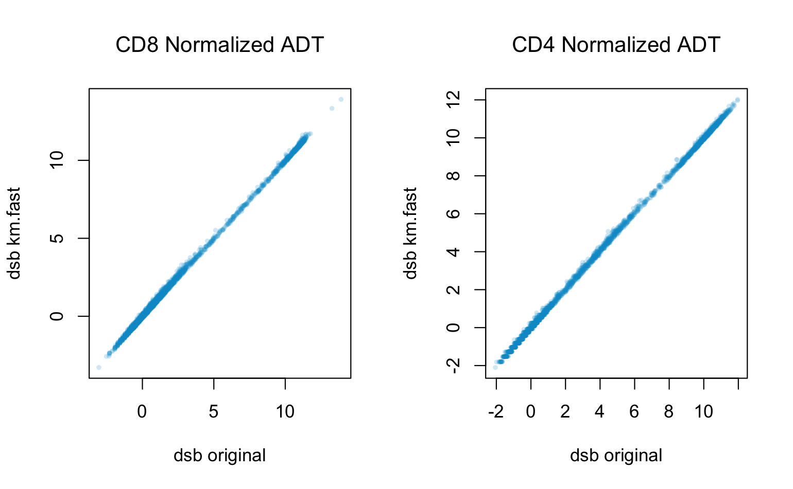
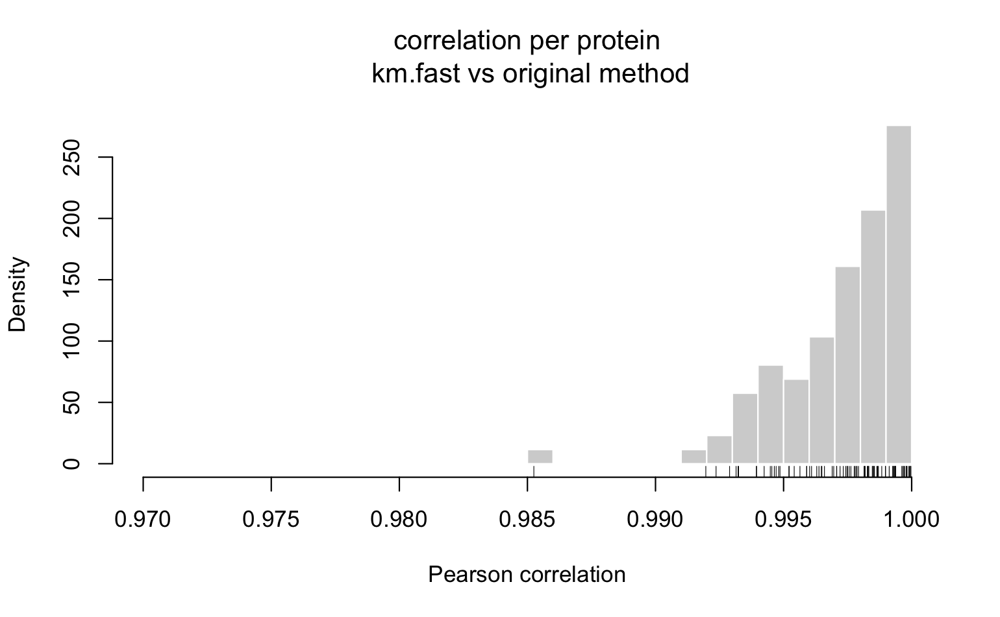

```{r, include = FALSE}
knitr::opts_chunk$set(
  collapse = TRUE,
  comment = "#>"
)
```

```{r, eval = FALSE}
library(dsb)
library(MASS)
library(mclust)
```

To speed up compute time for normalization ~ 10-fold, set `fast.km = TRUE`.  

Specify this argument with either the original method using empty droplets `DSBNormalizeProtein()`, or the dsb method that only requires the raw counts for cells and no empty drops `ModelNegativeADTnorm()`. 

Below is a benchmark showing 3 normalizations on a 1e6 cell benchmark  


How to use the fast method for datasets without empty drops:  
```{r, eval = FALSE}

isotypes = c("MouseIgG1kappaisotype_PROT", "MouseIgG2akappaisotype_PROT", 
             "Mouse IgG2bkIsotype_PROT", "RatIgG2bkIsotype_PROT")

norm.adt = ModelNegativeADTnorm(
  cell_protein_matrix = cells_citeseq_mtx,
  fast.km = TRUE,
  denoise.counts = TRUE,
  use.isotype.control = TRUE,
  isotype.control.name.vec = isotypes
  )

```

How to use the fast method for datasets with empty droplets specified (see main vignette):  
```{r, eval = FALSE}

norm.adt = DSBNormalizeProtein(
  cell_protein_matrix = dsb::raw.adt.matrix,
  empty_drop_matrix = dsb::empty_drop_citeseq_mtx,
  fast.km = TRUE,
  denoise.counts = TRUE,
  use.isotype.control = TRUE,
  isotype.control.name.vec = isotypes
  )

```


Differences in the resulting normalized values between the two methods:  


```{r, eval = FALSE}
r = "deepskyblue3"
library(dsb)

# specify isotypes 
isotypes.names = rownames(cells_citeseq_mtx)[67:70]

norm = DSBNormalizeProtein(
  # set fast.km = TRUE to run the fast method 
  fast.km = TRUE,
  cell_protein_matrix = dsb::cells_citeseq_mtx, 
  empty_drop_matrix = dsb::empty_drop_citeseq_mtx, 
  denoise.counts = TRUE, 
  use.isotype.control = TRUE, 
  isotype.control.name.vec = rownames(cells_citeseq_mtx)[67:70], 
)

# original method
norm.original = dsb::DSBNormalizeProtein(
  cell_protein_matrix = dsb::cells_citeseq_mtx, 
  empty_drop_matrix = dsb::empty_drop_citeseq_mtx, 
  denoise.counts = TRUE, 
  use.isotype.control = TRUE, 
  isotype.control.name.vec = rownames(cells_citeseq_mtx)[67:70], 
)

n.original = norm.original$dsb_normalized_matrix
n.fast = norm$dsb_normalized_matrix
# individual correlations 
par(mfrow=c(1,2))
plot(n.original['CD8_PROT', ], n.fast['CD8_PROT', ], 
     pch = 16, 
     font.main = 1,
     col = adjustcolor(r, alpha.f = 0.2),
     cex = 0.6,
     xlab = "dsb original",
     ylab = "dsb km.fast", 
     main = 'CD8 Normalized ADT'
)
plot(n.original['CD4_PROT', ], n.fast['CD4_PROT', ], 
     pch = 16, font.main = 1, cex = 0.6,
     col = adjustcolor(r, alpha.f = 0.2),
     xlab = "dsb original",
     ylab = "dsb km.fast", 
     main = 'CD4 Normalized ADT'
)

```


Correlation of normalized values:  

```{r, eval = FALSE}

correlations <- sapply(seq_len(nrow(n.original)), function(x){  
  cor(n.original[x, ], n.fast[x, ], method = 'pearson') 
  })

# plot 
hist(correlations, breaks = 20, xlim = c(0.97, 1), 
     main = "correlation per protein\n km.fast vs original method", 
     font.main = 1, 
     xlab = "Pearson correlation", freq = FALSE, col = "lightgray", border = "white") 
rug(correlations)

```



