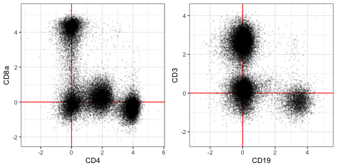
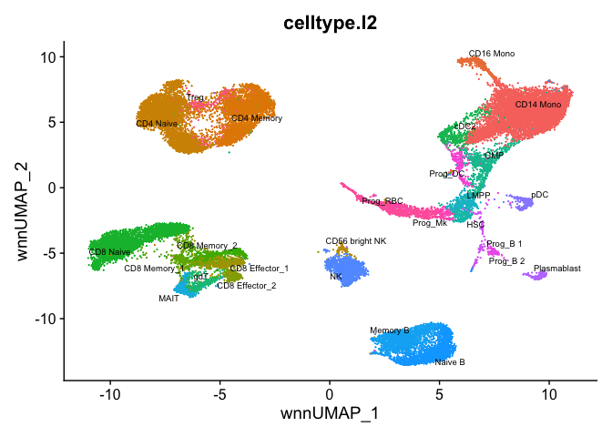

```{r, include = FALSE}
knitr::opts_chunk$set(
  collapse = TRUE,
  comment = "#>"
)
```

```{r setup}
library(dsb)
r = '#009ACD80'
```

This method has performed well on 4 datasets but it has not been as extensively tested as the default `DSBNormalizeProtein` method. 

Sometimes empty droplets are not available. In Supplementary Figure 1, we show that the fitted background population mean of each protein across all cells was concordant with the mean of ambient ADTs in both empty droplets and unstained control cells.  

This experiment suggests that this fitted background mean captures an estimate of ambient noise. By log + 1 transforming ADTs across cells, fitting the background population mean with a Gaussian Mixture and subtracting this value from cells, we should partly remove the ambient component and 0-center the background population for each ADT. We can then implement step II exactly as in the dsb function `DSBNormalizeProtein`. We provide this method with the function `ModelNegativeADTnorm`. 

```{r}
# pecify isotype controls to use in step II 
isotypes = c("MouseIgG1kappaisotype_PROT", "MouseIgG2akappaisotype_PROT", 
             "Mouse IgG2bkIsotype_PROT", "RatIgG2bkIsotype_PROT")

# run ModelNegativeADTnorm to model ambient noise and implement step II
raw.adt.matrix = dsb::cells_citeseq_mtx
norm.adt = ModelNegativeADTnorm(cell_protein_matrix = raw.adt.matrix,
                                denoise.counts = TRUE,
                                use.isotype.control = TRUE,
                                isotype.control.name.vec = isotypes
                                )

```

With this method of estimating background noise, we retain trimodal distributions of CD4 with the background population centered at 0. All populations are nicely recovered with a similar distribution of values as the default dsb method. Note that 2 proteins in this 87 protein panel are expected to be expressed by every cell--HLA-ABC and CD18. **Proteins that are ubiquitously expressed will also be centered around 0 with this method**. Note that the distribution of values for CD18 are the same as the default dsb, however, the lowest population cells are near and below 0.

```{r, fig.width=7.5, fig.height=6}
par(mfrow = c(2,2))
lab = 'ModelNegativeADTnorm'
hist(norm.adt["CD4_PROT", ], breaks = 45, col = r, main = 'CD4', xlab = lab)
hist(norm.adt["CD8_PROT", ], breaks = 45, col = r, main = 'CD8', xlab = lab)
hist(norm.adt["CD19_PROT", ], breaks = 45, col = r, main = 'CD19', xlab = lab)
hist(norm.adt["CD18_PROT", ], breaks = 45, col = r, main = 'CD18', xlab = lab)
```

Clustering performance and modeling e.g. with protein or joint WNN clustering is highly concordant using the default dsb and this modeled background method. Below we demonstrate WNN using this method on [bone marrow CITE-seq data](https://www.sciencedirect.com/science/article/pii/S0092867419305598?via%3Dihub) from the Satija lab. 

```{r, eval = FALSE}
# these data were installed with the SeuratData package
# library(SeuratData)
# InstallData(ds = 'bmcite')

# load bone marrow CITE-seq data
data('bmcite')
bm = bmcite; rm(bmcite)

# Extract raw bone marrow ADT data 
adt = GetAssayData(bm, slot = 'counts', assay = 'ADT')

# unfortunately this data does not have isotype controls
dsb.norm = ModelNegativeADTnorm(cell_protein_matrix = adt, 
                                empty_drop_matrix = NULL,
                                use.isotype.control = FALSE,
                                denoise.counts = TRUE)
```

Above we removed technical cell to cell variations with each cells fitted background only--adding isotype controls will further improve the precision in the technical component estimation. Note, if this dataset included isotype controls we would have used the following options: 

```{r, eval = FALSE}
dsb.norm.2 = DSBNormalizeProtein_(cell_protein_matrix = adt,
                                  empty_drop_matrix = NULL
                                  denoise.counts = TRUE, 
                                  use.isotype.control = TRUE, 
                                  isotype.control.name.vec = c('isotype1', 'isotype 2')
                                  )
```

This "modeled background" dsb method nicely recovers the trimodal CD4 population and bimodal expression in lineage defining proteins. Subtracting the modeled background population has centered the values around 0. 

```{r, fig.width=7, fig.height=3.5, eval = FALSE}
library(ggplot2); theme_set(theme_bw())
plist = list(geom_vline(xintercept = 0, color = 'red'), 
             geom_hline(yintercept = 0, color = 'red'), 
             geom_point(size = 0.2, alpha = 0.1))
d = as.data.frame(t(dsb.norm))

# plot distributions
p1 = ggplot(d, aes(x = CD4, y = CD8a)) + plist
p2 = ggplot(d, aes(x = CD19, y = CD3)) + plist
cowplot::plot_grid(p1,p2)

```

Now we can cluster with WNN using the dsb normalized values as in the other end to end analysis vignette. We first add the dsb normalized values to the object directly and we do not normalize with CLR, instead proceeding directly with the Seurat WNN clustering pipeline. 

```{r, eval = FALSE}
bm = SetAssayData(bmcite, slot = 'data', 
                  assay = 'ADT', 
                  new.data = dsb.norm.adt)

# process RNA for WNN 
DefaultAssay(bm) <- 'RNA'
bm <- NormalizeData(bm) %>% 
  FindVariableFeatures() %>% 
  ScaleData() %>% 
  RunPCA()

# process ADT for WNN # see the main dsb vignette for an alternate version
DefaultAssay(bm) <- 'ADT'
VariableFeatures(bm) <- rownames(bm[["ADT"]])
bm = bm %>% ScaleData() %>% RunPCA(reduction.name = 'apca')

# run WNN 
bm <- FindMultiModalNeighbors(
  bm, reduction.list = list("pca", "apca"), 
  dims.list = list(1:30, 1:18), modality.weight.name = "RNA.weight"
)

bm <- FindClusters(bm, graph.name = "wsnn",
                   algorithm = 3, resolution = 2, 
                   verbose = FALSE)
bm <- RunUMAP(bm, nn.name = "weighted.nn", 
              reduction.name = "wnn.umap", 
              reduction.key = "wnnUMAP_")

p2 <- DimPlot(bm, reduction = 'wnn.umap', 
              group.by = 'celltype.l2',
              label = TRUE, repel = TRUE,
              label.size = 2.5) + NoLegend()
p2
```



